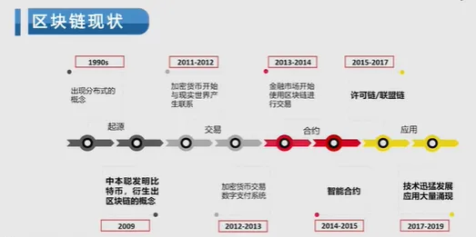
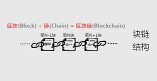
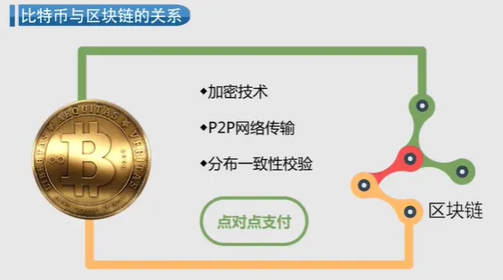
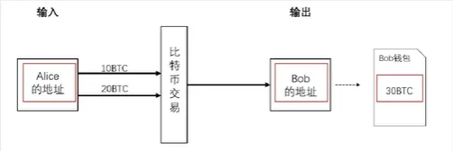
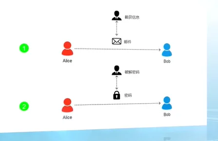
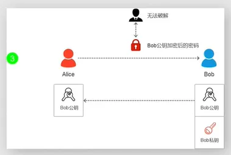
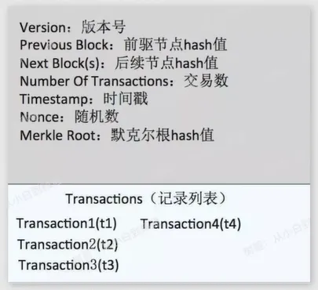
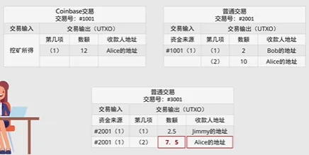
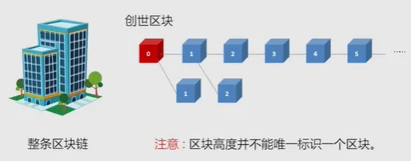
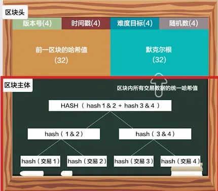

> 这篇文档是 2021 年 1 月我学习南京大学公开课《区块链与创新思维》时整理的部分笔记，为完成毕业设计而学习的区块链基础理论，也是我踏入区块链领域的启蒙课程。

公开课地址：https://www.icourse163.org/course/NJU-1449346161

## 第一章：什么是区块链和区块链思维

### 1.1、区块链的小故事

**去中心化思想**

经过改革以后，玉石村的每一个村民手里都拥有一个账本。每个账本里头都记录着村民挖出玉石的信息，摒弃了以往只有村长手里唯一账本的“中心化”记账方式，采取了人手一个账本的 “去中心化”分布式记账方式。

**防篡改思想**

在每个村民的账本里，会给每块玉石都做上标记，记录玉石挖掘到的时间、地点和人物，以及上一块被挖到的玉石的信息。这样，每块玉都与上一块玉形成信息关联，串联成一个链条。这种方式使得谁都无法凭空捏造，也无法更改之前的记录，从而做到了 “防篡改”。

**交易信息公开透明的思想**

当有村民挖到玉石之后，他在自己的账本上记录的同时，会用村口的大喇叭向全村广播通知。听到通知后，所有村民都在各自的本子上写下同样的内容。因此，所有村民都拥有一份完整的、同步的玉石信息，他们可以随时翻阅自己的账本进行查询。

**共识**

最后是共识的思想。当某个村民发现有一笔玉石信息记录错误并需要更正时，必须得到至少51%的村民同意，才能修改这笔记录。换句话说，只有得到多数村民的认同，信息才能被正式记录在每个人的账本中。这就体现了区块链中 “共识” 的基本思想。

### 1.2、区块链的起源与现状

**（1）密码朋克**

1992年，英特尔高级科学家蒂姆·梅（Tim May）与朋友聚会时，讨论互联网应该如何更好地保护人们的隐私。“**怎样保护全世界民众的隐私在互联网上不被别有用心的人利用呢？**”，他们成立了一个小组：密码朋克。

在聚会结束一周后，小组成员埃里克·休斯写了个程序，可以接收加密邮件，擦除所有身份标记，并将它们发送回用户列表，当你签名后，你会得到休斯的回信。

1993年，埃里克·休斯与其他几个人，升级迭代了加密电子邮件系统，直接把系统改名叫“密码朋克”。密码朋克不再是一个小组，使用密码朋克邮件系统的用户约1400人，这些人逐渐形成一个非常私密的圈子。同时埃里克·休斯发布了《密码朋克宣言》向权力机构发起了挑战：“在电子信息时代，个人隐私在一个开放的社会中是必需品。我们不指望政府、公司或者其他什么不要脸的组织来承诺我们的隐私权。我们必须保护我们的隐私。**必需有人站出来做一个软件，用来保护个人隐私**……我们计划做这样一个软件。”

补充：密码朋克早期成员非常多精英，比如“维基解密”创始人阿桑奇、BT下载作者布拉姆·科恩、万维网发明人Tim-Berners Lee爵士、提出来智能合约概念的尼克萨博、Facebook创始人之一肖恩·帕克、发明比特币的中本聪。

**（2）Ecash**

大卫·乔姆是密码朋克的领袖级人物，他在1990年发明了**密码学匿名现金支付系统**，即Ecash。乔姆认为分布式的、真正的数字现金系统应该为人们的隐私加密。因此他的电子支付系统里的加密使用了数学编码。还有一个小特点就是支付时**付款方匿名的，收款方非匿名的**。

Ecash离线工作，不占用电话系统，有点云存储的味道，后来因为太超前而失败了。

**（3）哈希现金**

英国密码学家亚当·贝克也是密码朋克的成员。1997年，他发明了哈希现金，用到了**工作量证明系统（proof of work）**。其实亚当·贝克最初发明这个系统是想**解决垃圾邮件的问题**，也就是为了避免其他人发送含有相同信息的邮件。它的工作量证明系统，解决了数字货币的一大难题：如何保证数字货币不被交易过很多次？ 这就要求计算机在获得信息之前，做一定的工作量计算来避免重复交易。

**（4）时间戳概念**

1997年，密码朋克成员哈伯和斯托尼塔提出了时间戳概念（一种签名协议）。后来这个保证了数字货币安全问题，即*用时间戳的方式来保证文件的先后顺序*。时间戳协议要求在文件创建后，不能改动。当一个虚拟货币被交易时，被盖上时间戳，它就**无法篡改**，在区块链系统中，每一个新区块生成时，都会被打上时间戳，最终依照区块生成时间的先后顺序相连成区块链。

**（5）比特币诞生**

2004年，一位密码朋克成员哈尔芬妮提出了电子货币和加密现金的概念。他理想中的这种货币是可重复使用的，并参照了失败项目的优点。但是他的设想还是不够成为一种世界型的虚拟货币。

2008年，中本聪对大卫乔姆的Ecash进行了优化，综合了**时间戳**、**工作量证明机制**、**非对称加密技术**、**UTXO的结构**，最终他发明了比特币。人们就把**比特币的底层技术称为区块链**。

**区块链技术发展的三个阶段**

1. 区块链 1.0 —— 数字货币：以比特币为代表的去中心化数字支付系统，代表项目：比特币、莱特币、山寨币。
2. 区块链 2.0 —— 智能合约：以以太坊为代表，支持用户自行编写智能合约，构建去中心化应用（DAPP）。
3. 区块链 3.0 —— 行业应用延伸：将区块链技术拓展到金融、物流、医疗、政务等各个行业的具体场景中，实现技术与实体经济的深度融合。

### 1.3、信任的建立和区块链的形象解释

传统社会如何建立信任？

血缘：后天难以获得

道德：可执行性差

宗教：太虚幻

霸权：缺乏一定的公允性

用权威手段引入第三方背书

共识，就是共同制定规则；

共治，就是共同管理系统；

共享，就是共享数据等方式来建立可靠的信任关系。

中心化的意思是中心决定节点，节点必须依赖中心，节点离开了中心就无法生存。

*区块链本质就是一个去中心化的分布式账本*，原来需要通过银行或第三方支付才能完成的交易，现在可以通过分布式节点组成的网络来完成。

区块链技术之所以可信，就是因为有一个相对可信的“公开的公众账本”，在相互陌生的用户之间建立了稳固的信任关系，放心大胆的进行交易。

区块链的定义：

***狭义来说，区块链是一种按照时间顺序，将数据区块以顺序相连的方式组合成的一种链式数据结构，并以密码学方式保证的不可篡改和不可伪造的分布式账本。***

***广义来说，区块链是利用块链式数据结构来验证与存储数据、利用共识算法来生成和更新数据、利用密码学的方式保证数据安全、利用智能合约来编程和操作数据的一种全新的分布式基础架构与计算范式。***

区块链的形象解释：本质上是一个去中心化的分布式账本，如果说区块链就是账本，那么构成区块链的每一个区块就是账本的每一页，每增加一个区块，账本后面就会增加一页，区块链有多长，账本就有多厚。

这个账本存在网络中各自节点的手里，而不是统一存储在一个中心节点，并且是任何人都可以看得到的公开账本。

区块高度就相当于账本的页数；区块就相当于记账本的一页；链就相当于记账本。

区块链是将交易数据打包成一个个“数据区块”，再按时间顺序连接起来，形成一种链式结构存储，这条链就是区块链，区块链也是数据的存储方式。

公式：区块（Block） + 链（Chain） = 区块链（Blockchain）

区块链=区块+链

**根据节点的加入或者退出是否需要批准**，将区块链分为：公有链、私有链以及联盟链。

节点就是网络的骨干，用来验证和记录交易。我们通常所说的节点是指区块链网络中的计算机，包括手机、矿机、台式机和服务器等。

公开链：就是公开的区块链，所有人都可以作为网络中的一个节点自由加入或退出，节点之间基于共识机制开展工作。是真正意义上完全的去中心化。

私有链：一般用在企业内部，系统的运作规则、节点的读取和修改权限根据企业的要求进行设定。

联盟链：一种多中心化或者部分去中心化的区块链，共识机制受某些指定节点控制，一般是由若干机构联合发起，比如行业内部，它介于公有链和私有链之间，兼具部分去中心化的特性。

### 1.4、从信息互联网到价值互联网

**信息互联网的作用**

- 提供不受地域限制的信息传递通道。
- 依靠硬件与基础协议（如 TCP/IP）实现全球信息传递。
- 信息互联网存在的问题

问题一：身份无法自证，无法向他人证明当前是“你”本人在进行交流。

问题二：信息真实性无法保证，信息易复制、造假成本低，且造假者身份难以追溯，加剧了虚假信息传播。

**区块链的解决方案**

通过建立“区块链价值传输协议”，利用**上链数据不可篡改**的特性，确保网络中数据的真实性与可信性。

**数据孤岛**

有价值，但是没有使用价值是信息互联网的基本特征。

价值互联网的作用在于：

- 保护信息的真实性；
- 使得数字化的价值也可以像信息一样在互联网上自由流通和传输。

希望通过建立区块链价值传输协议，利用**上链数据不可篡改（数据篡改难度过大、代价过高）** 的特点，确保网络中数据的真实性。

**案例分析：房屋买卖与智能合约**

场景描述：你拥有一套房子要出售，再购买新房。你需要：

1. 找房产中介挂牌；
2. 签署买卖合同；
3. 通过中介完成交易并支付中介费；
4. 到房管所办理产权变更。
   完成售出后，你作为买方再次经历相同流程。

智能合约如何优化此过程？

- **买卖双方**通过**私钥签名**确认身份与意愿。
- **公钥验证**机制确保交易双方身份真实且信息不可伪造。
- **区块链技术**保障整个交易流程透明、可信、无需第三方中介。

### 1.5、区块链的神话与误解

❌ 对于区块链的常见错误看法

- 区块链和比特币是一回事。
- 区块链就是圈钱的！！！
- 区块链的去中心化就是没有中心。
- 区块链是万能的。
- 区块链是企业、经济乃至整个人类的救星！

区块链技术之所以能存在和发展，其**本质上希望解决的是可靠交易的问题**。

核心目标：保证信息的真实准确，保障交易安全

**区块链的“神话”辟谣**

**观点一：区块链的价值是第一代互联网的很多倍？**

区块链虽然常被称为“第二代互联网”或“价值互联网”，但其本质是在**原有信息互联网的基础上，通过技术手段保障信息的可靠性**，并非对互联网原有功能进行彻底变革。因此，所谓“价值是第一代互联网的多少倍”的说法，实属言过其实。

**观点二：区块链已进入成熟应用的“3.0时代”？**

目前虽已有“区块链 3.0”的说法，且区块链技术已在多个行业实现落地应用，但我们仍需清醒认识到：**区块链技术仍处于发展萌芽期**，距离技术成熟还有很长的路，大规模商业应用仍需时间。

**观点三：区块链适用于所有行业且毫无缺陷？**

区块链作为一种具有**去中心化、数据不可篡改**特征的技术，与许多行业的真实需求相吻合，因此已在众多领域展开应用探索。**但这并不代表区块链适用于任何行业**，也不意味着该技术本身毫无缺陷。

不可能三角问题**：可扩展性**、**去中心化**、**安全性**只能三选二。

### 1.6、比特币：人类首次区块链大规模社会实验

中本聪的《一种点对点的电子现金支付系统》：

首先，在个人对个人的转账中，需要有一种能够不依附于第三方定价机构、就能判断其价值的电子货币。

然后，我们需要有一份去中心化的数字账本，能够把交易记录及存储的交易信息分发给世界各地的计算机，当然，账本的运作方式与其他传统记账方式大致相同。

区块链技术就是点对点传输、分布式账本、共识机制、加密算法等的集成运用。

金融时报某科技作者说：“*对于比特币而言，区块链对于它的意义，就如同互联网对邮件的意义一样。*”

为什么比特币的价格一度上升到19000美元，暴涨几千倍，即使在经历了2018年以来的持续下跌，目前仍然维持在5000美元左右的高位？

1）比特币的不依靠指定的货币发行机构，而依据特定算法，通过大量的计算产生，也就是“挖矿”。

比特币在诞生过程了附加了很多价值；在密码学的帮助下，比特币只能被真实的拥有者转移和支付，确保了货币的所有权和交易流通的匿名性。

2）总数量有限，极强的稀缺性，比特币的总数量在最初设定时，就被系统永久限制在2100万个。

3）由于对区块链技术的看好，它的第一个产品比特币也利好。欧盟把比特币看作是货币，按照货币监管；美国将比特币归为资产，等同于石油等大宗商品。

## 第二章：比特币分布式账本初探

### 2.1 比特币的前世今生

货币是一种共识的结果。

货币的发展阶段：

- 以物易物
- 实物货币
- 纸币
- 中心化记账货币：银行

中心化记账货币（第三方支付，比如微信钱包或者支付宝）

用户把现金存放到微信或支付宝，每次对外支付都有微信或支付宝代理记账，记录每笔交易和余额变化。移动电子支付的实质为记账货币，是通过银行、第三方支付机构、央行负责记账的。

**电子支付行业的两个基本问题：**

1. 如何不通过权威的第三方，就能够在有需求的双方之间进行在线转账呢？
2. 如何在进行电子转账的同时记录付款信息，避免重复支付并确保资金安全呢？

这个可以在中本聪的《一种点对点的电子现金支付系统》有答案。

### 2.2 钱包、私钥、签名与交易

**地址与私钥**

比特币的所有权是通过私钥和地址来确定的。地址类似于一个银行账户的账号，要想给一个人转比特币，只要知道他的比特币地址就可以了。私钥的作用主要是给交易来签名，用来证明这笔交易是由你发起的，别人收到这笔交易，通过验证签名就可以确认交易中涉及的资金是合法的。

**密码体制**

对称密码体制

- 一个密码体制中的加密密钥和解密密钥相同，或者由其中一个密钥很容易推算出另一个密钥。

非对称密码体制

- 加密密钥不能推出解密密钥，因此可以将加密密钥公开，这种加密密钥也被称为公钥密码。

公钥加密发明于20世纪70年代，自从公钥加密被发明之后，一些不可逆的数学函数被提出，就是说只能向一个方向计算，但不可以向相反方向倒推。

在比特币中，公钥用于接收比特币，私钥用于生成其对应地址上支付比特币所必需的签名，以唯一确定这些比特币的所有权。具体到比特币地址的生成，其实是先产生私钥，私钥通过椭圆曲线算法这种不可逆的函数来产生公钥，公钥经过一系列不可逆的运算再来产生地址。

私钥本质上是一个随机数。私钥持有者才是比特币的拥有者，那私钥放哪里呢？

钱包是私钥的容器，是密钥的管理工具，它只包含密钥而不是确切的某一个代币。一个比特币钱包中包含一系列的密钥对，每个密钥对包括一个私钥和一个公钥。

钱包地址是公开的（类似于银行账号）

私钥是隐秘的（类似于银行密码）

**冷钱包与热钱包**

冷钱包：又被称作离线钱包，从它的生成到使用都是在非联网状态下，这类钱包往往依靠不联网的电脑、手机以及其他的硬件设备运行。

- 优点：因为不联网所以可以避开黑客攻击和木马病毒；
- 缺点：使用起来比较麻烦，如果要发送交易，需要用中介来交换交易信息和签名数据，成本较高。

热钱包：在联网的状态下使用的，以在线钱包和交易平台钱包等形式出现。

- 优点：使用方便，成本低；
- 缺点：因为联网，所以外界可以通过互联网访问到你存储私钥的位置，存在被黑客攻击的可能性。

**比特币交易**

从一个比特币钱包向另一个中转账，每笔交易都有数字签名来保证安全。一个交易一旦发生那么就是对所有人都公开的，每个交易的历史可以最终追溯到相应的比特币最初被挖出来的那个点。用户用钱包中的私钥来签名交易，从而证明他们拥有交易的输出，也就是其中的比特币。

*比特币是以交易输出的形式储存在区块链中的*，比特币并不存在于任何地方，即使是硬盘上。持有比特币其实是拥有特定比特币的地址，但是其实所谓的币并不是直接就存在于这个地址中的，地址就相当于你的银行账户。世界上没有一个可以摸得着的实物，或者是一个数据文件，可以被叫做“比特币”的。

有的只是各个地址之间的转账记录，余额时增时减。所有的交易都存放在一个非常大的账本文件中，这个文件就在“区块链”。如果想知道一个比特币地址中的余额，那么这个不是直接存放在比特币地址中的，我们需要到区块链中去计算出来。

**交易**

如果Alice给Bob发送一些比特币，那么这个交易就有三项信息：

1、输入。这里面记录了最初Alice拥有的这些币是从哪个地址转给她的，我们假设她是从她的朋友Jack那里得到的币。

2、数目。这个就是Alice到底给Bob转了多少个比特币。

3、输出。Bob的比特币地址。

除了第一笔交易是矿工的挖矿所得外，每一笔交易都拥有一个或多个输入，以及一个或多个输出。

第一笔矿工挖矿的收入交易通常被称为**Coinbase**，它没有输入，所以交易输入的哈希总是被标记为00000000...0000；其他的交易，任何一个交易输入都会唯一追溯到区块链上在本区块之前的某个交易哈希，以及索引。

通过交易哈希和索引，即可唯一确定一个未花费的交易输出---UTXO。这样，每一个交易输入都和之前的某个交易输出关联了起来。

比特币的交易本质是一个包含输入值与输出值的数据结构。

既然输入是对之前输出的引用，那其他人为什么不能引用Alice打给Bob的这两笔交易输出呢？因为Alice在给Bob转账时，加了一个条件，这个条件在比特币交易中叫做**公钥脚本**，本例子中，公钥脚本的内容是交易输出的账号地址必须是Bob的地址。

**签名与验签：**

**签名必须使用私钥，而只有私钥对应的公钥才能验证签名通过**。因为只有Bob本人持有这个账户地址对应的私钥，所以Bob签名后，其他人可以用Bob提供的公钥去验签，而其他人不知道Bob的私钥，即使冒充Bob，填上Bob的公钥，别人也不会验证通过，也就作不了弊了。

注：地址是公钥的哈希

### 2.3 非对称加密如何避免记假账

Alice要从北京给广州的Bob发送一个快递，途中需要经过上海快递站，这时上海快递中心出现了一个黑客，他偷偷打开了Alice给Bob的快递，并修改了快递包里的东西，再按原样包装好发往广州。我们可以看到，对于这样简单包装的传输在中途是很容易被修改的。

上图中，Alice如何将加密的密码给Bob呢？

**为什么要使用非对称加密**

非对称加密的解决方案

Bob有两把钥匙，一把叫**公钥**，一把叫**私钥**。
公钥是公开的让全社会都知道，Bob告诉Alice，你给我发送密码的时候用我的公钥加密以后再传，不用担心这个公钥加密的内容被破解，因为只有我的私钥才能解密。
有了**非对称加密**，分布式电子货币才有了基础，才能解决**电子货币所有权的问题**。

非对称加密的定义：结合着对称加解密算法来理解，一个是对称，一个是非对称。

对称指的是加密和解密使用同一个密钥，称为对称密钥；非对称加解密算法在加密和解密时，用的就是不同的密钥，分别称为公钥和私钥。

非对称加密算法中公钥与私钥是一对；

- 若用公钥对数据进行加密，只有用对应的私钥才能解密；
- 若用私钥对数据进行加密，只有用对应的公钥才能解密。

***公钥加密、私钥解密。***

***私钥签名，公钥验签。***

***说某人对某个比特币拥有所有权，是指他拥有这个比特币地址对应的私钥。***

私钥、公钥、地址三者间的关系：**私钥生成公钥，公钥生成地址**。

当使用一个UTXO时，用户要提供这个UTXO中描述的地址对应的公钥，同时用这个公钥对应的私钥对这个交易进行签名，这样比特币的接受者才能去验证这笔交易是否有效。

**交易验证环节：**

把公钥做哈希看这个值是否与UTXO中描述的地址一致，然后再用提供的公钥对交易中提供的签名信息进行验签，以确定交易是UTXO的所有者发出的交易。在交易的验证环节，我们主要用了“非对称加密”中关于**签名**、**验签**的功能。其中比特币中的公、私钥生成以及签名算法ECDSA都是基于椭圆曲线算法的。

**椭圆曲线算法**

- 椭圆曲线密码学简称ECC，是一种建立公开密钥加密的算法（非对称加密）。类似的还有RSA、ElGamal算法等。ECC被公认为在给定密钥长度下最安全的加密算法。
- 椭圆曲线实际上是一个总称，是一种**数学基础算法**，不是真正用在密码学上的密码算法。许多非对称加密算法，例如RSA、椭圆曲线，能够被大家认可使用，是因为每种加密算法在数学上都有一个运算，而这个运算的逆过程被证明是数学难题。

**在比特币交易中有三个保障来避免计假账：**

1）用私钥对交易信息签名，必须用配对的公钥验证签名，私钥的使用者必须是付款人；**（私钥签名）**

2）被签名的交易信息在网络上进行广播，所有参与到比特币网络的人都可以接收到这笔交易信息，并且可以对交易信息进行验签，确保交易是合法的；**（公钥验签）**

3）接收到交易信息后，大家会按照约定的规则生成区块，就是一个数据块，这个数据块中包括所有的交易明细信息，按照merkle树的方式组装起来。

注：前两个保障都是使用了非对称加密算法来完成的

### 2.4 哈希运算与神奇的难以篡改

哈希函数的特性：

1）可以用于“任意”长度的消息；

2）产生的Hash值是固定长度的；

3）对于任意给定的消息，容易计算消息对应的哈希值；

4）不能通过给定的哈希值反向推算出输入的数据或者消息。

**区块链中的哈希指针**：普通的指针只是保存结构体在内存中的位置，而哈希指针是不仅要保存结构体在内存中的位置，还要保存**结构体的哈希值**。

**区块链和普通链表的区别**：比特币背后的技术主要是区块链，而区块链是由一个个区块连接而成，区块链和普通链表的主要区别就在于用哈希指针代替了普通的指针。普通链表如果内容发生了改变，指针不会发生改变，而区块链一旦内容发生了变化，后面区块的哈希指针都会发生变化，类似于多米若骨牌效应。

哈希运算能帮助识别区块数据是否被篡改，区块链的哈希值能唯一而精准地标识一个区块，区块链中任意节点通过简单的哈希计算都可以获得这个区块的哈希值，计算出的哈希值没有变化也就意味着区块链中的信息没有被篡改。另外，哈希运算还能帮助把各个区块串连成区块链。每个区块都包含上一个区块的哈希值和下一个区块的值，就相当于通过上一个区块的哈希值挂钩到这一个区块，通过这一个区块的哈希值挂钩到下一个区块，就自然而然形成一个链式结构的区块链。

注：哈希运算还能加密交易地址

**Merkle树的作用**

第一，可以快速定位每笔交易，由于交易在存储上是线性存储，定位到某笔交易会需要遍历，效率低时间慢，通过这样的二叉树可以快速定位到想要找的交易。

第二，在不需要存储整个数据的情况下，就可以简明地核实交易是否被篡改，从交易到每个二叉树的哈希值，有任何一个数字的变化都会导致根哈希的变化。同时，如果有错误，可以快速定位到错误的地方。

- merkle tree是一种树状结构，它具有树结构的所有特点；
- merkle tree的叶子节点的值是数据集合的单元数据或者是单元数据的哈希值；
- 非叶子节点的值是根据它下面所有叶子节点的值，按照hash算法计算而得出的。

**挖矿**: 区块头中有个参数叫随机数Nonce，寻找这个随机数的过程就叫做“挖矿”；

注：网络上任何一台机器只要找到合适的数字填到自己的Nonce位置，使得区块头这6个字段（80个字节）的数据的哈希值符合目标哈希值。

Nonce：Number Only Used Once 的缩写，即“只用一次的数字”。

### 2.5 双花问题和UTXO

双花，即一笔钱被花费了两次甚至更多次。

**数字货币中的双花问题：**

在数字货币系统中，数字资产本质上是以互联网为基础的虚拟数字，简单来说所谓的数字资产其实就是一串字符，因此它很容易被复制或者多次发送使用，在这种情况下，如果没有中心机构的存在，人们并不能确定一笔资产是否已经被花掉，这就导致系统可能存在同一笔数字资产因不当操作被重复使用的情况。

为了解决双花问题，我们日常的数字资产使用依赖于第三方信任机构进行。这类机构对数据进行中心化管理，由它保管交易总账，并通过实时修改账户余额的方法来防止双重支付的出现。但是验证费用极高。

**在比特币系统中是如何避免双花问题的呢？**

矿工在生成区块的时候，会从网络上收集交易信息，交易信息中包含了付款人的私钥签名。矿工首先会验证签名是不是正确的，只有正确的签名才会被认为是付款人认可的支付。然后矿工会从以前的区块链中追溯，看看付款人这次消费的比特币是不是以前没有被消费过。然后记录下付款人可用的比特币余额。这个过程也被称为UTXO机制。

UTXO是Unspent Transaction Outputs的缩写，全称叫做“*尚未使用的交易输出*”。

U 代表Unspent，表示未支付的或尚未使用的，“尚未支付”指的是这个交易输出还没有出现在其它交易的输入端；

TX 是transaction 的缩写，*交易是从一个比特币钱包向另一个钱包转账*，是唯一可以改变比特币所有权的方式，包含了输入、数目和输出这些基本内容；

O 是Output，是输出的意思，TXO连起来就是指交易输出。

注：比特币里并没有用户账户的概念。比特币是以交易输出，也就是TXO的形式存在的。我们说自己有多少比特币实际上是指我们拥有所有权的那些UTXO中所指明的比特币的数量。**没有比特币，只有UTXO**。

Alice有10个比特币，本质上是当前区块链账本中，有若干笔交易的UTXO项收款人写的是Alice的地址，而这些UTXO项的数额总和是10。

**比特币的分布式区块链账本**

比特币的分布式区块链账本，由一笔一笔的交易形成的，每一笔交易都要花费一笔输入产生一笔输出，而其所产生的输出，就是未花费过的交易输出”，也就是UTXO。这些交易构成了一组链式结构，所有合法的比特币交易都可以追溯到前一个或多个交易的输出，链条的源头就是挖矿奖励，末尾则是当前未花费的交易输出。

比特币交易规则：

1）除了coinbase交易外，所有的资金来源都必须来自前面某一个或者几个交易的UTXO；

2）任何一笔交易的交易输入总量必须等于交易输出总量，等式两边必须配平。

UTXO举例：

注：UTXO技术也并非100%保证基于区块链的交易中杜绝双花问题，51%攻击，又被称为Majority attack，这种攻击是通过控制网络算力实现双花。

### 2.6 共识算法和工作量证明机制

**什么叫“共识”**

从语文的角度进行理解，可以解释为，许多不同的人对同一件事情达成一样的或者至少说方向一致的看法。这个解释同样适用于比特币网络当中。

**共识机制**

达成共识的主体：它是当前这个区块链中的一些节点，到底哪些节点需要达成一致，也是一个需要考虑的问题。

这些节点需要对什么东西达成一致？共识机制涉及了区块该如何生成以及生成之后如何选择的问题。

在比特币网络中每个矿工都有权利生成新的区块，那么我们到底该选择谁的区块作为整个网络的新区块呢？这个新区块生成之后，在这条链上进行的交易能不能通过呢？

在日常生活中，我们可以有一个老大或者一个领导来拍板决定这些问题。在区块链中，每个节点都是平等的，没有一个中心机构的存在，这时候就需要通过共识机制来达成节点间的一致。

**共识算法**

共识算法是为了达成共识所依据的一种规则，是筛选出具有代表性的节点的方法。为此，区块链设计了一定的底层算法，通过这个特定的算法来选出哪个可以生成新区块的节点，同时对于每一笔在这条区块链上进行的交易是否准许完成进行了约束和规定，也就是共识算法。

共识算法有很多种，主要有工作量证明、权益证明、委托工作量证明、委托权益证明、实用拜占庭容错算法等，他们最终的目的是一致的，但在具体的实现过程中各具特色。

**比特币的共识机制--工作量证明机制**

工作量证明，英文全称叫proof of work，通常我们叫它POW。*工作量证明就是一份证明，用来确认你做过一定量的工作。怎么证明呢？通过工作结果--当用户做一定难度的工作得出一个结果时，通过展现出这个结果证明你完成了一定的工作量* -- 也就是说POW作为一种共识机制，它是结果导向而非过程导向的。

**工作量证明机制**

原因：实际应用中，如果我们通过监测工作的整个过程来证明工作量，这是极为低效的，为了保证一定的效率，就设计了通过验证结果的方式证明工作量的方法。

关键特征：不对称性

进行实际工作的用户需要付出很多的工作量才能得到一个符合已定条件的结果，但是作为验证方却可以根据用户提供的材料很容易重算这个结果，同时验证这个结果是否满足提前规定好的条件。

**示例**："Hello,world!"后面添加一个nonce的整数值，对变更后的字符串进行哈希运算。得到的哈希结果以"0000"开头，则说明验证通过，为了达到这个工作量证明的目标，我们需要不停的递增nonce值，对得到的新字符串进行哈希运算。按照这个规则，我们需要经过4251次计算才能找到恰好前4位为0的哈希散列。

实际证明我们不可能连续一直有这样好运气。绝大多数情况下是不得不通过对nonce的值进行逐个递增的方式来改变字符串的内容，多次尝试后最终得到满足条件的值。

首先，生成要加入到区块链中的一笔新的交易信息，也就是新区块时必须满足的要求。然后在基于工作量证明机制构建的区块链网络中，所有节点开始不断尝试和计算，直到第一个节点找到了那个随机哈希散列的数值解，于是它就得到了生成新区块的权力。

工作量证明机制的缺点：造成了大量的资源浪费，达成共识所需要的周期较长。

### 2.7 区块高度，51%攻击，矿池与算力

区块是一种被包含在公开账簿里的聚合了交易信息的容器数据结构，这个公开账簿就是区块链。它是构成区块链的基本单元，由包含元数据的区块头和包含交易数据的区块主体构成。

在整个区块链系统中，大约每十几分钟就会创建一个区块。这个区块里面包含了这段时间内全网范围发生的所有交易信息，也就是区块主体部分。那么这个区块生成之后要怎么跟原来的区块链接起来呢？

区块头中包含了三组元数据，其中第一组就是上一个区块的哈希值。也就是说，第二个区块的父哈希为第一个区块的哈希，第三个区块的父哈希为第二个区块的哈希，通过这种方式，就把一个个区块链接起来了，形成了一个前向的链表。

区块标识符：每个区块都有唯一的区块哈希值表示它的身份，就像我们的身份证号码一样，知道一个区块的哈希，就一定能找到唯一匹配的那个区块，这就是区块标识符。

还有一种识别区块的方式是通过该区块在区块链中的位置，即“区块高度”。区块高度是用来标识一个区块在区块链中位置的一个概念。

原因：在同一时间，有可能存在两个或两个以上的区块，他们相对于整条区块链来说，处于平等的位置，所以他们有着相同的区块高度。

就比如一座楼里面，有201房间，203房间，房间号表示区块哈希，二楼类似区块高度。

**算力**

也叫哈希率，是用来衡量进行哈希运算的能力的指标，或者说进行一次哈希计算所需要使用的时间。如果说网络达到了10T哈希每秒的哈希率时，就意味着它可以每秒进行10万亿次哈希运算。

区块链网络中每个矿工都有资格生成区块，因此为了决定下一个区块由谁生成，需要通过一定的方法来决定。在POW机制中，所有节点通过随机的尝试和计算，直到有一个节点找到了那个随机哈希散列的数值解，成为有资格生成新区块的主体。

哈希碰撞：解出随机哈希值不断尝试的过程。一个挖矿机每秒钟能做这种碰撞的次数，代表其算力。矿工进行挖矿所使用的机器越先进，算力就会越高。

**区块链转账的基本原理：**

整个区块链网络之所以能运行，靠的就是整个网络的“矿工”，因为他们通过算力解答加密难题，从而挖出新的区块。挖出区块后，他们就有权力将转账信息放入到区块中，然后完成这笔转账，这就是区块链转账的基本原理。

中本聪一开始就定义了比特币总量为2100万个，并且加密数学题的难度也越来越大。正所谓众人拾柴火焰高，越来越多的人把自己的矿机拿出来，组成了“挖矿小分队”，这类组织就被称为“矿池”。

51%攻击出现的根本原因：*在整个网络中，有人的算力超过了全网的50%，那么在他的控制算力的这段时间，可以将区块逆转，进行反向交易，实现双花。*

尽管51%的攻击不会产生新币或者直接导致区块链崩溃，但对参与者对加密货币的信心会产生严重影响。

**51%攻击论**

虽然看起来51%攻击非常恐怖，不过这通常仅存在于理论情况下。因为如果你想做到，首先需要足够的钱去掌控全网51%的算力，这将是非常大的一笔投资。其次在攻击后，币种价格会受到影响，你要卖出非常多的币才能达到收支平衡。这就是51%攻击论。

### 2.8 总结

**矿工**：矿工就是指参与比特币挖矿的个体，也就是说，每一个致力于生产新区块的比特币节点的主人，就是一个矿工，是一切行为的操作者，也就是比特币网络参与的主体。

**矿池**：矿池的概念是在矿工的基础上延伸出来的。随着参与挖矿的矿工越来越多，一个个体矿工要想挖到矿，得到生成新区块的权力的可能性越来越低，所以一些矿工集合起来，集合各自的算力，提高挖到矿的可能性。这种矿工的集合体就是矿池。

**公钥、私钥**：公钥、私钥是一组配合使用的概念，他们之间有着紧密的联系。简单来说，私钥是系统随机生成的，公钥是由私钥计算得出的；公钥负责加密，私钥负责解密；私钥负责签名，公钥负责验证。在两者的配合使用之下，矿工才能完成比特币的交易。

**钱包**：比特币钱包就是用来装密钥的容器，它只包含密钥而不包含具体的多少个比特币。具体来说，钱包里面存放了一系列的密钥，每一密钥对应着一个私钥和由这个私钥生成的公钥，用于完成这个钱包主人可能要进行的比特币交易。钱包还有一个地址，这个地址就相当于你支付宝的账号一样，你要提供自己的账号，才能向外转账或者给自己充值。

**交易**：利用矿工掌握的私钥，把比特币从一个地址转到另一个地址的行为。我们所说的比特币，其实就是一系列交易输出的集合，我们说自己有多少比特币实际上是指我们拥有所有权的那些UTXO中所指明的比特币的数量。

**区块**：是构成区块链的基本单元，在区块链中，每隔一段时间就会形成一个新的区块，矿工们就是在通过挖矿争夺生成新区块的权力。每一个区块由区块头和区块主体构成。在区块头中包含了前一个区块的哈希信息，可以帮助新区块和之前的区块联系起来；而区块主体则包含了这一段时间内所有的交易信息。

**算力**：是用来衡量进行哈希运算的能力的指标，它可以用每秒完成哈希碰撞次数来衡量。算力越强，挖到下一个新区块的可能性也相应的越大。