这篇文档是我 2023 年学习北京大学肖臻老师《区块链技术与应用》公开课时整理的课程笔记。

该课程为研究生级别，系统讲解了比特币与以太坊的核心技术原理与实现细节，内容涵盖密码学基础、数据结构、共识协议、挖矿机制、智能合约及以太坊状态树、GHOST协议等进阶主题。

这份笔记更适合已具备一定区块链基础、希望深入理解底层机制的学习者。现将其公开，既作为个人学习的总结，也希望能为更多对区块链技术感兴趣的朋友提供一份较为系统的参考资料。

## 课程简介

北京大学公开课《区块链技术与应用》由肖臻老师讲授，主要讲解区块链的基本概念和实现原理，面向广大对区块链技术和应用感兴趣的同学。通过这门课的学习，能够掌握比特币、以太坊等区块链技术的设计思路并有效解决实际问题。了解更多北京大学区块链课程的信息，获取课程相关资料请访问肖臻老师的 homepage：http://zhenxiao.com/。

肖臻老师 CV：http://zhenxiao.com/cv.pdf

课程：[北京大学肖臻老师《区块链技术与应用》公开课](https://www.bilibili.com/video/BV1Vt411X7JF/?vd_source=140fe50830cce251dbd8e167c7210aaa)

B站发布时间：2018-11-30

注：肖老师 2018 年课上就说这本 2016 年出版的书，比较过时了。

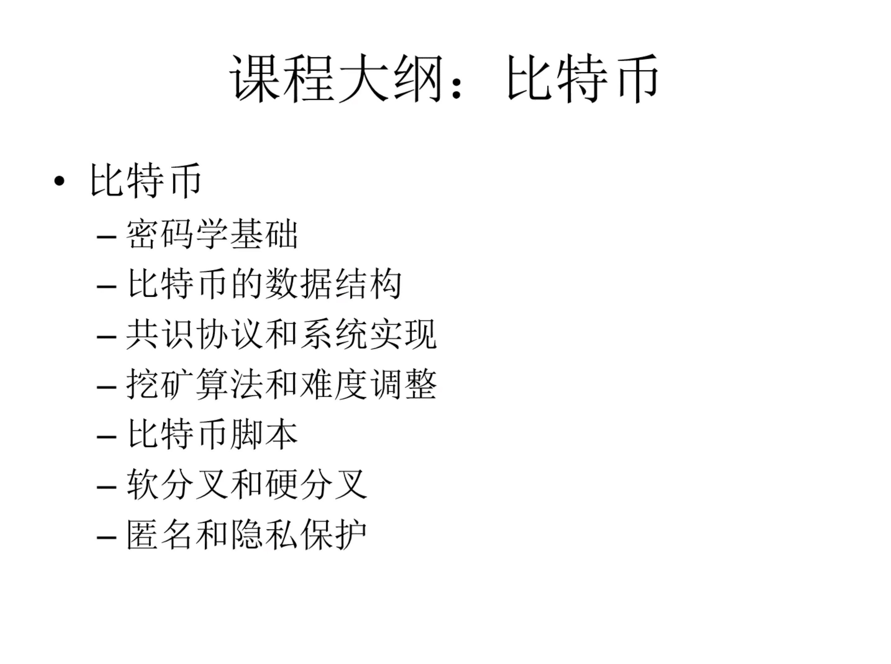

## BTC

第一次观看 BTC 部分内容总结：

（1）第一次观看时不必每个知识点都弄懂，也不一定非要做笔记，看感兴趣的部分就行；

（2）该研究生课程适合有一定基础的人：具备一定数据结构基础，掌握一些 Blockchain/Cryptography，本人科班出身，学习过南大《区块链与创新思维》课程，总体上来说，观感不错，可作为前者的进阶教程。

### BTC - 密码学原理

### BTC - 数据结构

### BTC - 协议

数字货币的发行

怎么防范 double spending attack

Bitcoin Script

Sybil attack

### BTC - 实现

比特币/区块链中用到了哪些数学知识？

Bernoulli trial

progress free（不成比例的优势）

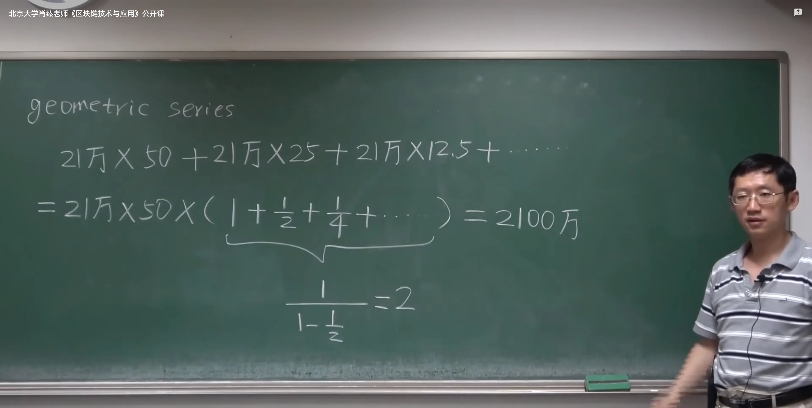

比特币的稀缺性是人为造成的。

Bitcoin is secured by mining.

selfish mining

https://www.blockchain.com/explorer

### BTC - 网络

### BTC - 挖矿难度

出块时间不是越短越好，

### BTC - 挖矿

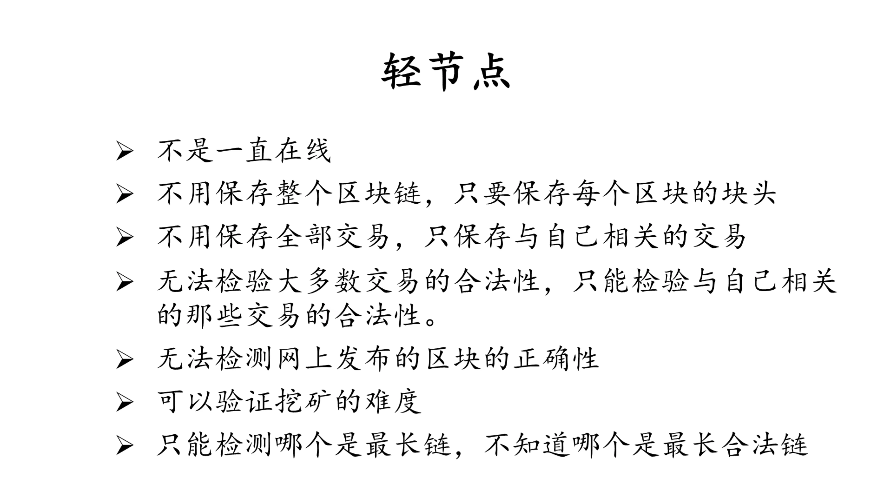

CPU，GPU，ASIC 芯片

矿池

### BTC - 比特币脚本

基于栈的语言

注：这节课内容涉及较多脚本

### BTC - 分叉

state fork：forking attack, deliberate fork

protocol fork： 比特币协议不同造成的分叉。hard fork，soft fork

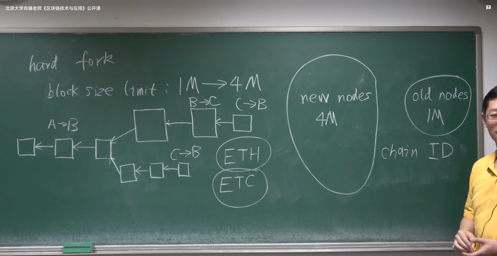

注： soft fork 系统不会有永久性分叉。

coinbase

P2SH：Pay to Script Hash

### BTC - 问答

Proof of Burn：OP_RETURN

比特币的一些数据：

Blockchain Size

Number of Unspent Transaction Outputs

矿池挖矿的情况：

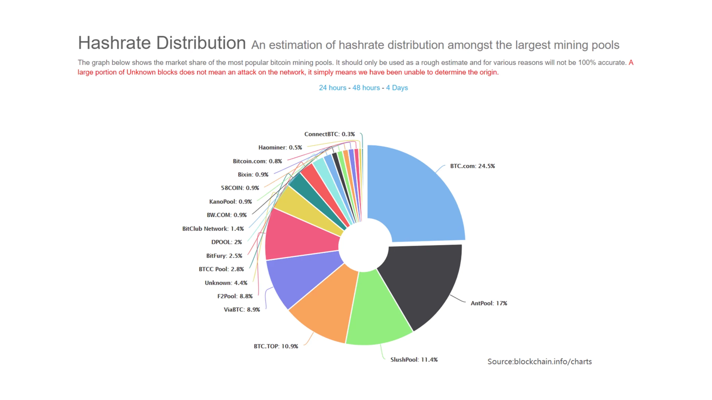

Market Price（价格）

Market Capitalization（市值）

USD Exchange Trade Volume（比特币交易量）

Confirmed Transactions Per Day

Average Number Of Transactions Per Block

### BTC - 匿名性

比特币交易的地址账户可能被关联起来；

资金的转入转出（与实体世界发生联系）；

用比特币支付，例如餐馆等（交易费用高，资金到账时间长），可能被社会工程学手段侦测出；

Silk Road 创始人被抓

hide your identify from whom?

coin mixing（可能跑路），一些钱包可能自带 coin mixing 功能，交易所天然具有 coin mixing 性质，

零知识证明：

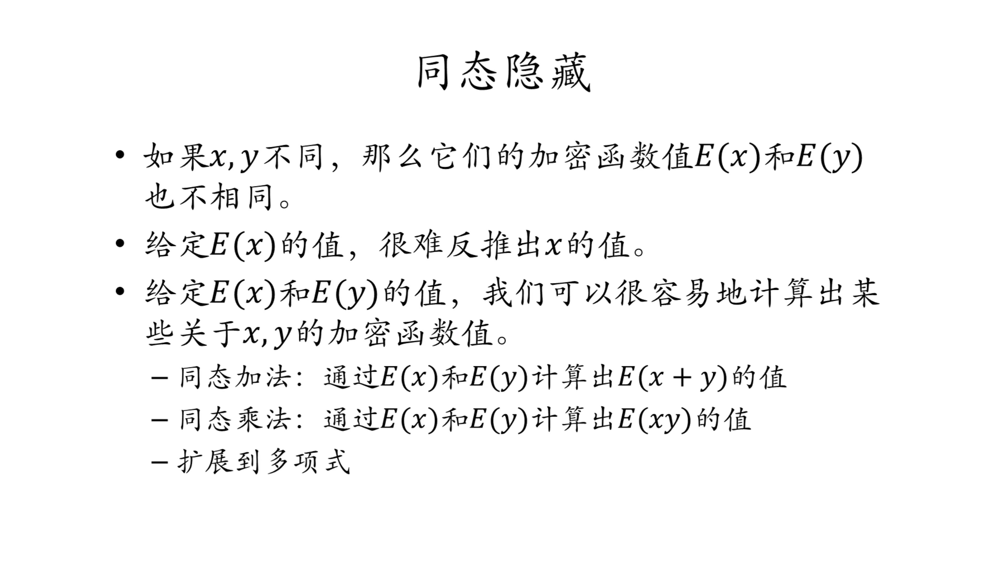

性质一的逆否命题

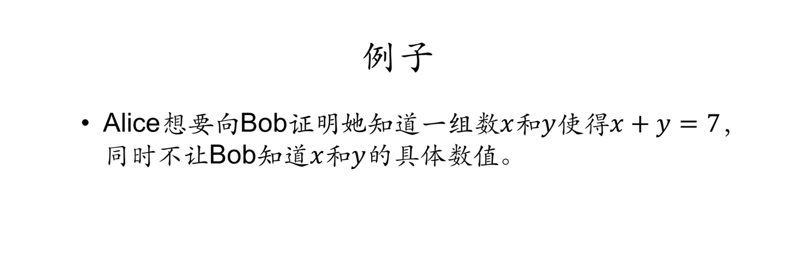

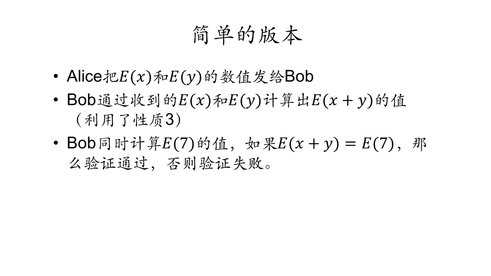

在不知道具体内容的情况下签名

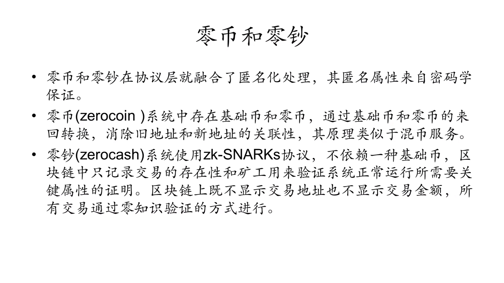

安全性与实用性之间达成平衡

### BTC - 思考

**哈希指针**：指针保存的是本地内存的地址，只在本地有意义，发送到其他计算机上就没有意义了。发布区块的时候，哈希指针是如何通过网络进行传输的。没有指针，只有哈希。

（key,value）levelDB

**区块恋**：截断私钥安全性降低，可以用多重签名。UTXO 中的死钱增多。

**分布式共识**：

为什么比特币系统能够绕过分布式共识中的那些不可能结论？

> ***知识改变命运，但是对知识的一知半解，可能使命运变得更差。***
>
> ***不要被学术界的思维限制了头脑，不要被程序员的思维限制了想象力。***

**比特币的稀缺性**：比特币这种总量固定的东西不适合拿来当作货币，（一个好的货币要自带通货膨胀功能），为什么放弃金本位，新增黄金产量跟不上社会新增财富速度，黄金会变得越来越值钱。

**量子计算**：距离实用还差很远；传统金融业首先受到冲击，加密货币总市值在现代金融体系中占比很小；量子加密算法；比特币额外保密措施：保护公钥不泄露。

## ETH

### ETH - 以太坊概述

很多人认为：用 ASIC 芯片的矿机去挖矿与当初区块链宣扬的去中心化的理念不符。

如果货币可以去中心化，还有什么可以去中心化呢？

Bitcoin: decentralized currency

Ethereum: decentralized contract

### ETH - 账户

比特币系统中，没有显视地维护这种基于账户的交易的概念，每个交易是单独处理的。需要说明币的来源。

以太坊：account-based ledger，可以防范 double spending attack

重放攻击（replay attack）：添加一个 nonce 值（发出的交易次数）。

externally owned account（外部账户）：balance、nonce。

smart contract account（合约账户）：code、storage；合约账户不能主动发起一个交易，所有交易只能由外部账户发起，但如果外部账户发起的一个交易调用了一个合约账户，这个合约账户可以发送一个 message 来调用另外一个合约。

*基于交易的账户模型在隐私保护方面做得比较好，每次交易可以换个新的账户，但是以太坊要支持的是智能合约，对于合约来说，要求参与者有比较稳定的身份。*

financial derivative（金融衍生品）

### ETH - 状态树【有点难】

从账户地址到账户状态的映射：addr -> state。【状态树用于存储以太坊区块链上所有账户的状态】

以太坊中的地址是 160 位，即 20 字节，常表示成 40 个 16 进制的数。

1）哈希表存储 addr -> state 映射？

如果跟一个人签合同，但是要对方证明一下自己账户余额，对方要怎么提供这个证明？

把哈希表中的内容组成一个 Merkle Tree，算出一个根哈希值，保存在 block header 中。如果发布一个新区块，新区块包含新的交易，执行这些新交易就会使得哈希表内容发生变化，发布下一个区块时，需要把哈希表中的内容重新组织成一个 Merkle Tree，代价太大，因为大多数账户的状态是不发生变化的。

2）用 Merkle Tree 来把所有账户都放进去，改的时候直接在 Merkle Tree 里改，每个区块更新的只是一小部分账户，所以改的只是 Merkle Tree 的一小部分。没有提供高效地查找和更新的方法【增删改查】，同时因为 Merkle Tree 节点不排序，所以 Merkle Tree 数量不唯一。

注：比特币中的 Merkle Tree 是不排序的，只有具备记账权的节点才能发布区块，这样组成的 Merkle Tree 数量才是唯一的。

> 我希望同学们上完这个课之后，不光是知道比特币、以太坊是怎么工作的，还能设计出自己的加密货币，设计出更好的数据结构。

3）trie（retrieval）

（1）每个节点的分支数目取决于 key 值中每个元素的取值范围。分叉树有时候叫做 branching factor；

（2）trie 的查找效率取决于 key 的长度；

（3）哈希碰撞，哈希表可能出现两个不同地址映射到同一个位置，trie 不会出现哈希碰撞；

（4）Merkle Tree 数目唯一；

（5）更新操作的局部性，每次发布一个区块，系统中绝大多数账户的状态是不变的，只有个别受到影响的账户的状态才会变。

上图中 trie 的存储效率低

Patricia tree/trie：压缩前缀树；

2^160 ：地址长度非常长，是去中心化的系统防止账户冲突的唯一办法，

MPT：Merkle Patricia Tree

Merkle tree VS binary tree

区块链 VS 链表：把普通指针换成哈希指针。

所有的账户组织成一个 Patricia Tree，用路径压缩提高效率，然后把普通指针换成哈希指针，就可以计算出一个根哈希值了，这个根哈希值也是写在 block header 里。比特币的 block header 里只有一个根哈希值，就是区块里包含的交易组成的 Merkle Tree 的根哈希值，以太坊里有三个根哈希值：状态树、交易树

根哈希值有什么用？

（1）防止篡改，只要根哈希值不变，整个树的任何部分都没有办法篡改，这样就可以保证每个账户的状态没有被篡改；

（2）Merkle Proof；

Modified MPT：

以太坊中的结构是一个大的 MPT，包含很多小的 MPT，每个合约账户的存储都是小的 MPT。

为什么要维护这些历史记录：

以太坊中的出块时间降到十几秒，临时性的分叉是一种常态。例如上图中，下面的区块分叉后需要回滚，取消该区块中的状态，退回到分叉前的区块的状态，然后沿着上面的链推进。

以太坊支持智能合约，智能合约是图灵完备的，理论上可以实现很复杂的功能，跟比特币中简单的脚本还不一样，如果不保留以前的状态，智能合约执行完之后，不可能再推算出前面的状态。

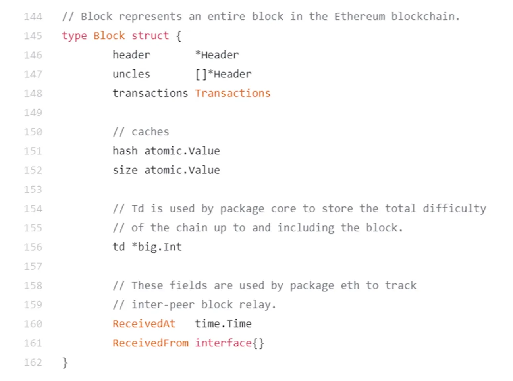

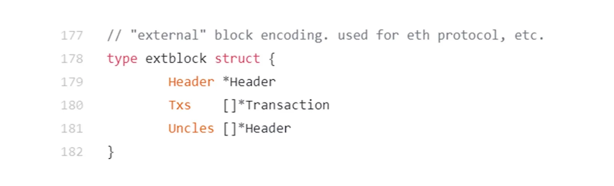

（key, value)：前面讲的都是`key`，也就是地址的管理方式，那`value`，即状态是怎么存储在状态树中的？用 RLP（Recursive Length Prefix）做序列化，然后存储。

protocol buffer （Protobuf）

RLP 的理念就是越简单越好，只支持一种类型，nested array of bytes，说白了就是字节数组，以太坊中所有的其他类型，整数、哈希表等，最后都要变成这个 nested array of bytes。

### ETH - 交易树和收据树

交易树用于存储以太坊区块中的交易：

- 每笔交易会被哈希化，然后这些哈希值组合成默克尔树的叶子节点；
- 通过组合这些叶子节点的哈希值，最终生成一个根哈希；
- 区块头中包含该交易树的根哈希，确保交易的完整性和不可篡改性；

收据树：存储每个交易的执行结果（收据），包括交易是否成功、消耗的 gas 以及日志事件等。  

- **状态树**：存储账户的当前状态（余额、存储、代码等）。
- **交易树**：存储一个区块中的所有交易。
- **收据树**：存储每个交易的执行结果（收据）。

这三棵树的根哈希值都是包括在块头中。

为什么需要收据树这个数据结构？以太坊智能合约执行过程较为复杂，通过收据树有利于快速查询执行结果。

如何查找过去 10 天中，所有与某个智能合约有关的交易？搜索过去 10 天的所有交易，查找符合条件的交易，但是这么做复杂度很高；轻节点没有交易列表，只有块头信息，没有通过扫描交易列表来查找符合查询条件的交易。如果要查找过去 10 天的所有众筹事件，发币事件，又该如何操作呢？

bloom filter：可以比较高效的查找某个元素是否在一个较大的集合里。

可能出现 false positive，但是不会出现 false negative，也就是说可能出现误报，但不会出现漏报。

每个交易执行完之后会形成一个收据，这个收据里面就包含了一个 bloom filter，记录这个交易的类型、地址等信息，发布的区块在它的块头里有一个总的 bloom filter，这个总的 bloom filter 是区块中所有交易的 bloom filter 的并集。要查找过去 10 天中，与某个智能合约有关的所有交易，先查下哪个区块的块头中的 bloom filter 有我们需要的交易类型，如果没有的话，那这个区块就不是我们需要的，如果有的话，再去查找区块中的交易对应的收据里的 bloom filter，去确认，也可能都没有，因为 false positive。通过这个结构可以快速过滤掉无关区块。

以太坊的运行过程可以看作是一个交易驱动的状态机（transaction-driven state machine）。

问题一：有人在以太坊上发布一个交易，某个节点收到这个交易，这个交易说从 A 转账到 B，有没有可能收款地址是节点之前从未听说过的？以太坊与比特币一样，创建账户时不需要通知其他人，只有该账户第一次收到钱时，其他节点才会知道该账户的存在，这个时候要在状态树中新插入一个节点。

A -> B (10 ETH)

问题二：状态树和交易树、收据树的一个区别是：状态树要包含系统中所有账户的状态，无论账户是否参与了当前区块中的交易，能不能将状态树的设计改一下，改成每个区块的状态树也只包含这个区块中的交易相关的那些账户的状态？（这样还能大幅削减每个区块对应的状态树的大小）

A 给 B 转账时，需要知道 A 的状态才能知道 A 是否有足够 ETH 来给 B 转账，也需要知道 B 的账户状态，当前余额是多少，因为要往 B 账户上添加 10 个 ETH，而 B 账户可能是个新建的账户，这个时候要找到哪去？要找到创世纪块去，才能发现 B 是个新建的账户。

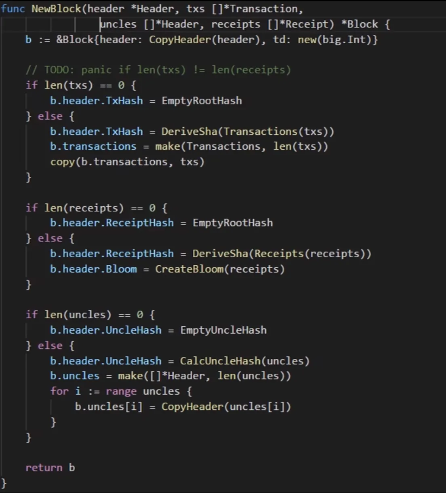

block.go 中，NewBlock 函数里调用 DeriveSha 来得到交易树和收据树的根哈希值。

创建收据树，计算根哈希值，创建 bloom filter。

计算叔父区块的哈希值，构建叔父数组。（下节课讲 GHOST 协议会用到）

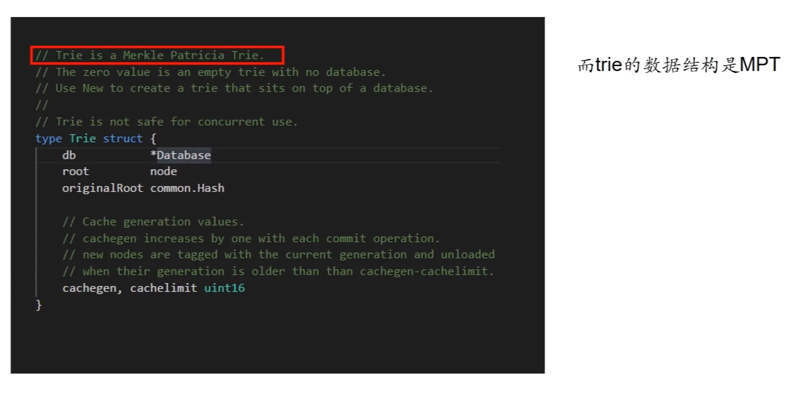

### ETH - GHOST

最多可以有两个 uncle block。

GHOST 协议的核心思想，是对那些挖到矿，但是最后没有得到认可的矿工一种安慰。虽然矿工挖的区块没有成为最长合法链上的区块，但是依然能获得大部分的出块奖励（八分之七）。

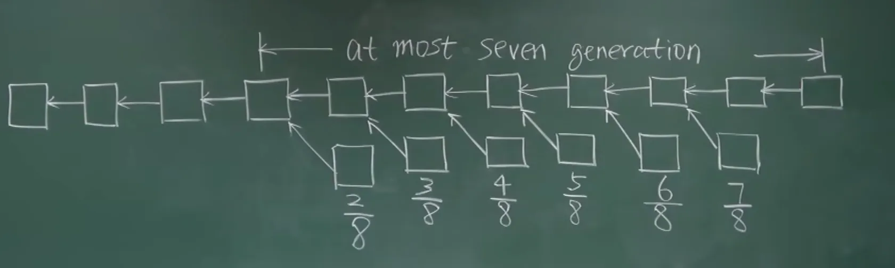

解决系统中出现的临时性分叉。

以太坊发布区块的奖励包括：block reward、Gas fee。uncle block 不获得 Gas fee。

子链不检查 uncle block 交易的合法性，也不执行其中的交易（因为可能与主链交易冲突），只检查它是不是有效区块，即是否符合挖矿难度。

某用户发布了一个交易，但是这个交易被打包在 uncle block 中，交易本身没有被执行，主链中的节点收到交易后会来执行。

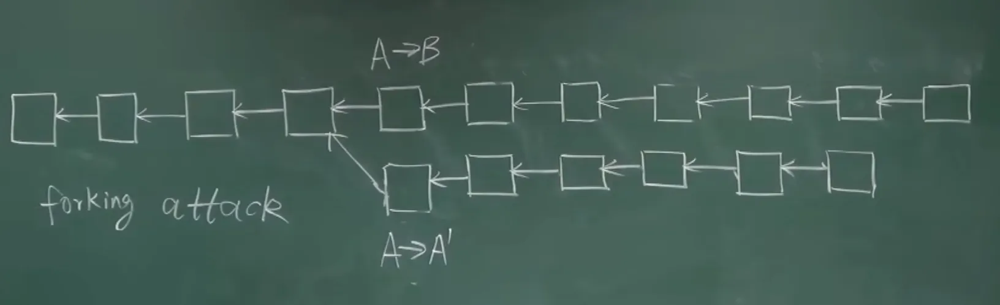

以太坊中规定：只有分叉后的第一个区块可以获得 uncle reward。

### ETH - 挖矿算法

Block chain is secured by mining.

bug bounty

比特币天然就是个 bug bounty，挖矿算法比较安全，经受住了时间检验。

one cpu, one vote. 现在的 ASIC 芯片挖矿不符合中本聪初衷。

理想情况下是 ASIC resistance，ASIC 矿机相比普通 PC 算力强上千倍，但是内存访问效率远没有这么高。如果能设计对内存要求很高的 puzzle，就能遏制 ASIC 芯片（memory hard mining puzzle）。例如 Litecoin（莱特币），曾经市值仅次于 Bitcoin，采用 scrypt 哈希函数（对内存要求很高）。

开设一个很大的数组，按顺序填充一些伪随机数，假设有个 seed（种子值），将 seed 值通过一些运算得到一个数，填到第一个位置，后面每个位置都是前一个位置的值取哈希得到的，为什么说是伪随机数，因为取哈希得到的值是什么不知道，看起来像随机数，不可能真的用随机数，因为无法验证。

数组填充时，取值是有前后依赖关系的，从第一个数依次算出来的，需要求解 puzzle 时，按伪随机的顺序，从数组中读取一些数，每次读取的位置，也是跟前一个数相关的。假设要解 puzzle 了，读取下图中 A 位置的数，根据这个数进行一些运算，算出下一次要读取的位置 B，再将 B 位置的数经过一些运算，算出下一个要读取的位置 C，这个过程也是一个伪随机的。这样做的好处是，如果数组开得足够大，对矿工来说就是 memory hard，如果不保存数组，挖矿的计算复杂度会大幅度上升。例如求解 puzzle 时，一开始需要读取 A 位置，若没有这个数组，就得从第一个数依次算，算出位置 A 的值，要读取第二个位置的数，也是从头开始算，算出位置 B 的值，以此类推。有的矿工保存一部分数组内容，例如只保留奇数位置的元素，偶数位置的元素可以计算出来，这样数组可以少一半。time-memory trade off。

要设计一个对 ASIC 不友好的，即使是普通计算机也能参与的，不能像比特币那样主要进行哈希运算（比特币进行两次哈希），而要增加运算过程中对内存访问的需求。设计的 puzzle 要像普通计算机干的事情，而不是像挖矿专用 ASIC 芯片干的事情。普通计算机对资源的配备比例，例如很大的内存，硬盘容量等。

对矿工来说是 memory hard，对轻节点来说也是，故而实际运行中设置为 128K。

mining puzzle 设计思想：difficult to solve, but easy to verify.（求解 puzzle 很难，验证很容易）

莱特币挖矿最后还是出现了 ASIC 挖矿，GPU 挖矿，设计目标没有实现，但是这个目标有助于解决冷启动问题。

比特币的冷启动：早期比特币玩家少，系统不安全，中本聪的宣传，吸引一些玩家，参与者越多，系统就越安全，比特币价值就越高，就越能吸引更多玩家，形成良性循环。

莱特币主张民主的设计理念，吸引了很大一部分人，而且出块时间大约是 2 分半，大约是比特币的四分之一，其他与比特币基本一致。

以太坊也是 memory hard puzzle，但与莱特币区别很大

> 注：课程视频 20:30 后的内容未记录。

### ETH - 难度调整

比特币每隔 2016 个区块会调整一下挖矿难度，目标是维持出块时间在 10 分钟左右，

### ETH - 权益证明

### ETH - 智能合约

 

### ETH - TheDAO

### ETH - 反思

### ETH - 美链

## 总结

## 补充资料

Blockchain Research：http://zhenxiao.com/blockchain_research/

2021 年 5 月 19 日，虚拟货币价格经历过山车，肖臻老师接受 [中国财经专访](https://finance.china.com.cn/news/20210526/5580833.shtml)：

肖臻谈到：“这次暴跌之前很多加密货币的价格已经严重虚高，泡沫很大，出现暴跌其实并不奇怪。DeFi等衍生品设计上存在一些不完善的地方以及市场杠杆率过高也会导致暴跌时引发多米诺骨牌效应，导致崩盘。”

他还提示了炒币属于投机行为：“目前购买加密货币的很多属于投机行为，今年以来动物币的疯狂暴涨更是加剧了这一现象。加密货币的交易所大多设在难于监管的地方，存在很多不合规的行为，比如刷交易量、插针、定点爆仓等都是被广为诟病的。这些如果发生在正规的股票、期货交易所是属于刑事犯罪的。这次暴跌的直接原因是政府加强了对加密货币的监管，从长远来看，这是大势所趋。未来的监管措施会从保护投资者利益、防范系统性金融风险的角度出发对市场乱象进行整治。”