> 这篇文档是我 2022 年 5 月学习《从区块链出发的元宇宙与Web3》视频时整理的笔记。原视频发布于B站，不知何原因已下架，目前仅存于 YouTube 缓存。
>

视频缓存：https://www.youtube.com/watch?v=4hjfYUf7d9c

视频中梳理了元宇宙与Web3的主流定义，回顾了区块链的核心原理与特性，并重点探讨了区块链如何从技术、治理、创作者经济及组织形式等维度，支撑起元宇宙与Web3的构建与发展。内容涵盖NFT、DAO、ENS等关键案例，也引述了多位领域内知名投资者的观点。

现将笔记公开分享，既为个人学习存档，也希望能为同样对区块链、元宇宙与Web3感兴趣的朋友提供一份结构化的参考。

## 元宇宙、Web3主流定义

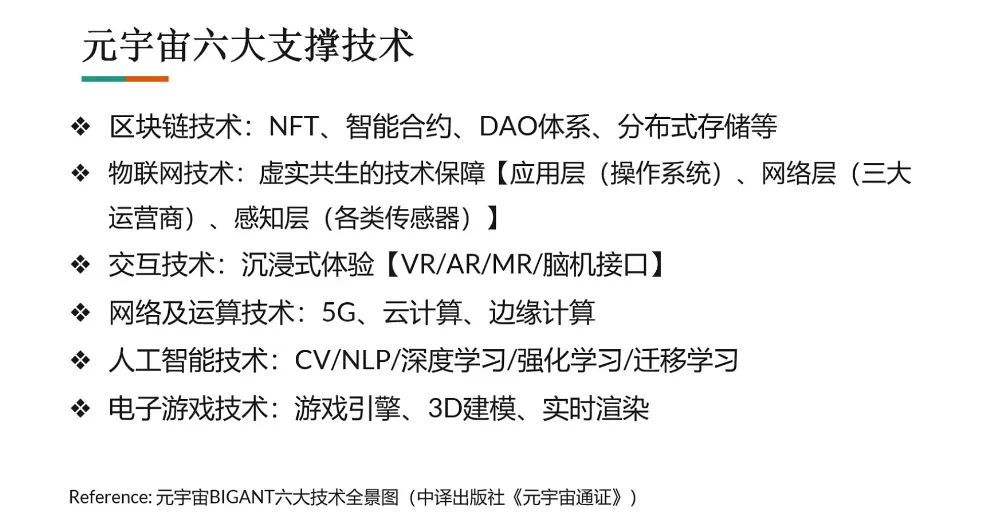

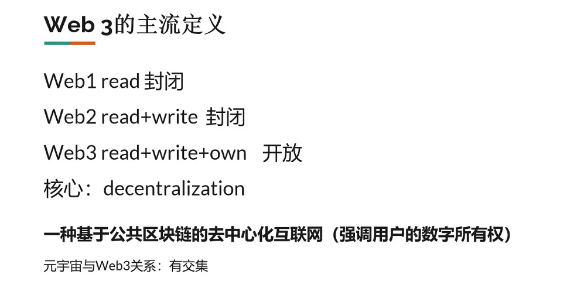

## 区块链的原理与基本性质

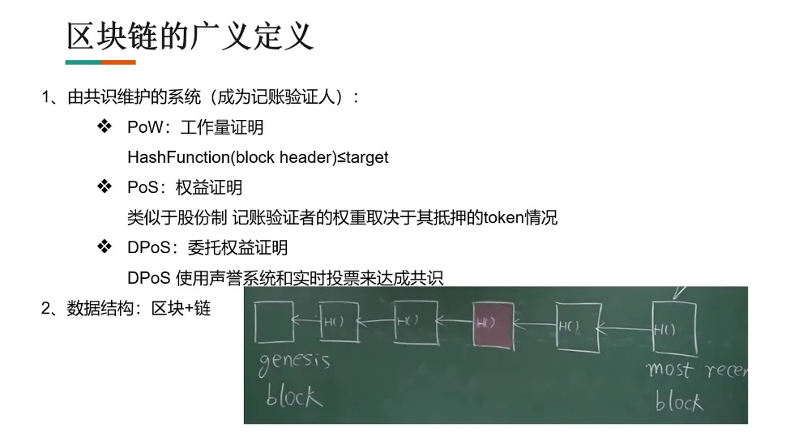

## 区块链如何支持元宇宙与Web3？

### 基于区块链的不同视角

A16Z合伙人、Coinlist创始人、Paradigm联合创始人观点

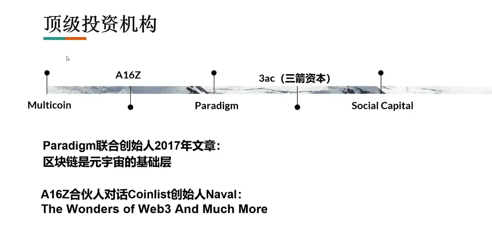

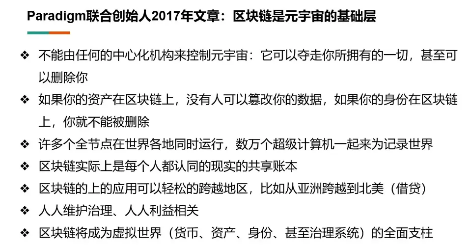

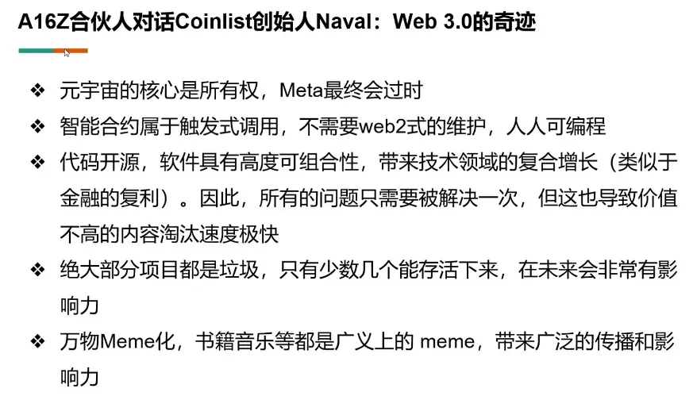

注：两位大佬播客对话视频值得一看

### 利他的ETH基金会与ENS DAO

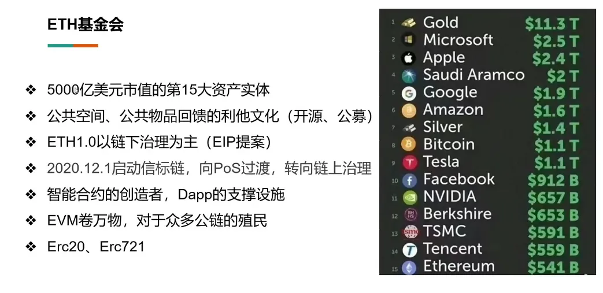

注：加密市场是个不可能忽视的市场

### 赋权创作者的NFT

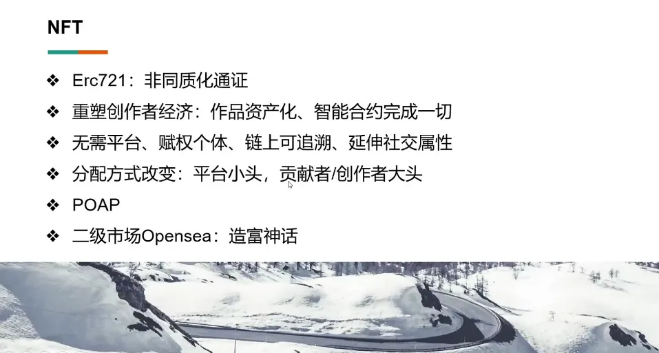

### 全新的治理、协作组织形式DAO

注：作者看好这个

### 区块链的三难问题

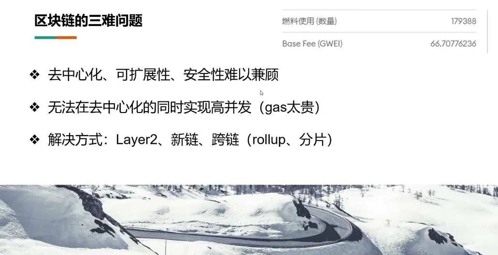

### 我们的链上名片

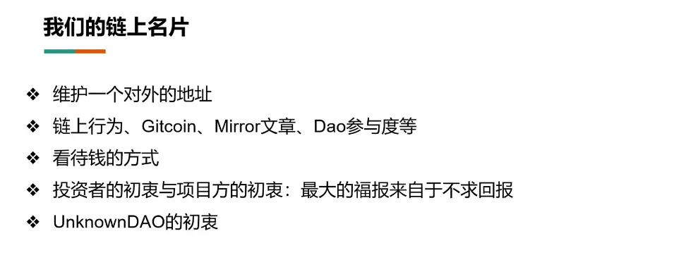

## 参考资料与推荐读物

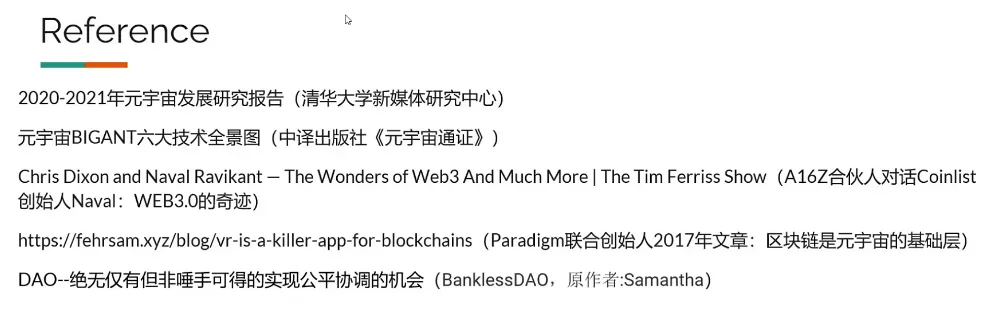

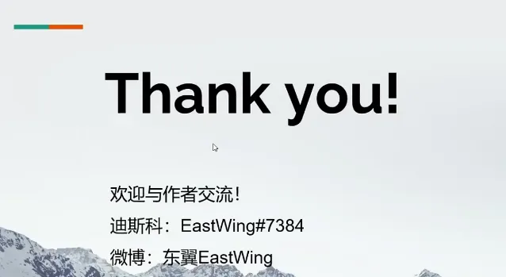