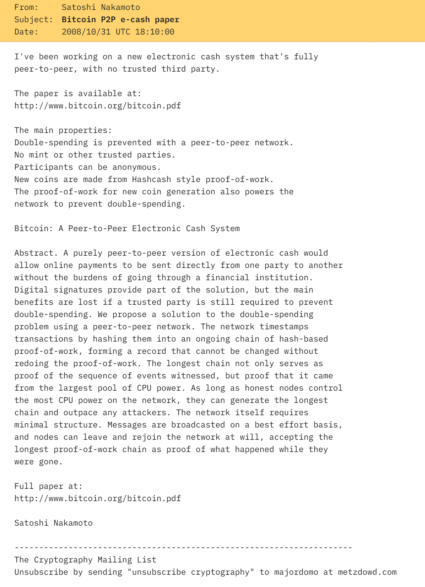

比特币并非横空出世的单点创新，而是将数十年间关于**私人货币、密码学隐私工具、点对点网络与工作量证明**等多条演进路径，在 2008-2009 年的历史窗口期内，组合为一个可运行的、开放参与、抗审查的电子现金系统。

根据 "[Bitcoin 101: past, present and future](https://www.btcstudy.org/2023/02/12/bitcoin-past-present-future-part-1/)" 整理如下：

1933 年，富兰克林·罗斯福（Franklin Roosevelt）总统签署了 6102 号行政令，禁止私人使用直接形式的货币（例如金杜布隆（doubloons）和金币）和间接形式的货币（例如代表抵押品的银行票据和金块），政府没收了所有公民的黄金，这件事对理解比特币的历史极为重要，因为这件事情发生在被认为是“自由大陆”、宪政自由民主政体的故乡；

> 一个奇怪的事实是，中本聪将自己的出生日期写为 1975 年的 4 月 5 日：4 月 5 日正是罗斯福签署 6102 号行政令的时间，而 1975 年是 Gerald Ford（杰拉尔德·福特）总统取消这一行政令的时间。
>
> 比特币的难度调整算法是每 2016 个区块发生一次，这个数字正是上述行政令的编号（6102）的倒序。
>

1936 年，Alan Turing（阿兰·图灵）发表《论可计算的数字以及可判定性的运用》，为信息革命奠定了理论基础；

1971 年，尼克松暂停美元与黄金的汇兑；

1976 年，研究员 Diffie（迪菲）和 Hellman（赫尔曼）发表《密码学的新方向》，非对称密码学理论诞生；

1978 年

- Rivest（李维斯特）、Shamir（沙米尔）和 Adleman（阿德尔曼）发表《一种获得数字签名和公钥密码系统的方法》，使非对称密码学成为现实；
- Hayek（哈耶克）出版《货币的去国家化》，反对国家对货币的垄断；

1979 年，Ralph Merkle（拉尔夫·默克尔，Merkle Tree 的提出者）为 Merkle Tree 的想法申请专利；

1980 年，Samuel Konkin III 发表《新自由意志主义宣言》，倡导一种激进的思想：“光叙说自由的美丽和统治的丑陋是不够的，我们还必须采取务实的行动，开发出能够抵御统治的技术工具。”，这种思想后来被“密码朋克”运动继承了；

1981 年

- 互联网协议（IP）发行了第四版（IPv4）；
- David Chaum（大卫·乔姆）设想了一种使用数字假名、无法追踪的电子邮件协议，并出版了《不可追踪的电子邮件、返回地址以及电子假名》，标志着使用非对称密码学来签名消息（而非加密文本）的用法的开端；

1982 年，《自由的伦理》建议废除美国联邦储备委员会，回到市场化货币模式；

1983 年，David Chaum 出版《用于不可追踪的支付的盲签名》，第一次提出使用密码学签名系统来构造不可追踪的电子支付的想法；

1985 年，出版《椭圆曲线密码学》，提出了一种基于有限域椭圆曲线、替代 RSA 的公钥签名算法；

1988 年，Timothy May（蒂莫西·梅）发表《密码无政府主义宣言》，总结部分写道：“在物理世界中，国家控制着我们，但在互联网的电子世界中，感谢密码学，只要我们开发出了正确的工具，国家就无法控制我们。我们可以创造假名、交换思想服务和产品，而不必忍受监视”；

1989 年，David Chaum 基于非对称密码学和盲签名开发了 DigiCash，它基于电子货币 Ecash，Ecash 可以在网络中传输、用于完成在线支付，用户可以从银行和其它金融机构购买 Ecash，实现快速和安全的支付；

> 这还不是比特币，但我们离它更近了。
>

1990 年，Claus Schnorr（克劳斯·施诺尔）为一种使用椭圆曲线密码学的签名算法申请了专利，对比特币的日后改进（例如 taproot）非常重要；

> 在 2008 年，Satoshi Nakamoto（中本聪）并没有使用 Schnorr 签名，虽然那个时候 Schnorr 的专利已经到期了，但中本聪认为将这么重要的系统构筑在一种新的、未经生产环境考验、缺乏审计、测试和同行评议的技术上，可能有危险。相反，他选择了不那么高效的 ECDSA 的算法，ECDSA 还不像 Schnorr 签名那样支持签名聚合。
>

1991 年

- Phil Zimmermann（菲尔·齐默尔曼）发明了 PGP (Pretty Good Privacy) 软件，它的作用就是为用户生成一对公私钥。公钥用来加密要发给其所有者的消息，而其人的私钥则用来解密这样的信息和文档；
- 研究员 Haber 和 Stornetta 发表论文《如何为电子文档添加时间戳》（中本聪在比特币论文中也引用了这篇文章），在该文中，两位研究员发掘了证明一份文档在给定时间就已存在的技术，但比特币必须做到更多：在相同的时间间隔同时证明“存在性”和“唯一性”；

1992 年，密码朋克团体在旧金山诞生，自由意志主义的积极分子主张大量运用计算机密码学，作为社会和政治变革的路径；

> 著名记者 Julian Assange（朱利安·阿桑奇）也是这个团体的成员。
>

1993 年，《密码朋克宣言》出版，密码朋克和密码无政府主义的区别在于，后者主张使用密码学技术，作为在社会中支持无政府主义和个人注意的工具，但密码朋克是使用密码学来变革社会和政治的活动家；

1994 年，Timothy May 出版《The cyphernomicon》（直译为 “密码学”），探讨了密码学技术可以如何用来保护个人数据的隐私性、创建用于交换商品和服务的网络而无需政府机构的控制、在日益相互连接的世界中保护言论自由；

> 90 年代的密码学战争（Crypto Wars）：美国政府将强加密技术视为军用物品，出口受到严格限制，极大地限制了加密技术在全世界的推广。

1997 年

- Adam Back（亚当·贝克）为解决垃圾邮件轰炸而提出了 HashCash，这就是比特币的工作量证明；
- Nick·Szabo（尼克·萨博）提出智能合约；
- 《主权个人》出版；

> 中本聪在论文中引用了亚当·贝克和他的 HashCash 论文，作为创造比特币的基础。
>
> 不过，出版于 1992 年的论文《通过运算来定价，打败垃圾邮件》已经提出了类似的想法。

1998 年

- Nick·Szabo 发明 BitGold（2005 年才完整公开）；
- Wei Dai 发表论文 B-Money；
- Peter Thiel（彼得·蒂尔）创建了 Confinity，一种用于电子商务的在线支付系统，但他的愿景类似于比特币：“在现实世界中，你需要跟你所在国度的货币打交道，但到了互联网上，你就是赛博空间的公民，因此是无国界的、无官僚主义的，你将用 confinty 货币来支付。”；

> Nick·Szabo 和 Wei Dai 的设想都受困于同一个问题：资金可能被重复花费（Double Spending Attack）。

1999 年

- Elon Musk（伊隆·马斯克）创建了 X.com；
- Milton Friedman（米尔顿·弗里德曼）预言：“我认为，互联网将是削弱政府权力对人们生活的影响的重大力量。但还少了一样东西 —— 我觉得很快就会有人发明出来 —— 一种互联网电子货币，允许 A 将资金转移给 B 且 B 不必认识 A。这样的系统还不存在，但一定会出现的，而且它会让互联网变成最伟大的变革。”

2000 年，Elon Musk 的 X.com 和 Peter Thiel 的 Confinity 合并了，PayPal 由此诞生，监管介入，PayPal 放弃了互联网货币的想法，转而成为了传统货币的一个支付网络；

2001 年

- Bram Cohen（布莱姆·科亨）创建 BitTorrent，一种点对点的网络协议，出现了可以传输音乐、视频和电子文件的 Napster，但它是以中心化的范式运行的；
- 美国发生 911 恐怖袭击后，出台严格的金融管制（在反恐的口号下），官员要求有权知道每一个人的每一笔资金动向以及理由（无论是否身处美国司法辖区）；
- Adam Back 向 16 岁的 Peter Todd（彼特·陶德） 解释，HashCash 不仅可以用于对抗垃圾邮件，还可以作为电子现金货币系统的基础。Peter 向 Adam 指出了一个问题：如果这种工作量证明是可以在主体间转移的，那么它将会恶性通胀；推理过程是，使用工作量证明可以证明了你付出了一些计算代价（机器的时间和能量），而关键是让工作量证明可以转移，也就是证明了某人花费了时间和投入了机器，而我只是复用了已经发生的计算代价：

在 2001 年完成的一个工作量证明，将跟 2022 年完成的工作量证明截然不同，因为机器的计算力是指数增长的，所以 2001 年的工作量证明会变得毫无意义；

如果人们对 “电子货币” 有很大的需求，那么它的价格会上升，其盈利空间也会增加，更多人会尝试加入，从而创造更多供给量。而供给量的增加会让价格回落；因此，糟糕的经济周期会出现，就像法币系统一样；

> 解决方案就是自动化的难度调整，这将由中本聪来实现。
>

2003 年，视频游戏 Second Life 爆火，游戏中的 Linden Dollar 货币可以在场内外交换，单位价值大大超过了单位美元，结果招来监管打击，被迫让 Linden Dollar 跟美元保持 1：1 的锚定价格；

2004 年，密码朋克 Hal Finney（哈尔·芬尼，PGP 2.0 的作者）发明“可复用的工作量证明（RPOW）”，最终让 HashCash 的工作量证明变得可以转移，但重复花费问题依然存在；

2005 年，Nick·Szabo 完整公开了 BitGold（构思于 1998 年的电子货币），而且可以认为其通过创建货币以及对交易历史投票，解决了重复花费问题；

> 已经非常接近比特币的想法。
>

2008 年

- Schnorr 签名算法的专利过期了（虽然中本聪没有选择它）；
- 次贷危机引发全球金融危机；
- 2008 年 10 月 31 日（UTC），中本聪发布比特币论文。

2009 年 1 月 3 日，第一个比特币区块挖出。
