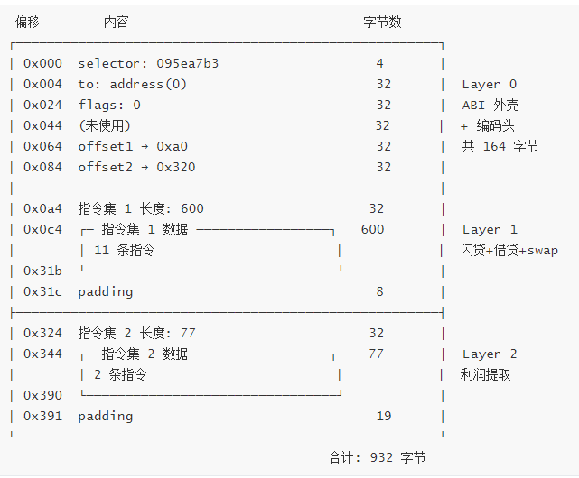
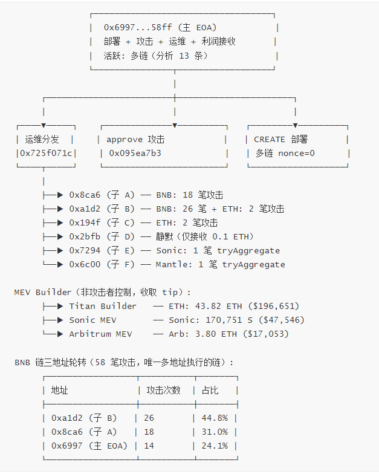

# Moonwell 安全事件深度分析：攻击合约逆向工程与链上取证

**声明**：本报告仅用于安全研究与教育目的，报告中涉及的攻击手法分析旨在帮助协议团队和安全社区理解威胁模型、改进防御措施。本报告不提供完整的攻击合约源码。

## 摘要

Moonwell 是一个去中心化、非托管的借贷协议（Lending & Borrowing Protocol），最初构建在 Polkadot 生态的 Moonbeam 和 Moonriver 网络上，后扩展至 Coinbase 的 Layer 2 网络 Base 以及 Optimism，其中 Base 链是其核心阵地。2025 年 10 月至 2026 年 2 月的半年内，该协议连续遭遇三次 Oracle 相关安全事故，累计产生超过 700 万美元坏账，成为 DeFi 领域 Oracle 风险的典型案例。

本报告聚焦前两次事故（2025-10-10 和 2025-11-04）中攻击者使用的合约基础设施。攻击者在几乎所有 EVM 及其兼容链上部署了攻击合约 `0xA98E339f`（以下简称 AttackEngine，缩写 AE，涉及 2025-10-10 事故），并在 Base 链上另行部署了同源合约 `0x42Ecd332`（以下简称 MevBot，涉及 2025-11-04 事故）。本报告选取了其中 **13 条公链**的 AE 攻击交易及 Base 链的 MevBot 攻击交易进行逆向分析。通过对链上字节码的逆向工程，我们发现：这些部署实质上是**同一份 Solidity 源码的参数化部署**（24,543 字节 runtime bytecode，差异仅为各链 wrapped native token 地址和编译器 IPFS 元数据，典型值 132 字节）。更进一步，通过资金链追溯，我们在 Base 链上发现了攻击者部署的 6 个前代合约，揭示了一条跨越 **14.5 个月**的系统化开发路径——从 14,000 字节的早期原型迭代到 24,543 字节的生产级跨链攻击引擎。

我们将攻击合约完整重建为 800+ 行 Solidity 源码（`AttackContract.sol`），并通过 **141 笔 Mainnet fork replay 测试（9 条链 + Base），全部 PASS（100%）**，在 wei 级别验证了重建合约与链上部署的功能等价性。攻击者跨链总到手利润约 **\$4.63M**（Base 链净提取 295.75 ETH ≈ \$1.06M + 其余 13 条链部署合计 ≈ \$3.56M）。


## 一. Moonwell 协议与 Oracle 危机

### 1.1 协议简介

Moonwell 是一个去中心化、非托管的借贷协议（Lending & Borrowing Protocol），最初构建在 Polkadot 生态的 Moonbeam 和 Moonriver 网络上，后来扩展到了 Coinbase 的 Layer 2 网络 Base 以及 Optimism。其核心机制类似于 Compound Finance——用户可以将加密资产存入流动性池赚取利息，也可以通过超额抵押的方式借出资产。协议采用算法利率模型，根据市场供需动态调整借贷利率。

在借贷协议中，价格 Oracle 是整个系统的命脉——它决定了抵押品值多少钱、借款人的 Health Factor 是否健康、何时触发清算。一旦 Oracle 报错，整个协议的经济模型会在几秒内崩塌。

过去六个月内，Moonwell 经历了三次 Oracle 相关事故，累计产生超过 700 万美元坏账，堪称 DeFi 领域 Oracle 风险的"活教材"。

### 1.2 三次 Oracle 事故

#### 事件一：2025-10-10 — Chainlink 价格偏差事件

Chainlink 的预言机价格 feeds 将 AERO、VIRTUAL 和 MORPHO 三种资产的报价定得低于 Base 上 DEX 池的实际价格。攻击者反复利用闪电贷借入 USDC/cbBTC，然后从 Moonwell 以 85-88% LTV 借出这些被低估的资产，在 DEX 上以更高价格卖出，偿还闪电贷后获利。

| 指标 | 值 |
|------|-----|
| 涉及合约 | AE `0xA98E339f`（部署于几乎所有 EVM 链） |
| 根因 | Chainlink 预言机报价低于链上 DEX 实际价格 |
| 受影响资产 | AERO、VIRTUAL、MORPHO |
| 清算规模 | >$12M |
| 协议坏账 | $1.7M |
| 后续处置 | 治理提案动用协议储备金弥补坏账 |

这次事件暴露了两个层面的问题：Chainlink 中心化预言机报价与链上 DEX 价格之间的结构性偏差，以及协议为高波动性代币设置了过高的 LTV（85-88%）。

#### 事件二：2025-11-04 — wrsETH 预言机异常事件（本报告重点）

wrsETH 市场使用 `(wrsETH/ETH) × (ETH/USD)` 的 Chainlink feeds 来定价。其中 wrsETH/ETH 预言机是基于市场价格而非兑换汇率。事件前一日（2025-11-03），Balancer——当时 rsETH 最大的流动性来源——遭到黑客攻击，很可能导致该预言机输出了一个荒谬的数值：**1 wrsETH ≈ 1,649,000 ETH**（约 $5.8B）。

攻击者（经链上数据验证，与 10/10 事件为同一人）在预言机报告错误数据后约 **30 秒**内就发起首笔攻击，存入少量被高估的 wrsETH 作为抵押品，借出大量代币并通过 DEX 套现。随后在约 26 秒内（05:44:57 ~ 05:45:23 UTC）连续发送 12 笔攻击交易。

| 指标 | 值 |
|------|-----|
| 涉及合约 | MevBot `0x42Ecd332`（部署于 Base 链） |
| 根因 | wrsETH/ETH 预言机基于市场价（受 Balancer 被黑影响），而非兑换汇率 |
| 预言机偏差 | ~1,657× |
| 攻击窗口 | 约 30 秒 |
| 攻击者获利 | 净提取 295.75 ETH（≈$1.06M，按 2025-11-04 ETH $3,600.72） |
| 协议坏账 | ≈$3.7M（据 Halborn Security） |
| Base 链攻击交易 | 15 笔（14 成功 + 1 失败） |

> 注：事件一和事件二的攻击者为同一人，使用的 AE 和 MevBot 是同一份源码的不同部署（详见第 2 章）。该攻击者通过 AE 在 13 条公链上的攻击利润合计 ≈\$3.56M，加上 MevBot 在 Base 链的 ≈\$1.06M，跨链总到手利润约 **\$4.63M**。

#### 事件三：2026-02-15 — cbETH 预言机配置错误（"Vibe Coding" 事件）

当治理提案 MIP-X43 被执行以集成 Chainlink OEV（Oracle Extractable Value）wrapper 合约后，其中一个 oracle 配置错误——cbETH 的 USD 定价仅使用了原始的 cbETH/ETH 汇率（约 1.12），而没有乘以 ETH/USD 价格。结果系统将 cbETH 报价为约 **$1.12**，而非其实际市场价约 $2,200。

清算机器人立即对 cbETH 抵押头寸发起攻击。由于系统认为 cbETH 仅值 1 美元多，清算者只需偿还约 $1 的债务即可清算大量抵押品。

| 指标 | 值 |
|------|-----|
| 根因 | 治理提案代码中 Oracle 配置错误：`cbETH/ETH` 汇率未乘以 `ETH/USD` |
| 被清算资产 | 1,096.317 cbETH |
| 协议坏账 | $1,779,044.83 |

### 1.3 三次事故的共同主题

三次事故呈现出清晰的模式：

| 事件 | 日期 | Oracle 问题类型 | 坏账 |
|------|------|----------------|------|
| 事件一 | 2025-10-10 | 报价偏差（低于 DEX 价格） | $1.7M |
| 事件二 | 2025-11-04 | 报价异常（1,657× 偏差） | $3.7M |
| 事件三 | 2026-02-15 | 配置错误（漏乘 ETH/USD） | $1.78M |
| **合计** | | | **>$7M** |

从报价偏差 → 异常数值 → 配置错误，三次事故涵盖了 Oracle 风险的三个典型维度。借贷协议对 Oracle 的单点依赖，使得任何定价层面的异常都可能在几秒内被利用。

### 1.4 本报告的范围

本报告聚焦于**事件一和事件二中攻击者使用的合约基础设施**。通过链上字节码逆向分析，我们将：

- 证明两次攻击使用同一套合约，且该合约在几乎所有 EVM 链上均有部署（本报告选取 13 条公链分析）
- 追溯攻击者 14.5 个月的合约迭代开发历程
- 详细分析攻击合约的 calldata 驱动 VM 架构
- 逐字节解析一笔典型攻击交易的执行过程

事件三（2026-02-15）属于治理提案代码审查缺陷，与合约层面的攻击无关，本报告不做深入分析。


## 二. 攻击者基础设施：一份源码，多链部署

### 2.1 部署者与合约地址

攻击者使用单一 EOA 地址部署所有合约：

| 角色 | 地址 |
|------|------|
| 部署者 / 利润接收者 | `0x6997a8c804642AE2de16D7B8Ff09565a5D5658ff` |
| AE — AttackEngine（多链） | `0xA98E339f5a0F135792286d481B4e23d91A667d3f`（nonce=0，涉及事件一） |
| MevBot（Base 链） | `0x42Ecd332D47C91CbC83B39bD7f53CEbe5E9734bB`（nonce=53，涉及事件二） |

两个合约地址可通过 `cast compute-address` 验证——它们是同一 EOA 通过 `CREATE` 操作码在不同 nonce 下部署的：

```bash
$ cast compute-address 0x6997a8c804642AE2de16D7B8Ff09565a5D5658ff --nonce 0
# → 0xA98E339f5a0F135792286d481B4e23d91A667d3f ✓

$ cast compute-address 0x6997a8c804642AE2de16D7B8Ff09565a5D5658ff --nonce 53
# → 0x42Ecd332D47C91CbC83B39bD7f53CEbe5E9734bB ✓
```

### 2.2 字节码同一性验证

对本报告分析范围内的 14 个链上部署（13 条公链 + Base）的 runtime bytecode 进行逐字节比对，结果分为三个层级：

| 层级 | 部署 | 与 Base AE 差异 | 数量 |
|------|------|-----------------|------|
| **完全相同** | AE-Base ≡ AE-Optimism ≡ Base MevBot | 仅 IPFS 元数据（32B） | 3 |
| **参数化部署** | AE-{Ethereum, BNB, Arbitrum, Avalanche, Berachain, Mantle, Moonbeam, Sei, Sonic} | WETH 地址(100B) + IPFS(32B) = **132B** | 9 |
| **参数化部署（地址相似）** | AE-Fraxtal | WETH 地址(10B) + IPFS(32B) = **42B** | 1 |
| **功能扩展** | AE-Polygon | +1 函数(atlasSolverCall) + WETH + IPFS | 1 |

这 14 个部署的 runtime bytecode 均为 **24,543 字节**（Polygon 为 25,692 字节，多出的 1,149 字节为 Atlas Protocol solver 集成）。典型的 132 字节差异来自：

- **5 处 WETH 地址引用**（各 20 字节 = 100B）：合约使用 `immutable` 存储各链的 wrapped native token 地址
- **1 处 IPFS 元数据**（32B）：编译器附加的源码哈希，不影响执行逻辑

> 注：Fraxtal 的 frxETH 地址 `0xfc00...0002` 与 Base WETH `0x4200...0006` 高度相似（仅首尾 2 字节不同），因此每处引用仅 2 字节差异，总差异为 5×2 + 32 = 42B。本质与其他链一致，仅因地址相似度高而差异字节数更少。

以 Base 链与 BNB 链的 WETH 差异为例：

```
偏移       Base (WETH)                        BNB (WBNB)
0x0d48   4200000000000000000000000000000000000006
         bb4CdB9CBd36B01bD1cBaEBF2De08d9173bc095c

0x0de1   (同上 5 处引用)
0x20d6
0x2163
0x21f4
```

这意味着攻击者只需编写一份 Solidity 合约，通过构造函数传入不同链的 WETH 地址即可编译出所有部署版本。全部部署均使用 **solc 0.8.15** 编译，CBOR 元数据长度均为 51 字节。

### 2.3 跨链部署策略与攻击规模

2025-09-30，攻击者在**同一天内**完成了几乎所有 EVM 链的部署（Ethereum 首部署于 08:48 UTC），全部使用 nonce=0。11 天后（2025-10-11），在 Base 链以 nonce=53 部署了 `0x42Ecd332`。以下为本报告分析的 13 条公链部署情况：

| 链 | 部署时间 (UTC) | 攻击交易数 | 利润 |
|----|---------------|-----------|------|
| Ethereum | 2025-09-30 08:48 | 7 | 125.24 ETH ($562K) |
| BNB | 2025-09-30 08:59 | 58 | 629.94 BNB ($724K) |
| Sonic | 2025-09-30 09:17 | 31 | 172,424 S ($48K) |
| Polygon | 2025-09-30 10:01 | 3 | 0 (全部失败) |
| Optimism | 2025-09-30 10:10 | 14 | 3.37 ETH ($15K) |
| Avalanche | 2025-09-30 10:27 | 4 | 1.99 AVAX ($60) |
| Moonbeam | 2025-09-30 10:58 | 8 | 687.47 GLMR ($40) |
| Base (AE) | 2025-09-30 11:57 | 50 | 269.38 ETH ($1.21M) |
| Arbitrum | 2025-09-30 12:05 | 8 | 1.80 ETH ($8K) |
| Mantle | 2025-09-30 14:50 | 6 | 20.34 MNT ($40) |
| Fraxtal | 2025-09-30 15:17 | 6 | 44.18 frxETH ($197K) |
| Sei | 2025-09-30 16:28 | 37 | 2,760,606 SEI ($801K) |
| Berachain | 2025-09-30 18:12 | 17 | 150.18 BERA ($426) |
| **Base (MevBot)** | **2025-10-11 07:55** | **15** | **295.75 ETH ($1.06M)** |
| **合计** | | **264 攻击** | **≈$4.63M** |

> 注：AE 利润 USD 换算使用 2025-10-05 各币种历史价格（攻击活跃期中间点）；Base MevBot 使用 2025-11-04 ETH 价格 $3,600.72。数据来源：链上 internal_txs 汇总、RPC balance diff、Foundry fork replay，USD 价格取自 CoinGecko 历史 API。

合约覆盖 **18+ DEX 协议**（Uniswap V3、PancakeSwap、Algebra、Solidly、iZiSwap 等）和 **5+ 闪电贷源**（Uniswap V3 flash、Balancer、Aave V3、Euler V2、Morpho Blue），共 45 个 dispatch selector（42 个函数 + 3 个 fallback 路由）。Polygon 版本额外集成了 Atlas Protocol solver（+1 selector）。


## 三. 攻击合约的迭代演变

### 3.1 资金溯源与前代合约发现

攻击合约部署者 `0x6997` 的资金来源追溯如下：

```
0x5995af29D3726b3a697Fe91F41F92786802d8c45    ← 上游资金来源
    │
    │  2025-09-30 (TX: 0xb0ceb2ec...)
    ▼
0x305306720faFEE05298b15e8b1e7aEa9FE418374    ← 中间地址
    │
    │  2025-09-30 (TX: 0xaf0f6bef...)
    ▼
0x6997a8c804642AE2de16D7B8Ff09565a5D5658ff    ← 攻击合约部署者
    ├── nonce=0  → 0xA98E339f (13 链部署)
    └── nonce=53 → 0x42Ecd332 (Base 链部署)
```

关键发现：上游地址 `0x5995af29` 在 Base 链上部署过 **6 个合约**，部署时间跨度从 2024 年 7 月至 2025 年 4 月。这些合约的交易记录中出现了 `approve` 和 `0x725f071c` 等与最终攻击合约高度一致的 Input Data 模式。

### 3.2 前代合约部署清单

| 合约地址 | 部署时间 (UTC) | 字节码大小 | 占最终版比例 |
|----------|---------------|-----------|-------------|
| `0x90c3aDA5...` | 2024-07-31 | 13,997B | 57.0% |
| `0x3b2EC7a4...` | 2024-08-06 | 15,472B | 63.0% |
| `0x19048d48...` | 2024-09-11 | 15,527B | 63.3% |
| `0x31e2F68e...` | 2024-11-15 | 15,558B | 63.4% |
| `0xc318a915...` | 2025-04-02 | 24,175B | 98.5% |
| `0x90B758E4...` | 2025-04-22 | 24,175B | 98.5% |
| **AttackContract** | **2025-10-11** | **24,543B** | **基准** |

全部使用 **solc 0.8.15** 编译，CBOR 元数据长度均为 51 字节。

### 3.3 五层同源性验证

我们采用五层递进分析方法验证这 6 个前代合约与最终攻击合约的关系：

**第 1 层：字节码大小**

字节码从 13,997B 到 24,543B 渐进增长，存在两个明显的发展阶段（Phase 1: ~14K-15.5K，Phase 2: ~24K），中间经历了一次重大重写。

**第 2 层：逐字节 Diff**

Phase 2 的两个 24,175 字节合约（`0xc318` 和 `0x90B7`）之间仅 32 字节差异，全部位于 CBOR 元数据区域——可执行代码零差异，是同一份源码的两次独立编译。

**第 3 层：函数选择器集合比对**

| 合约 | PUSH4 数量 | 与最终版交集 | 匹配率 |
|------|-----------|-------------|--------|
| `0x90c3`（最早版本） | 46 | 42/62 | 67.7% |
| `0x31e2`（Phase 1 末） | 49 | 45/62 | 72.6% |
| `0xc318`（Phase 2 首） | 53 | 51/62 | 82.3% |
| **AttackContract** | **62** | **62/62** | **基准** |

`approve` 入口伪装（`0x095ea7b3`）存在于**所有版本**中——从最早的原型到最终的生产版本。运维函数 `ops`（`0x725f071c`）从第二个版本开始引入。

**第 4 层：Opcode 序列对齐**

相邻版本间的 opcode 匹配率揭示了演化的节奏：

```
0x90c3 → 0x3b2E:  92.8%   ← 功能新增
0x3b2E → 0x1904:  98.5%   ← 小幅调整
0x1904 → 0x31e2:  99.6%   ← 微调
0x31e2 → 0xc318:  43.3%   ← ★ 重大架构重写 ★
0xc318 → 0x90B7:  99.9%   ← 仅 IPFS 差异
0x90B7 → AC:      93.2%   ← 协议覆盖扩展
```

`0x31e2 → 0xc318` 之间 43.3% 的匹配率确认了一次**根本性的架构重写**。字节码从 15,558 → 24,175 字节（+55%）。

**第 5 层：硬编码常量指纹**

| 常量 | 前代合约 | 最终版 |
|------|---------|--------|
| `0x5995af29`（利润接收地址） | 每个合约出现 **4 次** | 不存在（已替换） |
| `0x6997a8c8`（新利润接收地址） | 不存在 | **1 次** |
| Base WETH `0x4200...0006` | 仅 Phase 2 合约（5×） | 5× |
| Uniswap V3 MAX_SQRT_RATIO | **所有版本**（1×） | 1× |

`0x5995af29` 是所有 6 个前代合约的硬编码利润接收地址，在最终版中被 `0x6997` 替代。结合资金链（`0x5995af29` → `0x305306` → `0x6997`），这是同一操作者更换 EOA 的直接证据。

### 3.4 两阶段演化时间线

```
Phase 1: 早期迭代（~14K-15.5K 字节, PROFIT_RECEIVER = 0x5995af29）
─────────────────────────────────────────────────────────────────
0x90c3 (13,997B)   2024-07-31    首个版本
    │  +ops 运维函数, +2 selectors           间隔 6 天
    ▼
0x3b2E (15,472B)   2024-08-06    引入运维函数
    │  无 selector 变化                      间隔 36 天
    ▼
0x1904 (15,527B)   2024-09-11    小幅调整
    │  无 selector 变化                      间隔 65 天
    ▼
0x31e2 (15,558B)   2024-11-15    Phase 1 最终版

════════ ★ 重大架构重写（43.3% opcode 匹配率，间隔约 4.5 个月） ════════

Phase 2: 生产级架构（~24K 字节, WETH immutable）
─────────────────────────────────────────────────────────────────
0xc318 (24,175B)   2025-04-02    引入 immutable WETH, 重构指令集
    │  仅 IPFS 差异                          间隔 20 天
    ▼
0x90B7 (24,175B)   2025-04-22    同源码重新编译
    │  +11 DEX 回调, PROFIT_RECEIVER 更换     间隔约 5.5 个月
    ▼
AttackContract     2025-10-11    最终生产版
(24,543B)                        → 多链部署, 利润 ≈$4.63M

完整开发周期: 2024-07-31 → 2025-10-11 = 约 14.5 个月
```

### 3.5 演进启示

| 特征 | Phase 1 (0x90c3→0x31e2) | Phase 2 (0xc318→AC) |
|------|------------------------|---------------------|
| 字节码大小 | 14,000-15,558 | 24,175-24,543 |
| WETH 处理 | 无 immutable | 5 处 immutable 引用 |
| 跨链能力 | 不支持 | 支持（构造函数参数化） |
| DEX 覆盖 | 基础 V2/V3 回调 | 18+ 协议回调 |
| PROFIT_RECEIVER | `0x5995af29` (4×) | `0x6997a8c8` (1×) |

Phase 1→2 的架构重写是关键转折点：字节码几乎翻倍（+55%），引入了 `immutable WETH` 参数化部署能力——这是后来跨链部署的技术前提。攻击者用了 14.5 个月将一个单链原型工具打磨成了生产级跨链攻击引擎。


## 四. 逆向工程方法论

### 4.1 工具链

| 工具 | 用途 |
|------|------|
| Heimdall | 字节码反编译（Solidity/Yul 输出） |
| WhatsABI | 静态函数选择器提取 |
| `cast 4byte` | 4byte.directory 签名查询 |
| `cast run --trace` | 链上交易 execution trace |
| `cast storage` | Storage slot 检查（确认零状态） |
| `cast compute-address` | CREATE 地址验证 |
| Phalcon (BlockSec) | 交易调用图可视化 |
| `forge test --fork-url` | Mainnet fork replay 验证 |

### 4.2 分析流程

```
1. 数据采集
   │  选取 13 条链，采集 289+15 笔交易 + 14 份 runtime bytecode
   ▼
2. 字节码预分析
   │  Heimdall 反编译 + WhatsABI selector 提取
   │  发现：Heimdall 仅对 42 个 selector 中的 7 个有实质输出（16.7%）
   ▼
3. 基础检查
   │  cast storage → slot 0-50 全零（完全无状态）
   │  Proxy 检查 → 非代理合约
   ▼
4. 跨链字节码 diff
   │  发现：13 条链间仅 42-132B 差异 = WETH + IPFS
   │  关键洞察：逆向 Base 版本 = 逆向所有版本
   ▼
5. 交易分类
   │  第一轮：按 selector 快速分类（approve 攻击 / ops 运维）
   │  第二轮：按 token_transfers 精细分类（借贷协议 / DEX / 闪电贷源）
   ▼
6. 深度分析
   │  Phalcon trace（7 笔代表性交易的完整调用图）
   │  cast run --trace（opcode 级指令映射）
   ▼
7. Solidity 重建 + 编译
   │  800+ 行 Solidity 源码，solc 0.8.15 编译
   ▼
8. Mainnet fork replay 验证
   │  141 笔交易，9 条链（含 Base AE）+ Base MevBot，100% PASS
   ▼
9. EOA 网络分析 + 利润量化
```

`cast run --trace` 是整个逆向过程中的**关键突破口**。当 Heimdall 反编译输出不足时（这在高度优化的合约中很常见），execution trace 提供了每个 EVM opcode 的执行序列，使我们能够逐条验证 calldata 中每个字节的含义。

### 4.3 Mainnet Fork Replay：终极验证

逆向工程的核心挑战是：**如何证明重建的 Solidity 源码与攻击者部署的原始字节码功能完全等价？** 我们采用 Mainnet fork replay 方法：

**验证原理**：

1. 使用 Foundry 的 `--fork-url` 和 `--fork-block-number` 将本地 EVM 状态 fork 到攻击区块的前一个区块
2. 通过 `vm.transact()` 重放该区块内攻击交易之前的所有交易，恢复精确的链上状态
3. 分别使用**原始链上字节码**和**重建 Solidity 编译字节码**执行同一笔攻击交易
4. 比较执行结果：成功/失败必须一致，成功的交易利润必须 **wei 级精确匹配**

**验证规模**：

| 范围 | 测试数 | 结果 | 利润匹配 | 一致 Revert |
|------|--------|------|---------|------------|
| 9 条链（含 Base AE）+ Base MevBot | 141 | **141/141** | 110 | 31 |

"一致 Revert" 指原始字节码和重建合约在同一输入下都 revert——这意味着即使是失败路径，两份代码的行为也完全一致。**零 MISMATCH**。

### 4.4 逆向过程中的关键 Bug 与修正

逆向工程不是线性过程。重建合约经历了多轮"测试→发现不一致→修正→重测"的迭代。以下是最具代表性的几个 Bug：

**Bug 1：回调参数类型混淆**（BNB 链 5 笔 Algebra 交易触发）

Solidity 中 `(uint256, uint256, bytes)` 和 `(int256, int256, bytes)` 生成完全不同的 4-byte selector。早期重建中 11 个回调函数的参数类型被搞反——`FlashCallback` 应使用 `uint256`（路由到 `_handleUintCb`），`SwapCallback` 应使用 `int256`（路由到 `_handleIntCb`）。类型错误导致 selector 不匹配，回调无法正确路由。

**Bug 2：Opcode 0x02 功能误判**（Fraxtal 链 3 笔交易触发）

初始实现将 opcode 0x02 理解为"读取 32 字节值"。实际功能是 **FLASH_LOAN_INITIATE**：读取 `amount(32) + token(20) + type(1) + pool(20)` = 73 字节参数，根据 type 调用对应的闪电贷协议（1=Balancer, 2=Aave V3, 3=Aave V3 Simple, 4=Euler V2），并将指令流剩余部分作为回调数据。这个误判源于 Base 链的 15 笔交易中从未使用过 opcode 0x02——仅当分析扩展到 Fraxtal 链时才触发。

**Bug 3：V2 Flash Swap 遗漏**（Avalanche 链 1 笔交易触发）

Opcode 0x00 的 `flag & 1 = 1` 分支实现了 V2 Flash Swap 模式（不同于普通 V2 swap），剩余指令字节成为回调数据。需要在 `fallback()` 中新增 `_handleV2FlashCallback()` 处理器，支持 `uniswapV2Call`、`joeCall`、`pancakeCall` 等多种 V2 回调名称。

每个 Bug 的修正都遵循同一模式：发现 replay 失败 → 分析 execution trace 定位分歧点 → 修正源码 → 重新验证。这也是 Mainnet fork replay 作为验证手段的核心价值：它不仅证明最终结果正确，还能精确定位错误发生的位置。


## 五. 攻击合约架构深度分析

> 本章基于逆向重建的 Solidity 源码进行分析，引用关键代码片段说明架构设计，但不公布完整源码。

### 5.1 设计哲学：EVM 中的 EVM

攻击合约的核心是一个运行在 EVM 之上的**自定义字节流虚拟机**。三个核心设计原则：

**零状态（Zero Storage）**：`cast storage` 检查确认 slot 0-50 全部为零。合约不使用任何 storage 变量——所有配置（目标协议地址、代币地址、交易金额、DEX 路径）全部编码在 calldata 中。每笔交易完全自包含，合约本身是一个无状态的通用执行引擎。

**协议无关性**：合约不绑定任何特定的 DeFi 协议。通过通用调用指令（`RAW_CALL`、`CALL_WITH_AMT`），攻击者可以在 calldata 中编码对任意合约的任意函数调用。添加新的攻击目标不需要修改合约代码，只需构造新的 calldata。

**Calldata 驱动的指令集**：12 个自定义 opcode（0x00-0x0b）构成一套微型指令集。攻击者在链下构造指令序列，嵌入 calldata 中发送给合约。合约运行时逐条解析并执行这些指令，形成 `Flash → Deposit → Borrow → Swap → Repay` 等任意复杂的 DeFi 交互流程。

### 5.2 入口伪装：approve(address, uint256)

攻击合约使用 ERC-20 标准函数 `approve(address, uint256)` 的 selector（`0x095ea7b3`）作为攻击入口。在区块浏览器上，攻击交易显示为一笔普通的代币授权操作。

但真正的 `approve(address, uint256)` 只需要 68 字节 calldata（4B selector + 32B address + 32B uint256）。攻击交易携带 **600-1000 字节** calldata——多出来的数百字节就是攻击载荷。

```solidity
function approve(address to, uint256 flags) external payable {
    // ...
    // 执行指令集 1（主攻击逻辑：闪电贷 + 借贷 + DEX 套利）
    _execCalldataChunk(0x64);
    // 执行指令集 2（利润提取：残余资产 → WETH）
    _execCalldataChunkIfNonEmpty(0x84);
    // ...
}
```

两个参数的真实语义：
- `to`：利润分成接收者。`address(0)` 表示发送给 `block.coinbase`（即 MEV builder tip，用于 Flashbots 竞价）
- `flags`：直接作为 caller 分成金额（单位 wei）。`flags = 0` 时所有利润归 `PROFIT_RECEIVER`

攻击载荷通过 `_execCalldataChunk()` 函数提取——该函数使用内联汇编从 calldata 中按 ABI 编码的偏移量切出 `bytes` 数组，绕过 Solidity 标准解码器对参数区域的限制。

### 5.3 指令集架构：12 个自定义 Opcode

合约定义了 12 个 opcode（0x00-0x0b），可分为四类：

**DEX 交互指令**

| Opcode | 名称 | 参数 | 功能 |
|--------|------|------|------|
| 0x00 | V2_SWAP / V2_FLASH | 56-57B | V2 swap；flag&1=1 时切换为 V2 Flash Swap |
| 0x01 | V3_SWAP / V3_FLASH | 55-56B | V3 swap；flag&1=1 时切换为闪电贷 |

**闪电贷指令**

| Opcode | 名称 | 参数 | 功能 |
|--------|------|------|------|
| 0x02 | FLASH_LOAN_INITIATE | 73B | 发起 Balancer/Aave V3/Euler V2 闪电贷 |

**资产管理指令**

| Opcode | 名称 | 参数 | 功能 |
|--------|------|------|------|
| 0x03 | WETH_DEPOSIT | 0B | 将合约 ETH 余额存入 WETH |
| 0x04 | WETH_WITHDRAW | 0B | 提取全部 WETH 为 ETH |
| 0x05 | REGISTER_COPY | 0B | 从辅助寄存器复制值到 amount |
| 0x06 | SET_OR_MIN | 33B | 设置 amount 或取 min(amount, value) |
| 0x07 | BALANCE_OF | 20B | 读取指定代币余额到 amount |
| 0x08 | SUB_BALANCE | 20B | 从 amount 减去指定代币余额 |

**通用调用指令**

| Opcode | 名称 | 参数 | 功能 |
|--------|------|------|------|
| 0x09 | RAW_CALL | 23+N | 对任意合约发起任意 calldata 的调用 |
| 0x0a | CALL_WITH_AMT | 25+P+T | 构造 calldata = prefix + amount + trail，实现动态金额注入 |
| 0x0b | CALL_WITH_CHECK | 56+N | 调用 + 返回值校验 |

整个 VM 围绕一个 `amount` 寄存器运转——它是 `_exec()` 函数的局部变量，多个 opcode 读写它。`BALANCE_OF` 将代币余额写入 `amount`；`V3_SWAP` 将 swap 输出金额写入 `amount`；`CALL_WITH_AMT` 将 `amount` 的值拼接进调用的 calldata。

`CALL_WITH_AMT`（0x0a）是最精妙的指令。它的核心操作是：

```solidity
// 伪代码：CALL_WITH_AMT 的 calldata 构造
bytes memory cd = new bytes(prefixLen + 32 + trailLen);
copy(cd[0:prefixLen], prefix);              // 复制 prefix（函数 selector + 前置参数）
cd[prefixLen:prefixLen+32] = amount;        // ★ 动态注入 amount 值
copy(cd[prefixLen+32:], trailData);         // 复制 trail（后置参数）
target.call(cd);
```

这实现了"先用 `BALANCE_OF` 查询余额，再用 `CALL_WITH_AMT` 操作全部余额"的模式——攻击者无需在链下预测精确金额，链上动态计算即可。

### 5.4 回调路由系统

攻击合约通过大量的 callback selector 接收来自 DEX 和借贷协议的回调。45 个 dispatch selector 形成一个高效的路由系统：

```
外部协议回调 → selector dispatch → 薄 wrapper → 共享处理器 → _exec()
```

合约将回调分为两大类，**按参数类型路由**：

| 类型 | 签名模式 | 处理器 | 数量 | 行为 |
|------|---------|--------|------|------|
| Flash 回调 | `xxxFlashCallback(uint256, uint256, bytes)` | `_handleUintCb` | 15 | 执行指令流 + 归还本金 |
| Swap 回调 | `xxxSwapCallback(int256, int256, bytes)` | `_handleIntCb` | 16 | 仅转账归还 |
| 独立实现 | 各异 | 专用逻辑 | 9 | Morpho/Balancer/Aave/iZiSwap 等 |
| 入口+运维 | approve / ops | 专用逻辑 | 2 | — |
| Fallback 路由 | 未知签名 | 共享处理器 | 3 | → `_handleUintCb` × 2, `_handleIntCb` × 1 |

每个回调 wrapper 函数极其精简——仅做参数转发：

```solidity
// 典型的薄 wrapper（15 个 Flash 回调都是这个模式）
function uniswapV3FlashCallback(uint256 f0, uint256 f1, bytes calldata d)
    external { _handleUintCb(f0, f1, d); }

function algebraFlashCallback(uint256 a, uint256 b, bytes calldata d)
    external { _handleUintCb(a, b, d); }

// ... 13 个类似的 wrapper
```

参数类型的区别（`uint256` vs `int256`）不仅是语义差异，更是**执行权限的分水岭**：
- `_handleUintCb`（unsigned）= "你借了钱，执行指令流，然后还钱"——Flash 回调会调用 `_execLoop(d)` 执行 callback data 中的指令
- `_handleIntCb`（signed）= "你做了 swap，现在付钱"——Swap 回调仅将欠 pool 的代币转回，不执行任何指令

### 5.5 VM 自分裂机制

闪电贷是异步的——协议先转钱给你，你在回调中做事，然后还钱。但指令流是线性的（一个 `while` 循环顺序执行）。攻击合约用一种巧妙的方式解决了这个矛盾：**VM 自分裂**。

以 V3 闪电贷（opcode 0x01, flag=1）为例：

```solidity
if (flag & 1 != 0) {
    // FLASH LOAN
    uint256 remaining = len - cur;           // 计算剩余指令字节数
    bytes memory cbData = new bytes(remaining);
    for (uint256 i = 0; i < remaining; i++) {
        cbData[i] = d[cur + i];              // 复制剩余指令到 cbData
    }
    cur = len;                               // ★ 指针跳到末尾，循环终止
    IUniV3Pool(pool).flash(..., cbData);     // 闪电贷，cbData 中携带后续指令
}
```

这里发生了三件关键的事：

1. **打包**：闪电贷 opcode 之后的所有指令字节被复制到 `cbData`
2. **自杀**：`cur = len`，当前 `_exec()` 的 while 循环终止——旧的 VM 实例死亡
3. **重生**：`flash()` 调用触发回调，回调中 `_handleUintCb` 调用 `_execLoop(cbData)`——一个全新的 `_exec()` 实例开始执行打包的指令

新的 VM 实例有自己独立的 `amount` 寄存器（`_exec()` 中的局部变量），初始值为 0。这意味着闪电贷前后的 `amount` 值不会相互干扰。

同样，`approve()` 调用的两个指令集之间，`amount` 也会重置为 0——因为每次 `_exec()` 调用都创建新的局部 `amount`。

### 5.6 安全机制

合约内置了多层安全机制：

**反重放**：当 `msg.value > 0` 时，合约检查 `block.number` 与 `msg.value` 的关系。攻击者可以通过设置 `msg.value` 为目标区块号来确保交易只在特定区块有效——过期的交易自动失败。

**利润保证**：

```solidity
uint256 postETH = address(this).balance;
require(postETH > preETH);   // 无利润则 revert 整笔交易
```

这是最后的安全网：如果整个攻击流程中任何一步出错——闪贷失败、swap 滑点过大、预言机已修复——最终 ETH 余额不会增加，`require` 会 revert 整笔交易。要么赚钱，要么什么都不发生。

**Flashbots 适配**：当 `to = address(0)` 时，builder tip 发送至 `block.coinbase`。配合 `flags` 参数控制 tip 金额（上限为利润的 66%），合约可以直接参与 MEV 拍卖——在 Flashbots 的 bundle 中通过 coinbase transfer 向 builder 支付小费，以确保交易被优先打包。链上数据表明，攻击者在三条链上实际使用了这一机制，合计向 MEV Builder 支付 Tips 约 **$261,250**：

| MEV Builder | 链 | Tips 金额 | USD |
|-------------|-----|----------|-----|
| Titan Builder | Ethereum | 43.82 ETH | $196,651 |
| Sonic MEV | Sonic | 170,751 S | $47,546 |
| Arbitrum MEV | Arbitrum | 3.80 ETH | $17,053 |


## 六. 交易深度解析：TX_01 的 932 字节

本章以 Base 链上一笔典型的攻击交易为例，逐步还原 932 字节 calldata 如何驱动攻击合约完成闪电贷 → 抵押 → 借贷 → DEX 套利 → 利润提取的完整流程。

### 6.1 交易概览

| 字段 | 值 |
|------|-----|
| TX Hash | `0x229caeb87e0b6c31afad950150d2ba05a8d7fe823c9e5c05af63b4150b8f6cc6` |
| 链 | Base (Chain ID 8453) |
| Block | 37,722,875 |
| 时间 | 2025-11-04 05:44:57 UTC |
| From | `0x6997a8c804642AE2de16D7B8Ff09565a5D5658ff` |
| To | `0x42Ecd332D47C91CbC83B39bD7f53CEbe5E9734bB` |
| Value | 0 ETH |
| Gas Used | 1,638,462（gas price 235.24 gwei，成本 0.385 ETH） |
| Calldata | 932 bytes |
| 利润 | **30.791452500817363501 ETH**（≈$110,870，按攻击当日 ETH $3,600.72） |

**Gas Price 异常**：TX_01 的 gas price 为 235.24 gwei，而 Base 链正常水平不到 1 gwei——高出 **200 倍以上**。12 笔主攻击交易（TX_01-TX_12）的 gas price 范围为 175-253 gwei，仅这 12 笔的 gas 总成本就达 4.42 ETH（≈$15,900）。攻击者不惜支付巨额 gas 溢价，只为确保在预言机异常的约 26 秒窗口内（05:44:57 ~ 05:45:23 UTC）将全部交易打包进区块。相比之下，10/17 的试探性攻击（TX_FAIL、TX_SUCCESS）和 11/03 的 TX_NEW 使用的 gas price 仅为 2-4 gwei，与 Base 正常水平一致——此时已无时间压力。

### 6.2 Calldata 三层结构

932 字节的 calldata 具有清晰的三层结构：



- **Layer 0**（ABI 外壳）：标准的 `approve(address, uint256)` ABI 编码，加上两个 `bytes` 数组的偏移量指针
- **Layer 1**（指令集 1, 600 字节）：闪电贷 + 抵押 + 借贷 + DEX 套利的主攻击逻辑
- **Layer 2**（指令集 2, 77 字节）：残余资产清扫和利润提取

### 6.3 指令集 1：闪电贷攻击主逻辑

指令集 1 共 600 字节，包含 11 条指令。执行流程如下：

#### 第 1 步：V3_FLASH — 借入 wrsETH（VM 自分裂）

```
指令 #1: opcode=0x01 (V3_SWAP), flag=1 (闪贷模式!)
  pool = 0x14dccd311ab827c42cca448ba87b1ac1039e2a4  (Aerodrome CLPool)
  amount = 650,064,525,566,293 (≈0.00065 wrsETH, ≈$2.42)
  dir = 1
```

`flag & 1 = 1` 触发闪贷模式：合约向 Aerodrome CLPool 借入 0.00065 wrsETH。剩余的 543 字节被打包为 callback data，`cur = len` 终止当前 VM 实例。CLPool 转入 wrsETH 后回调 `uniswapV3FlashCallback`。

#### 第 2 步：回调中启动新 VM

`_handleUintCb` 记录 `preBalance = 650,064,525,566,293`（用于计算还款金额），然后调用 `_execLoop(cbData)` 启动新的 VM 实例（amount=0）。以下指令 #2-#11 均在这个嵌套 VM 中执行。

#### 第 3 步：抵押阶段（指令 #2-#6）

| 指令 | Opcode | 操作 | amount 变化 |
|------|--------|------|------------|
| #2 | BALANCE_OF | 查询 wrsETH 余额 | 0 → 650,064,525,566,293 |
| #3 | RAW_CALL | wrsETH.approve(mwrsETH, 0) — 清零旧授权 | 不变 |
| #4 | CALL_WITH_AMT | wrsETH.approve(mwrsETH, **amount**) — 精确授权 | 不变 |
| #5 | CALL_WITH_AMT | mwrsETH.mint(**amount**) — 存入 Moonwell | 不变 |
| #6 | RAW_CALL | Comptroller.enterMarkets([mwrsETH]) — 启用抵押 | 不变 |

指令 #4 和 #5 展示了 `CALL_WITH_AMT` 的威力：先用 `BALANCE_OF` 获取精确余额，再用 `CALL_WITH_AMT` 将这个值动态注入到 `approve` 和 `mint` 的 calldata 中。

#### 第 4 步：借贷（指令 #7）— 预言机偏差的利用点

```
指令 #7: opcode=0x09 (RAW_CALL)
  target = mcbXRP (Moonwell cbXRP 市场)
  calldata = borrow(1,205,797,429,716)  ← 金额硬编码在 calldata 中
```

注意这里使用的是 `RAW_CALL`（0x09）而非 `CALL_WITH_AMT`（0x0a）——借款金额是攻击者在链下精确计算后硬编码的，不依赖链上动态值。

**这是攻击的关键一步。** `mcbXRP.borrow()` 内部调用 `Comptroller.borrowAllowed()`，后者查询 Chainlink 预言机获取 wrsETH 价格来计算抵押品价值。预言机返回了比真实价格高 **1,657 倍**的错误数值。Moonwell 据此认为合约的 0.00065 wrsETH 价值约 $4,014（实际价值约 $2.42），校验通过，**1,205,797.43 cbXRP** 被成功借出。

#### 第 5 步：DEX 套利（指令 #8-#11）

| 指令 | Opcode | 操作 | amount 变化 |
|------|--------|------|------------|
| #8 | BALANCE_OF | 查询 cbXRP 余额 | → 1,205,797,429,716 |
| #9 | V3_SWAP | cbXRP → WETH (Algebra DEX) | → 30,962,141,163,328,628,317 (≈30.96 WETH) |
| #10 | BALANCE_OF | 查询 WETH 余额（确认值） | 不变 |
| #11 | V3_SWAP | WETH → wrsETH (Uniswap V3) | → 24,261,399,159,482,096,056 (≈24.26 wrsETH) |

两跳 swap 将借出的 cbXRP 最终换回 wrsETH：cbXRP → WETH → wrsETH。

指令 #9 的 swap 触发 `algebraSwapCallback` → `_handleIntCb`，后者**只转账不执行指令**（signed 回调）——这与指令 #1 的 `uniswapV3FlashCallback` → `_handleUintCb`（执行指令流）形成对比。

#### 第 6 步：闪贷偿还

VM 实例 B 的 while 循环结束后，控制流返回 `_handleUintCb`：

```solidity
_safeTransfer(token, msg.sender, preBalance + fee);
// = transfer(wrsETH, CLPool, 650,064,525,566,293 + 65,006,452,557)
// = transfer(wrsETH, CLPool, 650,129,532,018,850)
```

偿还金额 = preBalance（闪贷本金）+ fee（手续费 ≈ 0.000000065 wrsETH）。

偿还后，合约剩余 wrsETH：

```
24,261,399,159,482,096,056  (swap 得到)
-   650,129,532,018,850     (偿还闪贷)
= 24,260,749,029,950,077,206  (≈24.26 wrsETH，纯利润)
```

### 6.4 指令集 2：利润提取

`approve()` 继续执行，调用 `_execCalldataChunkIfNonEmpty(0x84)` 处理 77 字节的指令集 2。**新的 `_exec()` 实例**启动，`amount` 寄存器重置为 0。

| 指令 | Opcode | 操作 | amount 变化 |
|------|--------|------|------------|
| #12 | BALANCE_OF | 查询 wrsETH 余额 | 0 → 24,260,749,029,950,077,206 |
| #13 | V3_SWAP | wrsETH → WETH (Uniswap V3) | → 30,791,452,500,817,363,501 (≈30.79 WETH) |

指令集 2 做了一件简单的事：把所有剩余的 wrsETH 换成 WETH。

### 6.5 利润结算

两个指令集执行完毕后，`approve()` 进入收尾阶段：

```
1. WETH.withdraw(30,791,452,500,817,363,501)      → WETH 转为 ETH
2. require(balance > preETH)                      → 30.79 > 0 ✓
3. _sendETH(PROFIT_RECEIVER, 30.79 ETH)           → 利润转入 0x6997
```

`flags = 0`，无 builder tip。**30.791452500817363501 ETH 全额转入利润接收地址**。

整个攻击在一笔交易中完成——从假 approve 到利润落袋，不到一个区块的时间。

### 6.6 完整执行流程图

```
EOA (0x6997)
 │  approve(address(0), 0) + 932B calldata
 ▼
approve() ──────────────────────────────────────────
 │ preETH = 0
 │
 │ ① _execCalldataChunk(0x64) → 指令集 1 (600B)
 │    │
 │    ▼
 │   _exec(set1, 0)                   ← VM 实例 A (amount=0)
 │    │ #1 V3_SWAP(flag=1) → 闪贷!
 │    │    cbData = 543B, cur=len → VM-A 终止
 │    │    CLPool.flash(0.00065 wrsETH, cbData)
 │    │         │  转 wrsETH → Bot
 │    │         │  回调 uniswapV3FlashCallback
 │    │         ▼
 │    │   _handleUintCb
 │    │    │ preBalance = 650,064,525,566,293
 │    │    │ _execLoop(cbData)
 │    │    │    ▼
 │    │    │   _exec(cbData, 0)        ← VM 实例 B (amount=0)
 │    │    │    │ #2  BALANCE_OF(wrsETH)
 │    │    │    │ #3  RAW_CALL approve(0)
 │    │    │    │ #4  CALL_WITH_AMT approve(amt)
 │    │    │    │ #5  CALL_WITH_AMT mint(amt)
 │    │    │    │ #6  RAW_CALL enterMarkets
 │    │    │    │ #7  RAW_CALL borrow ← ★ 预言机偏差生效
 │    │    │    │ #8  BALANCE_OF(cbXRP)
 │    │    │    │ #9  V3_SWAP cbXRP→WETH
 │    │    │    │ #10 BALANCE_OF(WETH)
 │    │    │    │ #11 V3_SWAP WETH→wrsETH
 │    │    │    ▼ VM-B 结束
 │    │    │
 │    │    │ transfer(CLPool, preBalance + fee) ← 闪贷偿还
 │    │    ▼
 │    │   CLPool 验证偿还 ✓
 │    ▼
 │   VM-A 返回
 │
 │ ② _execCalldataChunkIfNonEmpty(0x84) → 指令集 2 (77B)
 │    ▼
 │   _exec(set2, 0)                   ← VM 实例 C (amount=0)
 │    │ #12 BALANCE_OF(wrsETH) → 24.26 wrsETH
 │    │ #13 V3_SWAP wrsETH→WETH → 30.79 WETH
 │    ▼
 │
 │ ③ WETH.withdraw(30.79 WETH)
 │ ④ require(30.79 > 0) ✓
 │ ⑤ send 30.79 ETH → 0x6997
 ▼
交易完成，利润 30.79 ETH ≈ $110,870
```


## 七. 影响与启示

### 7.1 三次事故的损失汇总

| 事件 | 日期 | 坏账 | 攻击者获利 | 后续处置 |
|------|------|------|-----------|---------|
| 事件一 | 2025-10-10 | $1.7M | ≈$3.56M（AE 跨链总计） | 治理提案动用储备金 |
| 事件二 | 2025-11-04 | $3.7M | ≈$1.06M（MevBot Base 链） | Halborn Security 事后分析 |
| 事件三 | 2026-02-15 | $1.78M | 清算机器人获利 | — |
| **合计** | | **>$7M** | | |

两次事件的攻击者合计获利约 **$4.63M**（AE ≈\$3.56M + MevBot ≈\$1.06M），远超 Moonwell 单协议的坏账总和，这是因为同一攻击者使用同一套合约基础设施在多条链上同时运营，Moonwell 只是其中一个攻击目标。

### 7.2 对借贷协议的安全启示

**Oracle 风险的多维防御**

三次事故分别暴露了 Oracle 的三种失效模式：价格偏差、异常数值、配置错误。单一的防御手段无法覆盖所有场景：

- **断路器（Circuit Breaker）**：当 Oracle 报价偏离 TWAP 或链上 DEX 价格超过阈值时，自动暂停相关市场的借贷操作
- **兑换汇率 vs 市场价格**：对于 LST（Liquid Staking Token）等衍生资产，应区分"市场交易价格"和"底层兑换汇率"，后者受市场波动影响更小
- **多源聚合**：不依赖单一 Oracle 源，结合 Chainlink、Uniswap TWAP、Redstone 等多个数据源进行交叉验证

**风险参数设计**

- 高波动性资产的 LTV 上限应更加保守（事件一中 AERO 等资产的 85-88% LTV 过高）
- 单一资产的借款上限（borrow cap）可以限制单笔攻击的损失规模
- 新增市场应经过更长的观察期，逐步放宽参数

**治理提案的代码审计**

事件三是一个低级配置错误（漏乘 ETH/USD），但其影响高达 $1.78M。任何涉及 Oracle 配置变更的治理提案都应经过独立的安全审查，而非仅依赖治理投票。

### 7.3 攻击者画像

本报告通过逆向分析揭示的攻击者特征：

- **14.5 个月的持续开发**：从 2024-07-31 的首个 13,997 字节原型到 2025-10-11 的 24,543 字节生产版本，经历了至少 7 个可追踪的迭代版本
- **架构级重写能力**：Phase 1 → Phase 2 的重写（43.3% opcode 匹配率）不是修修补补，而是全面的架构升级——引入 immutable WETH 参数化、扩展闪电贷支持、重构回调处理
- **跨链基础设施化**：一份源码部署到几乎所有 EVM 链（本报告分析的 13 条公链 + Base 即有 304 笔交易、≈$4.63M 利润）。攻击合约不是一次性工具，而是一套可复用的跨链攻击基础设施
- **30 秒响应时间**：从 wrsETH 预言机异常到首笔攻击交易上链仅约 30 秒，预示着高度自动化的链下机会发现和 calldata 构造系统
- **操作安全意识**：在 Phase 2 中更换了利润接收地址（`0x5995af29` → `0x6997a8c8`），通过中间地址进行资金转移
- **多地址协作网络**：攻击者运营着一个中心辐射型（Hub-and-Spoke）的 EOA 网络，通过运维函数 `ops`（`0x725f071c`）向子 EOA 分发 gas 费。BNB 链是唯一使用多地址轮转执行攻击的链，三个地址分担 58 笔交易，可能是为了规避单地址的速率限制或监控



### 7.4 对安全研究者的方法论价值

**字节码逆向 + Mainnet fork replay** 形成了一套完整的合约分析验证范式：

1. **跨链字节码 diff** 可以快速定位同源合约——42-132 字节的差异模式（5×WETH + IPFS）在所有分析的部署中高度一致
2. **前代合约追溯**（资金链 + 部署者 + 硬编码常量指纹）可以揭示攻击者的开发演化轨迹
3. **Mainnet fork replay** 提供了无可辩驳的功能等价性证明——不是"看起来一样"，而是"141 笔交易 × wei 级精确匹配"
4. **Calldata 驱动 VM** 是一种值得关注的合约架构模式——它使得链上行为完全由链下构造的 calldata 决定，给静态分析带来极大挑战


## 附录

### 附录 A：攻击者地址与合约清单

**核心地址**

| 角色 | 地址 | 链 |
|------|------|-----|
| 部署者 / PROFIT_RECEIVER | `0x6997a8c804642AE2de16D7B8Ff09565a5D5658ff` | 全链 |
| 攻击合约（13 链） | `0xA98E339f5a0F135792286d481B4e23d91A667d3f` | 多链 |
| 攻击合约（Base） | `0x42Ecd332D47C91CbC83B39bD7f53CEbe5E9734bB` | Base |
| 上游资金来源 | `0x5995af29D3726b3a697Fe91F41F92786802d8c45` | Base |

**子 EOA**

| 地址 | 活跃链 | 用途 |
|------|--------|------|
| `0x8ca6b5922cb3645907a82ebf2a2a595c27ce3fc5`（子 A） | BNB | 攻击执行（18 笔） |
| `0xa1d2630964907b994e09ee6ec0fe9153bcd6aa74`（子 B） | BNB, ETH | 攻击执行（28 笔） |
| `0x194f28d8328bae8f93fba649bf0ec4cf26d16cf9`（子 C） | ETH | 攻击执行（2 笔） |
| `0x2bfb...`（子 D） | — | 静默（仅接收 0.1 ETH） |
| `0x7294...`（子 E） | Sonic | 1 笔 tryAggregate |
| `0x6c00...`（子 F） | Mantle | 1 笔 tryAggregate |

**前代合约（Base 链）**

| 合约地址 | 部署时间 (UTC) | 阶段 |
|----------|---------------|------|
| `0x90c3aDA55221885f4e210F29B9A59c0aed4C6bb9` | 2024-07-31 | Phase 1 |
| `0x3b2EC7a4788D6ba41fbBdD052E1aA97309D64b56` | 2024-08-06 | Phase 1 |
| `0x19048d484943A68BaDE41da322d4a2742506c380` | 2024-09-11 | Phase 1 |
| `0x31e2F68eF312a78d63348d9a6564DE5Cf33E385b` | 2024-11-15 | Phase 1 |
| `0xc318a915444Fd21D2fB66e046af22D88f1A511eD` | 2025-04-02 | Phase 2 |
| `0x90B758E4b8732aAd0dF920Ed59687AAA589214B1` | 2025-04-22 | Phase 2 |

### 附录 B：Base 链 15 笔攻击交易明细

| TX | 时间 (UTC) | 抵押品 | 借出资产 | 市场 | 协议 | 毛利润 (ETH) |
|----|-----------|--------|---------|------|------|-------------|
| TX_01 | 11/04 05:44:57 | wrsETH | cbXRP | mcbXRP | Moonwell | 30.79 |
| TX_02 | 11/04 05:44:59 | wrsETH | EURC | mEURC | Moonwell | 25.49 |
| TX_03 | 11/04 05:45:01 | wrsETH | EURC | mEURC | Moonwell | 23.55 |
| TX_04 | 11/04 05:45:03 | wrsETH | USDC | mUSDC | Moonwell | 22.40 |
| TX_05 | 11/04 05:45:05 | wrsETH | AERO | mAERO | Moonwell | 24.93 |
| TX_06 | 11/04 05:45:11 | wrsETH | wstETH | mwstETH | Moonwell | 24.92 |
| TX_07 | 11/04 05:45:13 | wrsETH | wstETH | mwstETH | Moonwell | 24.80 |
| TX_08 | 11/04 05:45:15 | wrsETH | wstETH | mwstETH | Moonwell | 24.68 |
| TX_09 | 11/04 05:45:17 | wrsETH | cbETH | mcbETH | Moonwell | 24.84 |
| TX_10 | 11/04 05:45:19 | wrsETH | cbETH | mcbETH | Moonwell | 24.51 |
| TX_11 | 11/04 05:45:21 | wrsETH | wstETH | mwstETH | Moonwell | 24.57 |
| TX_12 | 11/04 05:45:23 | wrsETH | AERO | mAERO | Moonwell | 24.70 |
| TX_NEW | 11/03 18:03:29 | wrsETH | tBTC | mtBTC | Moonwell | 0.18 |
| TX_SUCCESS | 10/17 08:04:43 | weETH | WETH | weETH/WETH | Morpho Blue | 0.14 |
| TX_FAIL | 10/17 06:58:39 | — | VIRTUAL | mVIRTUAL | Moonwell | 0 (失败) |

> 毛利润合计：300.49 ETH。净提取（链上实际转出）：295.75 ETH（扣除 gas 4.74 ETH）。利润数据经 Foundry fork replay 14/14 wei 级精确验证。
>
> 链上转出记录：攻击者 EOA `0x6997` 通过一笔 ETH 转账（TX `0x46dcb1b4...af4b9`，block 37,723,122，nonce=71）将 **295.7528 ETH** 转出至地址 `0x733EDE...06Ce`。毛利润与净提取的差额 4.74 ETH 已完整追溯至 gas 成本：12 笔主攻击 gas 4.42 ETH + 3 笔其他攻击 gas 0.008 ETH + ~57 笔运维 TX gas 0.31 ETH + EOA 残留余额 0.001 ETH。

### 附录 C：跨链部署与利润汇总表

| 链 | Wrapped Token | 部署时间 (UTC) | 攻击数 | 利润 | USD | Tips |
|----|--------------|---------------|--------|------|-----|------|
| Ethereum | WETH | 2025-09-30 08:48 | 7 | 125.24 ETH | $562,041 | 43.82 ETH ($196,651) |
| BNB | WBNB | 2025-09-30 08:59 | 58 | 629.94 BNB | $724,141 | — |
| Sonic | WS | 2025-09-30 09:17 | 31 | 172,424 S | $48,012 | 170,751 S ($47,546) |
| Polygon | WMATIC | 2025-09-30 10:01 | 3 | 0 | $0 | — |
| Optimism | WETH | 2025-09-30 10:10 | 14 | 3.37 ETH | $15,124 | — |
| Avalanche | WAVAX | 2025-09-30 10:27 | 4 | 1.99 AVAX | $60 | — |
| Moonbeam | WGLMR | 2025-09-30 10:58 | 8 | 687.47 GLMR | $40 | — |
| Base (AE) | WETH | 2025-09-30 11:57 | 50 | 269.38 ETH | $1,208,899 | — |
| Arbitrum | WETH | 2025-09-30 12:05 | 8 | 1.80 ETH | $8,078 | 3.80 ETH ($17,053) |
| Mantle | WMNT | 2025-09-30 14:50 | 6 | 20.34 MNT | $40 | — |
| Fraxtal | frxETH | 2025-09-30 15:17 | 6 | 44.18 frxETH | $197,094 | — |
| Sei | WSEI | 2025-09-30 16:28 | 37 | 2,760,606 SEI | $800,576 | — |
| Berachain | WBERA | 2025-09-30 18:12 | 17 | 150.18 BERA | $426 | — |
| **AE 小计** | | | **249** | | **$3,564,531** | **$261,250** |
| **Base MevBot** | **WETH** | **2025-10-11 07:55** | **15** | **295.75 ETH** | **$1,065,000** | **—** |
| **总计** | | | **264** | | **≈$4,630,000** | |

> AE 利润 USD 使用 2025-10-05 各币种 CoinGecko 历史价格；Base MevBot 使用 2025-11-04 ETH 价格 $3,600.72。Tips 为攻击者通过 `to = address(0)` → `block.coinbase` 机制向 MEV Builder 支付的打包优先费，已从利润中扣除，不计入攻击者到手收益。Tips 接收方为 Titan Builder（Ethereum）、Sonic MEV（Sonic）、Arbitrum MEV（Arbitrum），均为第三方 Builder，非攻击者控制。

### 附录 D：攻击合约 Opcode 完整规格表

> 参数字节数不含 opcode 自身 1 字节。

| Opcode | 名称 | 参数字节 | 编码格式 | 说明 |
|--------|------|---------|----------|------|
| 0x00 | V2_SWAP / V2_FLASH | 56 / 可变 | flag(1)+pool(20)+amt(32)+dir(1)+cb(1)+[fee(1)] | flag&1=1: V2 Flash Swap，剩余→callback |
| 0x01 | V3_SWAP / V3_FLASH | 55-56 | flag(1)+pool(20)+amt(32)+dir(1)+cb(1)+[d(1)] | flag&1=1: V3 flash loan，剩余→callback |
| 0x02 | FLASH_LOAN_INITIATE | 73 | amt(32)+token(20)+type(1)+pool(20) | type: 1=Balancer, 2=AaveV3, 3=AaveV3Simple, 4=EulerV2 |
| 0x03 | WETH_DEPOSIT | 0 | — | SELFBALANCE → WETH.deposit{value}() |
| 0x04 | WETH_WITHDRAW | 0 | — | WETH.balanceOf → WETH.withdraw(全部) |
| 0x05 | REGISTER_COPY | 0 | — | amount = secondaryRegister |
| 0x06 | SET_OR_MIN | 33 | value(32)+flag(1) | flag=0: amount=value; flag=1: amount=min(amount,value) |
| 0x07 | BALANCE_OF | 20 | token(20) | amount = token.balanceOf(this); token=0→ETH 余额 |
| 0x08 | SUB_BALANCE | 20 | token(20) | amount -= token.balanceOf(this) |
| 0x09 | RAW_CALL | 23+N | tgt(20)+vflag(1)+len(2)+cd(N) | vflag≠0: call{value: amount}; 否则 call{value: 0} |
| 0x0a | CALL_WITH_AMT | 25+P+T | tgt(20)+vflag(1)+pLen(2)+prefix(P)+trail(2)+trailData(T) | cd = prefix + amount(32B) + trailData |
| 0x0b | CALL_WITH_CHECK | 56+N | tgt(20)+vflag(1)+mask(32)+val(32)+len(2)+cd(N) | call + require((returndata & mask) == val) |

### 附录 E：TX_01 指令集摘要

**指令集 1（600 字节，11 条指令）**

| # | 偏移 | Opcode | 名称 | 参数字节 | 操作摘要 | amount 变化 |
|---|------|--------|------|---------|---------|------------|
| 1 | 0x0c4 | 0x01 | V3_FLASH | 56 | CLPool.flash(0.00065 wrsETH) → VM 分裂 | 0 → 650,064,525,566,293 |
| 2 | 0x0fd | 0x07 | BALANCE_OF | 20 | wrsETH.balanceOf(this) | 0* → 650,064,525,566,293 |
| 3 | 0x112 | 0x09 | RAW_CALL | 90 | wrsETH.approve(mwrsETH, 0) | 不变 |
| 4 | 0x16e | 0x0a | CALL_WITH_AMT | 62 | wrsETH.approve(mwrsETH, amt) | 不变 |
| 5 | 0x1ac | 0x0a | CALL_WITH_AMT | 30 | mwrsETH.mint(amt) | 不变 |
| 6 | 0x1ca | 0x09 | RAW_CALL | 122 | Comptroller.enterMarkets([mwrsETH]) | 不变 |
| 7 | 0x246 | 0x09 | RAW_CALL | 58 | mcbXRP.borrow(1,205,797,429,716) | 不变 |
| 8 | 0x282 | 0x07 | BALANCE_OF | 20 | cbXRP.balanceOf(this) | → 1,205,797,429,716 |
| 9 | 0x297 | 0x01 | V3_SWAP | 55 | cbXRP→WETH (Algebra) | → ≈30.96 WETH |
| 10 | 0x2cf | 0x07 | BALANCE_OF | 20 | WETH.balanceOf(this) | 确认值 |
| 11 | 0x2e4 | 0x01 | V3_SWAP | 55 | WETH→wrsETH (UniV3) | → ≈24.26 wrsETH |

> *指令 #2 起在回调 VM 实例中执行，amount 从 0 重新开始。

**指令集 2（77 字节，2 条指令）**

| # | 偏移 | Opcode | 名称 | 参数字节 | 操作摘要 | amount 变化 |
|---|------|--------|------|---------|---------|------------|
| 12 | 0x344 | 0x07 | BALANCE_OF | 20 | wrsETH.balanceOf(this) | 0 → ≈24.26 wrsETH |
| 13 | 0x359 | 0x01 | V3_SWAP | 55 | wrsETH→WETH (UniV3) | → ≈30.79 WETH |

*分析方法：字节码逆向 + 链上 execution trace + Mainnet fork replay + 交易分类 + EOA 图谱*

*数据源：13 条公链 + Base 链上交易数据 + Phalcon trace + Heimdall + WhatsABI + CoinGecko 历史价格 + Halborn Security 事后分析*

*验证：141 笔 Mainnet fork replay 全部 PASS (100%)，9 条链（含 Base AE）+ Base MevBot，零 MISMATCH*

