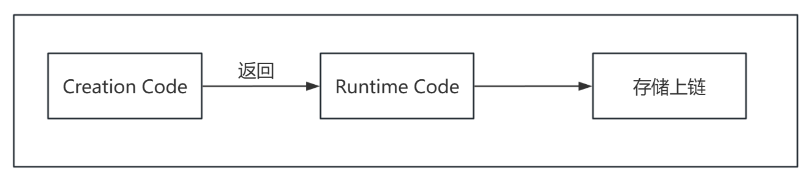
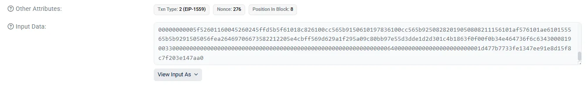

# EVM 基础原理（一）：从交易到字节码

> 本文是 EVM 基础原理系列的第一篇，帮助你建立对以太坊虚拟机的整体认知。

作为 Solidity 开发者，你可能已经写过不少合约，但有没有想过：当你点击 "Deploy" 的那一刻，代码究竟经历了什么？

```
Solidity 源码 → 编译 → 字节码 → 部署上链 → EVM 执行
```

EVM（Ethereum Virtual Machine）是这条链路的终点，也是真正的执行者。它不认识 `function`、`mapping` 这些关键字，只认识一串十六进制的字节码。

理解 EVM 的工作原理，是写出高效、安全合约的基础。

## 一、以太坊是一台状态机

以太坊的本质是一台**全球共享的状态机**，通过交易驱动状态变化。

三个核心概念：

- **状态**：所有账户的数据快照（余额、合约存储等）
- **交易**：改变状态的唯一方式
- **状态转换函数**：给定当前状态 + 交易 → 输出新状态

用公式表达：

```
APPLY(旧状态, 交易) → 新状态 或 错误
```

每个区块包含一批交易，按顺序执行后世界状态更新。整个以太坊网络就是不断重复这个过程。

## 二、两种账户

以太坊的世界状态由账户组成，账户分两种：

| 特性 | EOA（外部账户） | 合约账户 |
|------|----------------|----------|
| 控制者 | 私钥持有人 | 代码逻辑 |
| 有无代码 | 无 | 有 |
| 能否发起交易 | 能 | 不能（只能被调用） |
| 例子 | 你的 MetaMask 钱包 | Uniswap 合约 |

每个账户有 4 个字段：

```
账户 {
    nonce,        // 交易计数（防重放）
    balance,      // ETH 余额（单位：wei）
    codeHash,     // 代码哈希（EOA 为空）
    storageRoot   // 存储树根（合约数据）
}
```

**关键点**：合约账户不能主动发起交易，必须由 EOA 触发。这就是为什么每笔交易都需要你用钱包签名。

## 三、交易的结构

当你调用合约时，实际上是发送了一笔交易。交易的关键字段：

- **from**：发送者（必须是 EOA）
- **to**：接收者（合约地址或 EOA；部署合约时为空）
- **value**：转账金额（单位：wei）
- **data**：调用数据（函数选择器 + 参数编码）
- **gasLimit**：愿意支付的最大 Gas
- **gasPrice**：每单位 Gas 的价格

两种交易类型由 `to` 字段决定：

- `to` 为空 → 创建合约
- `to` 为合约地址 → 调用合约

## 四、交易执行流程

一笔交易从签名到改变状态，经历以下步骤：

1. 验证交易（签名、nonce、余额）
2. 预扣 Gas 费用
3. EVM 执行交易
4. 成功：更新状态，退还剩余 Gas；失败：回滚状态，Gas 不退

**原子性**：交易要么完全成功，要么完全失败，没有中间状态。

## 五、Gas：计算的燃料

EVM 执行每一步操作都需要消耗 Gas。这个设计有三个目的：

1. **防止无限循环**：没有 Gas 限制，恶意代码可以卡死网络
2. **资源定价**：不同操作消耗不同资源，价格不同
3. **激励矿工**：Gas 费支付给区块生产者

Gas 成本的大致分级：

| 级别 | Gas 范围 | 典型操作 |
|------|----------|----------|
| 便宜 | 3-5 | 加减乘除、栈操作 |
| 中等 | 30-200 | 内存操作、哈希 |
| 昂贵 | 100-2600 | 读存储（SLOAD） |
| 极贵 | 5000-20000+ | 写存储（SSTORE） |

为什么存储操作这么贵？因为存储数据需要永久保存在区块链上，所有节点都要存一份。这个话题我们在第二篇详细展开。

## 六、实战：追踪一笔交易

来看一个具体例子。部署这个简单的计数器合约：

```solidity
// SPDX-License-Identifier: MIT
pragma solidity ^0.8.24;

contract Counter {
    uint256 public count;
    address public immutable owner;

    event Initialized(uint256 initialCount, address indexed owner);

    constructor(uint256 initialCount, address initialOwner) {
        owner = initialOwner;   // immutable：部署时确定，运行时从 code 中读取
        count = initialCount;

        emit Initialized(initialCount, initialOwner);
    }

    function increment() external {
        count += 1;
    }
}
```

调用 `increment()` 后，在 Etherscan 上可以看到交易的 Input Data 是：`0xd09de08a` 

这 4 个字节是什么？它是 `increment()` 函数的**选择器**，计算方式：

```
keccak256("increment()") 的前 4 字节 = 0xd09de08a
```

EVM 就是通过这个选择器来识别你要调用哪个函数。接下来我们深入字节码的世界。

## 七、编译产出：两段字节码

Solidity 编译后会产出两段字节码：

               

### Creation Code

Solidity 源码编译后会生成 Creation Code（创建字节码），主要职责包括：

- 解析 constructor 参数
- 执行 constructor 逻辑
- 初始化 storage（写入状态变量初始值）
- 在最后 `RETURN` 出 Runtime Code

Creation Code 只在部署阶段执行一次，执行完毕后返回 Runtime Code，然后被丢弃，不存储在链上。

### Runtime Code

Runtime Code 是 Creation Code 执行结束时返回的字节序列，永久存储在链上，后续所有 `CALL / DELEGATECALL / STATICCALL` 调用都执行这段代码。

它不包含 constructor，无法再修改（不可变），只负责响应外部函数调用。

一句话总结：***Solidity 源码在编译后会生成 Creation Code，合约部署的过程，本质上就是 EVM 执行 Creation Code，而该执行过程的返回值就是最终被永久存储在链上的 Runtime Code***。

> **类比**：Creation Code 像是"安装程序"，执行一次就完成使命；Runtime Code 是"已安装的软件"，长期驻留。

### 用 EVM 视角重新理解"部署合约"

从 EVM 的角度看：

1.部署交易本身也是一笔普通交易

2.`data` 字段中携带的是 Creation Code

3.EVM 在部署阶段：

- 创建一个新的空合约账户
- 执行 Creation Code
- 将 `RETURN` 的字节码保存为该账户的 `code`

用一句非常"EVM 味"的话说就是：

> **Deploy = execute init code, store returned bytes as account.code**

### 动手验证：查看三种字节码

前面介绍了 Creation Code 和 Runtime Code，现在通过 Remix 实际查看它们的样子。

在实际部署时，还有一个概念需要了解：**Init Code**。

- **Creation Code**：Solidity 编译器生成的部署字节码
- **Init Code**：实际发送到链上执行的完整部署数据，**Init Code = Creation Code + ABI 编码的构造函数参数**

如果合约没有构造函数参数，两者完全相同；如果有参数，Init Code 会在 Creation Code 末尾附加参数数据。Init Code 是以太坊黄皮书和 EVM 规范中使用的术语，本系列后续内容遵循 EVM 规范，使用 Init Code 术语。

**（1）在 Remix 中查看字节码**

以前面的 Counter 合约为例，这个合约有两个构造函数参数（`initialCount` 和 `initialOwner`）。

在 Remix 中创建、编译合约后，点击 **Compilation Details** 按钮（在 Compile 按钮对应界面），会弹出一个详情窗口。在这个窗口中可以看到：

| 字段                      | 对应内容      |
| ------------------------- | ------------- |
| BYTECODE → object         | Creation Code |
| RUNTIME BYTECODE → object | Runtime Code  |


点击 **BYTECODE** 旁边的复制图标，得到一个 JSON 对象：

```json
{
  "functionDebugData": {},
  "generatedSources": [...],
  "linkReferences": {},
  "object": "60a0604052...",  // ← 这就是 Creation Code
  "opcodes": "PUSH1 0xA0 PUSH1 0x40 ...",
  "sourceMap": "..."
}
```

`object` 字段的值就是 **Creation Code**（十六进制字符串）。

同样，复制 **RUNTIME BYTECODE**，其中的 `object` 字段就是 **Runtime Code**。

以下是使用 Solidity 0.8.25 编译后的实际字节码（可能因编译器版本和优化设置略有不同）：

Creation Code（编译产出）：

```
60a060405234801561000f575f80fd5b506040516103b93803806103b983398181016040528101906100319190610151565b8073ffffffffffffffffffffffffffffffffffffffff1660808173ffffffffffffffffffffffffffffffffffffffff1681525050815f819055508073ffffffffffffffffffffffffffffffffffffffff167fa7a5b80bcd3bef76524ec80559f1ad1932344089b316a7be619ed23956b5ad6c836040516100b1919061019e565b60405180910390a250506101b7565b5f80fd5b5f819050919050565b6100d6816100c4565b81146100e0575f80fd5b50565b5f815190506100f1816100cd565b92915050565b5f73ffffffffffffffffffffffffffffffffffffffff82169050919050565b5f610120826100f7565b9050919050565b61013081610116565b811461013a575f80fd5b50565b5f8151905061014b81610127565b92915050565b5f8060408385031215610167576101666100c0565b5b5f610174858286016100e3565b92505060206101858582860161013d565b9150509250929050565b610198816100c4565b82525050565b5f6020820190506101b15f83018461018f565b92915050565b6080516101eb6101ce5f395f609001526101eb5ff3fe608060405234801561000f575f80fd5b506004361061003f575f3560e01c806306661abd146100435780638da5cb5b14610061578063d09de08a1461007f575b5f80fd5b61004b610089565b60405161005891906100e4565b60405180910390f35b61006961008e565b604051610076919061013c565b60405180910390f35b6100876100b2565b005b5f5481565b7f000000000000000000000000000000000000000000000000000000000000000081565b60015f808282546100c39190610182565b92505081905550565b5f819050919050565b6100de816100cc565b82525050565b5f6020820190506100f75f8301846100d5565b92915050565b5f73ffffffffffffffffffffffffffffffffffffffff82169050919050565b5f610126826100fd565b9050919050565b6101368161011c565b82525050565b5f60208201905061014f5f83018461012d565b92915050565b7f4e487b71000000000000000000000000000000000000000000000000000000005f52601160045260245ffd5b5f61018c826100cc565b9150610197836100cc565b92508282019050808211156101af576101ae610155565b5b9291505056fea26469706673582212205e4cbff569d629a1f295a09c80bb97e55d3dde1d2d301c4b1863f0f00f0b34e464736f6c63430008190033
```

这段代码包含：构造函数逻辑、参数解析代码、最终 RETURN Runtime Code 的逻辑。长度：953 字节（1906 个十六进制字符）。

Runtime Code（部署后永久存储在链上）：

```
608060405234801561000f575f80fd5b506004361061003f575f3560e01c806306661abd146100435780638da5cb5b14610061578063d09de08a1461007f575b5f80fd5b61004b610089565b60405161005891906100e4565b60405180910390f35b61006961008e565b604051610076919061013c565b60405180910390f35b6100876100b2565b005b5f5481565b7f000000000000000000000000000000000000000000000000000000000000000081565b60015f808282546100c39190610182565b92505081905550565b5f819050919050565b6100de816100cc565b82525050565b5f6020820190506100f75f8301846100d5565b92915050565b5f73ffffffffffffffffffffffffffffffffffffffff82169050919050565b5f610126826100fd565b9050919050565b6101368161011c565b82525050565b5f60208201905061014f5f83018461012d565b92915050565b7f4e487b71000000000000000000000000000000000000000000000000000000005f52601160045260245ffd5b5f61018c826100cc565b9150610197836100cc565b92508282019050808211156101af576101ae610155565b5b9291505056fea26469706673582212205e4cbff569d629a1f295a09c80bb97e55d3dde1d2d301c4b1863f0f00f0b34e464736f6c63430008190033
```

这段代码只包含：函数调度器（dispatcher）、`count()` 函数逻辑、`owner()` 函数逻辑、`increment()` 函数逻辑。长度：491 字节（982 个十六进制字符）。

**注意**：Runtime Code 中不包含构造函数，因为构造函数只执行一次。可以看到 Runtime Code 比 Creation Code 短了将近一半。

**（2）构造 Init Code**

**步骤 1：准备构造函数参数**

假设我们部署时传入：

- `initialCount = 100`
- `initialOwner = 0x1d477b7733Fe1347eE91e8D15f8c7f203E147AA0`

**步骤 2：ABI 编码参数**

构造函数参数需要按 ABI 规则编码：

```
// uint256(100) = 0x64，左填充零到 32 字节
0000000000000000000000000000000000000000000000000000000000000064

// address，左填充零到 32 字节
0000000000000000000000001d477b7733Fe1347eE91e8D15f8c7f203E147AA0
```

两个参数拼接后（64 字节 = 128 个十六进制字符）：

```
00000000000000000000000000000000000000000000000000000000000000640000000000000000000000001d477b7733Fe1347eE91e8D15f8c7f203E147AA0
```

**步骤 3：拼接得到 Init Code**

Init Code = Creation Code + 构造函数参数编码

完整的 Init Code（1017 字节 = 2034 个十六进制字符）：

```
60a060405234801561000f575f80fd5b506040516103b93803806103b983398181016040528101906100319190610151565b8073ffffffffffffffffffffffffffffffffffffffff1660808173ffffffffffffffffffffffffffffffffffffffff1681525050815f819055508073ffffffffffffffffffffffffffffffffffffffff167fa7a5b80bcd3bef76524ec80559f1ad1932344089b316a7be619ed23956b5ad6c836040516100b1919061019e565b60405180910390a250506101b7565b5f80fd5b5f819050919050565b6100d6816100c4565b81146100e0575f80fd5b50565b5f815190506100f1816100cd565b92915050565b5f73ffffffffffffffffffffffffffffffffffffffff82169050919050565b5f610120826100f7565b9050919050565b61013081610116565b811461013a575f80fd5b50565b5f8151905061014b81610127565b92915050565b5f8060408385031215610167576101666100c0565b5b5f610174858286016100e3565b92505060206101858582860161013d565b9150509250929050565b610198816100c4565b82525050565b5f6020820190506101b15f83018461018f565b92915050565b6080516101eb6101ce5f395f609001526101eb5ff3fe608060405234801561000f575f80fd5b506004361061003f575f3560e01c806306661abd146100435780638da5cb5b14610061578063d09de08a1461007f575b5f80fd5b61004b610089565b60405161005891906100e4565b60405180910390f35b61006961008e565b604051610076919061013c565b60405180910390f35b6100876100b2565b005b5f5481565b7f000000000000000000000000000000000000000000000000000000000000000081565b60015f808282546100c39190610182565b92505081905550565b5f819050919050565b6100de816100cc565b82525050565b5f6020820190506100f75f8301846100d5565b92915050565b5f73ffffffffffffffffffffffffffffffffffffffff82169050919050565b5f610126826100fd565b9050919050565b6101368161011c565b82525050565b5f60208201905061014f5f83018461012d565b92915050565b7f4e487b71000000000000000000000000000000000000000000000000000000005f52601160045260245ffd5b5f61018c826100cc565b9150610197836100cc565b92508282019050808211156101af576101ae610155565b5b9291505056fea26469706673582212205e4cbff569d629a1f295a09c80bb97e55d3dde1d2d301c4b1863f0f00f0b34e464736f6c6343000819003300000000000000000000000000000000000000000000000000000000000000640000000000000000000000001d477b7733Fe1347eE91e8D15f8c7f203E147AA0
```

长度验证：953（Creation Code）+ 64（参数）= 1017 字节 ✓

**（3）在 Etherscan 上验证**

在 Etherscan 上查看部署交易详情，input 字段的内容就是 Init Code（Creation Code + 参数编码）：



部署成功后，查看合约页面：

- Contract Creation Code 显示的是 Init Code
- Deployed Bytecode 显示的是 Runtime Code


**（4）常见问题**

**Q1：为什么 Runtime Code 比 Creation Code 短？**

Creation Code 包含构造函数逻辑和参数解析代码，这些只在部署时执行一次。Runtime Code 只保留运行时需要的函数，所以通常更短。在本例中，Runtime Code（491 字节）大约只有 Creation Code（953 字节）的一半大小。

**Q2：immutable 变量存在哪里？**

`immutable` 变量在部署时确定值，直接嵌入到 Runtime Code 中。所以每次部署参数不同，Runtime Code 也会略有不同。

**Q3：为什么 CREATE2 要用 Init Code 而不是 Creation Code？**

CREATE2 的地址计算公式：

```
address = keccak256(0xff ++ sender ++ salt ++ keccak256(initCode))[12:]
```

使用 Init Code 是因为**相同的代码 + 相同的参数**才应该得到相同的地址。如果只用 Creation Code，不同参数会部署到同一地址，这不是期望的行为。

## 八、EVM 执行模型

EVM 是基于栈的虚拟机。栈是一种数据结构，就像一摞盘子——只能从顶部放入或取出。

EVM 栈的特性：

- 每个元素 256 位（32 字节）
- 最大深度 1024
- 只能操作顶部 16 个元素（这是硬限制）


EVM 执行字节码的过程：

1. 读取当前位置的操作码
2. 执行该操作码
3. 扣除 Gas
4. 移动到下一个位置
5. 重复，直到遇到 STOP/RETURN/REVERT 或 Gas 耗尽

**程序计数器（PC）**：记录当前执行到哪个位置。遇到跳转指令时，PC 会改变。

## 九、操作码：EVM 的指令集

操作码（Opcode）是 EVM 能理解的最小指令。每个操作码占 1 字节，所以最多 256 种，目前使用约 140 种。

### 一个最简单的例子

这段字节码计算 1 + 1：

```
6001 6001 01
```

拆解：

| 字节码 | 操作码 | 含义 |
|--------|--------|------|
| 60 01 | PUSH1 0x01 | 把 1 压入栈 |
| 60 01 | PUSH1 0x01 | 把 1 压入栈 |
| 01 | ADD | 弹出两个值，相加，结果压入栈 |

执行过程：

```
初始:     []
PUSH1 1: [1]
PUSH1 1: [1, 1]
ADD:     [2]       ← 1+1 的结果
```

### 常用核心操作码

| 类别 | 操作码 | 功能 |
|------|--------|------|
| 算术 | ADD, SUB, MUL, DIV | 基本运算 |
| 比较 | LT, GT, EQ | 小于、大于、等于 |
| 栈操作 | PUSH, POP, DUP, SWAP | 压入、弹出、复制、交换 |
| 内存 | MLOAD, MSTORE | 读写内存 |
| 存储 | SLOAD, SSTORE | 读写存储（很贵！） |
| 环境 | CALLER, CALLVALUE | msg.sender, msg.value |
| 流程 | JUMP, JUMPI, RETURN, REVERT | 跳转、返回、回滚 |

**Gas 差异预告**：MLOAD 只要 3 Gas，SLOAD 要 100-2100 Gas。为什么差这么多？下一篇揭晓。

> 完整操作码列表：https://www.evm.codes/

## 十、函数选择器：EVM 如何路由？

一个合约有多个函数，EVM 怎么知道调用哪个？

### 选择器的计算

每个函数有一个 4 字节的"身份证" —— **函数选择器**：

```
选择器 = keccak256("函数签名") 的前 4 字节
```

例如：

```
keccak256("increment()") → 0xd09de08a...
keccak256("count()")     → 0x06661abd...
```

### 路由逻辑

合约字节码开头有一段 **dispatcher（调度器）**，逻辑如下：

1. 从 calldata 取前 4 字节作为 selector
2. 依次与每个函数的选择器比较
3. 匹配 → 跳转到对应函数代码
4. 都不匹配 → 执行 fallback 或 revert

用操作码表示的核心流程：

```
PUSH1 0x00
CALLDATALOAD     // 加载 calldata 前 32 字节
PUSH1 0xe0
SHR              // 右移 224 位，得到前 4 字节
DUP1
PUSH4 0xd09de08a // increment() 的选择器
EQ               // 比较是否相等
PUSH2 0x0045     // increment() 代码位置
JUMPI            // 相等则跳转
```

**这就解释了**为什么调用 `increment()` 时，交易的 input 是 `0xd09de08a`。

## 小结

本文介绍了 EVM 的核心概念：

1. 以太坊是交易驱动的状态机
2. 账户分 EOA 和合约账户两种
3. 交易是改变状态的唯一方式
4. Gas 是计算资源的度量单位
5. 编译产出 Creation Code 和 Runtime Code，动手验证了它们与 Init Code 的区别
6. EVM 是基于栈的虚拟机，通过操作码执行计算
7. 函数选择器用于路由到正确的函数

下一篇，我们将深入 EVM 的三个数据区域——栈、内存、存储，理解它们的成本差异和优化策略。


**系列导航：**

- 第一篇：EVM 基础原理（一）：从交易到字节码（本篇）
- 第二篇：[EVM 基础原理（二）：EVM 数据区域与合约执行](./evm_fundamentals_part2_data_regions_and_contract_execution_240411.md)
- 第三篇：[EVM 基础原理（三）：ABI 编码与底层调用](./evm_fundamentals_part3_abi_encoding_and_low-level_calls_240413.md)
