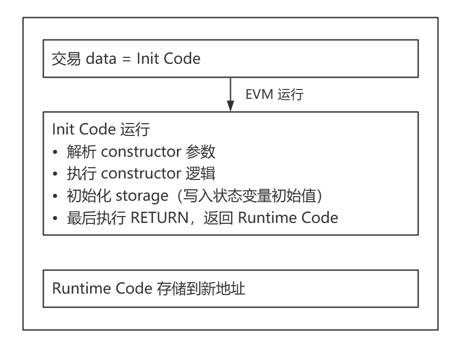

# EVM 基础原理（二）：数据区域与合约执行

> 本文是 EVM 基础原理系列的第二篇，深入理解栈、内存、存储的设计原理，以及合约的部署与调用机制。

上一篇我们提到 MLOAD 只要 3 Gas，而 SLOAD 要 2100 Gas（冷访问）。为什么差距这么大？

因为它们操作的数据区域有本质区别：

- **内存**：临时的、本地的、便宜的
- **存储**：永久的、全网共识的、昂贵的

## 一、三个数据区域概览

| 区域 | 生命周期 | 访问成本 | 典型用途 |
|------|----------|----------|----------|
| 栈 | 函数执行期间 | 最便宜 | 局部变量、计算中间值 |
| 内存 | 函数执行期间 | 中等 | 函数参数、临时数据 |
| 存储 | 永久 | 最贵 | 状态变量 |

**核心原则**：能用栈就不用内存，能用内存就不用存储。

## 二、栈（Stack）

上一篇已经介绍了栈的基础，这里聚焦它的局限性。

**局限性 1：只能访问顶部 16 个元素**

EVM 的 DUP 和 SWAP 指令最多操作第 16 个元素：

```
DUP1 - DUP16     // 复制第 1-16 个元素到栈顶
SWAP1 - SWAP16   // 交换栈顶与第 2-17 个元素
```

如果你的函数有超过 16 个局部变量，编译器会被迫使用内存，Gas 成本上升。

实践建议：减少函数内的局部变量数量，尤其是同时存活的变量。

**局限性 2：最大深度 1024**

栈深度超过 1024 会导致交易失败。这在深度递归或复杂的合约调用链中可能触发。

**栈的优势**

- 操作成本极低（PUSH/POP/DUP/SWAP 都是 3 Gas 左右）
- 无需地址寻址，直接操作栈顶

**Stack too deep 错误**

Solidity 编译器会尝试优化栈使用。当你遇到 `Stack too deep` 错误时，意味着编译器无法在 16 个槽位内安排所有变量。

解决方案：

- 减少同时存活的局部变量
- 将部分逻辑提取到内部函数
- 使用结构体打包相关变量

## 三、内存（Memory）

内存是**线性字节数组**，按需扩展，函数执行结束后清空。

### Solidity 的内存布局

Solidity 保留了前 4 个 32 字节槽位：

| 偏移量 | 用途 |
|--------|------|
| 0x00 - 0x3f | Scratch space（临时计算空间） |
| 0x40 - 0x5f | Free memory pointer |
| 0x60 - 0x7f | Zero slot（用于动态数组初始化） |
| 0x80+ | 可分配区域 |

**Free Memory Pointer（0x40）** 是 Solidity 内存管理的核心：

- 存储下一个可分配地址
- 每次分配内存后自动递增
- Solidity 不会主动释放内存（函数结束后整体清空）

### 扩展成本：越大越贵

内存不是固定大小，而是按需扩展。扩展是有成本的，而且是**非线性增长**：

```
memory_cost = 3 * words + words² / 512
```

其中 `words = ceil(size / 32)`。

| 内存大小 | 扩展成本 |
|----------|----------|
| 1 KB (32 words) | 98 Gas |
| 10 KB (320 words) | 1,160 Gas |
| 1 MB (32,768 words) | 2,195,456 Gas |

**二次方增长的设计意图**：防止合约滥用内存。小内存操作便宜（鼓励正常使用），大内存操作极其昂贵（惩罚滥用）。

**内存 vs 栈**

内存的优势是可以存储任意大小的数据（如动态数组、字符串），而栈每个元素固定 32 字节。

## 四、存储（Storage）

存储是合约的**永久状态**，数据写入后一直保留在区块链上。

### 存储模型

存储是一个 **2²⁵⁶ 槽位的稀疏数组**，每个槽位 32 字节：

```
slot[0] → 32 bytes
slot[1] → 32 bytes
...
slot[2²⁵⁶ - 1] → 32 bytes
```

实际实现是键值数据库（如 LevelDB），只有非零槽位才占用空间。

### 状态变量的槽位分配

**定长类型**：Solidity 按声明顺序分配，小变量会打包到同一槽位。

```solidity
contract SlotPacking {
    uint256 a;     // slot 0（完整占用）
    uint128 b;     // slot 1（前 16 字节）
    uint128 c;     // slot 1（后 16 字节）
    uint256 d;     // slot 2
}
```

**结构体**：从新槽位开始，内部按顺序排列。

```solidity
struct Data {
    uint256 id;    // slot n
    address owner; // slot n+1
}
```

### 动态类型的槽位计算

Solidity 用 keccak256 计算动态类型的位置。

**动态数组**：

```solidity
uint256[] arr;  // 假设在 slot p
```

- `slot p` 存储数组长度
- `arr[i]` 的位置：`keccak256(p) + i`

**Mapping**：

映射不能按顺序存储，因为键是动态的。

```solidity
mapping(address => uint256) balances;  // 假设在 slot p
```

- `slot p` 不存储任何数据
- `balances[key]` 的位置：`keccak256(abi.encode(key, p))`

把 key（32 字节）和 slot（32 字节）拼成 64 字节，再哈希。

**嵌套 Mapping**：

```solidity
mapping(address => mapping(uint256 => bool)) approvals;  // slot p
```

`approvals[addr][id]` 的位置：

```
keccak256(abi.encode(id, keccak256(abi.encode(addr, p))))
```

### 存储成本详解

| 操作 | 条件 | Gas 成本 |
|------|------|----------|
| SLOAD | 冷访问 | 2,100 |
| SLOAD | 热访问 | 100 |
| SSTORE | 0 → 非零 | 22,100 |
| SSTORE | 非零 → 非零 | 5,000 |
| SSTORE | 非零 → 0 | 5,000，有退款 |

**冷/热访问（EIP-2929）**：同一交易中首次访问某槽位为"冷"，后续为"热"。

## 五、合约部署机制

### 两种交易类型

以太坊的交易分两种，由 `to` 字段决定：

| to 字段 | 交易类型 | 执行内容 |
|---------|----------|----------|
| 空 | 创建合约 | 执行 data 中的 Init Code |
| 合约地址 | 调用合约 | 执行 data 作为 calldata |

### 术语说明：Creation Code 与 Init Code

在不同的文档和工具中，你可能会看到 **Creation Code** 和 **Init Code** 这两个术语：

- **Creation Code**：Solidity 编译器和开发工具（如 Hardhat、Foundry）常用的术语，指编译产出的部署字节码
- **Init Code**：以太坊黄皮书和 EVM 规范中使用的术语，指实际发送到链上执行的完整部署数据

两者的关系：**Init Code = Creation Code + ABI 编码的构造函数参数**

如果合约没有构造函数参数，两者完全相同；如果有参数，Init Code 会在 Creation Code 末尾附加参数数据。本系列遵循 EVM 规范，使用 Init Code 术语。

### 部署执行流程



关键点：

- Init Code 是一段"安装程序"，执行后被丢弃
- Runtime Code 是 Init Code 的执行结果，由 RETURN 返回
- 构造函数的参数被 ABI 编码后附加在 Creation Code 末尾，共同构成 Init Code

### 合约地址计算

**CREATE（普通部署）**：

```
address = keccak256(rlp([sender, nonce]))[12:]
```

地址由部署者地址和 nonce 决定，因此**不可预测**（nonce 会变化）。

**CREATE2（确定性部署）**：

```
address = keccak256(0xff ++ sender ++ salt ++ keccak256(initCode))[12:]
```

通过自定义 salt，可以在部署前预测地址。这在工厂合约、跨链部署中很有用。

## 六、函数调用机制

### calldata 结构

调用 `transfer(address to, uint256 amount)` 时，calldata 的结构：

```
函数选择器（4 字节）+ ABI 编码的参数（32 字节 × N）
```

EVM 通过选择器路由到对应函数（上一篇已讲）。

### Call 的上下文传递

当合约 A 调用合约 B 时，EVM 会传递一个执行上下文：

| 上下文变量 | 含义 |
|------------|------|
| msg.sender | 调用者（A 的地址） |
| msg.value | 发送的 ETH |
| msg.data | calldata |
| gas | 可用 Gas |

**63/64 规则（EIP-150）**：调用时最多转发当前剩余 Gas 的 63/64，保留 1/64 用于调用后的操作。

### 三种调用方式

| 操作码 | msg.sender | 存储上下文 | 典型用途 |
|--------|------------|------------|----------|
| call | 变为调用者 | 被调用合约 | 普通调用 |
| delegatecall | 保持不变 | 调用方合约 | 代理模式 |
| staticcall | 变为调用者 | 只读 | view 函数 |

**delegatecall 的本质**："借壳执行"——代码是 B 的，但存储和 msg.sender 都是 A 的。这是代理合约的基础。

## 七、返回与异常

### 正常返回

**RETURN**：返回数据并结束执行。

```
RETURN(offset, size)  // 返回 memory[offset:offset+size]
```

返回的数据存入调用者的 returndata 缓冲区，可通过 RETURNDATASIZE 和 RETURNDATACOPY 访问。

### 异常回滚

| 操作码 | 行为 | Gas 处理 |
|--------|------|----------|
| REVERT | 回滚状态，返回错误数据 | 退还剩余 Gas |
| INVALID | 回滚状态，无返回数据 | 消耗所有 Gas |

Solidity 的 `require` 和 `revert` 编译为 REVERT，`assert` 在 0.8.0 后也用 REVERT（早期版本用 INVALID）。

### returndata 机制

EIP-211 引入了 returndata 缓冲区：

```solidity
(bool success, bytes memory data) = target.call(payload);
```

底层操作：

1. call 执行后，返回值写入 returndata
2. RETURNDATASIZE 获取返回数据长度
3. RETURNDATACOPY 将数据复制到内存

## 八、Event 底层机制

### LOG 操作码

Event 通过 LOG0 - LOG4 操作码实现：

```
LOG{n}(offset, size, topic0, topic1, ..., topic{n-1})
```

- `n` 是 topic 数量（0-4）
- `offset/size` 指定非 indexed 数据在内存中的位置
- topic0 通常是事件签名的 keccak256

### indexed 参数

```solidity
event Transfer(address indexed from, address indexed to, uint256 value);
```

| 参数 | 存储位置 | 作用 |
|------|----------|------|
| indexed | topic | 可被链下高效过滤 |
| 非 indexed | data | 只能全量读取 |

一个事件最多 4 个 topic（包括事件签名），所以最多 3 个 indexed 参数。

### 为什么 Event 比存储便宜？

Event 数据：

- 不存储在世界状态中
- 不参与共识验证
- 只能被链下读取

因此 LOG 操作的 Gas 远低于 SSTORE。

## 小结

本文介绍了 EVM 的数据管理和执行机制：

1. 栈：最快最便宜，但有 16 元素和 1024 深度限制
2. 内存：临时存储，扩展成本非线性增长
3. 存储：永久状态，成本最高，冷热访问有区别
4. 部署：Init Code 执行后返回 Runtime Code
5. 调用：call/delegatecall/staticcall 各有不同的上下文
6. Event：通过 LOG 操作码实现，比存储便宜

下一篇，我们将深入 ABI 编码规则和底层调用的实战技巧。


**系列导航：**

- 第一篇：[EVM 基础原理（一）：从交易到字节码](./evm_fundamentals_part1_from_transactions_to_bytecode_240410.md)
- 第二篇：EVM 基础原理（二）：EVM 数据区域与合约执行（本篇）
- 第三篇：[EVM 基础原理（三）：ABI 编码与底层调用](./evm_fundamentals_part3_abi_encoding_and_low-level_calls_240413.md)
