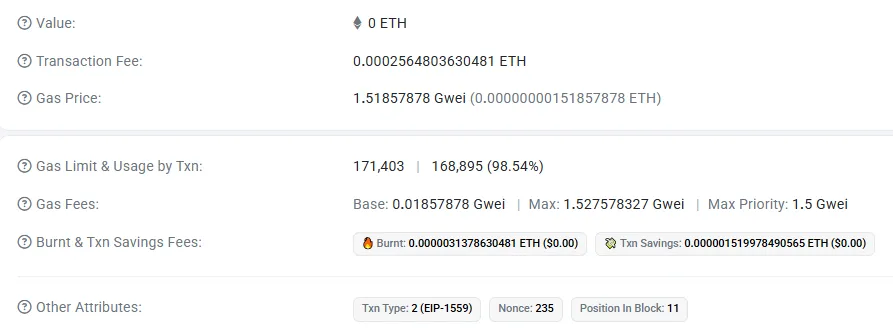
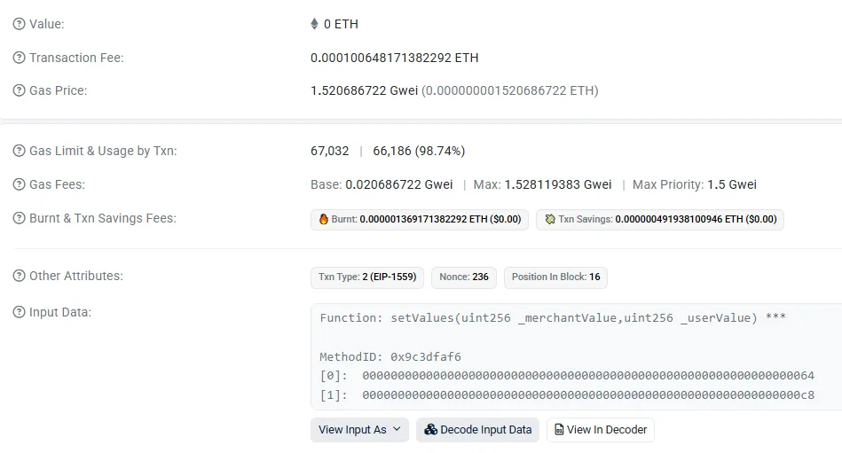
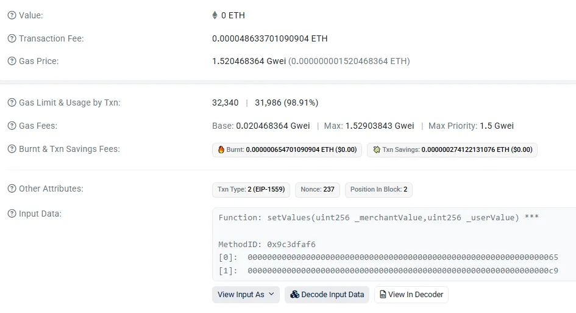

# Gas 优化指南（二）：EIP-1559 交易解析

> 本篇是 Gas 优化系列的第二篇，通过一个真实的链上实验，验证上一篇介绍的 EIP-1559 费用计算规则。

我们将部署一个简单的 GasDemo 合约，执行三笔不同类型的存储写入交易，逐一拆解 Etherscan 截图中的各个数字是如何计算得出的。

## 一、实验合约

演示：一笔 Type 2（EIP-1559）交易的实际结算价格是如何从 Base/Max/Priority 推导出来的，并且用 `Gas Used` 直接算出 `Transaction Fee / Burnt / Txn Savings`。

```solidity
// SPDX-License-Identifier: MIT
pragma solidity ^0.8.28;

contract GasDemo {
    uint256 public value1;
    uint256 public value2;

    // 首次写入 VS 修改
    function setValues(uint256 v1, uint256 v2) public {
        value1 = v1;    // 观察：首次 22100，后续 5000
        value2 = v2;
    }

    // 冷访问 VS 热访问
    function readValues() public view returns (uint256, uint256) {
        uint256 a = value1;     // 冷访问：2100
        uint256 b = value1;     // 热访问：100
        return (a, b);
    }

    // 清零退款
    function clear() public {
        value1 = 0;     // 获得退款
        value2 = 0;
    }
}
```

GasDemo 主要想展示三件事：

1. 首次写入 vs 修改（SSTORE 0→非 0 vs 非 0→非 0）
2. 冷访问 vs 热访问（SLOAD cold vs warm）
3. 清零退款（SSTORE 非 0→0 的 refund 机制）

## 二、部署合约



| 截图字段                        | 数值                     |
| ------------------------------- | ------------------------ |
| Gas Used                        | 168,895                  |
| Gas Price (Effective Gas Price) | 1.51857878 gwei          |
| Base                            | 0.01857878 gwei          |
| Max                             | 1.527578327 gwei         |
| Max Priority                    | 1.5 gwei                 |
| Transaction Fee                 | 0.0002564803630481 ETH   |
| Burnt                           | 0.0000031378630481 ETH   |
| Txn Savings                     | 0.000001519978490565 ETH |

**2.1 有效成交价（Effective Gas Price）怎么来的？**

EIP-1559 下，用户提交的参数是：

- maxFeePerGas（截图里的 Max）
- maxPriorityFeePerGas（截图里的 Max Priority）

链上结算使用：

- effectivePriorityFee = min(maxPriorityFeePerGas, maxFeePerGas - baseFeePerGas)
- effectiveGasPrice = baseFeePerGas + effectivePriorityFee

代入截图：

- baseFee = 0.01857878
- maxFee = 1.527578327
- maxPriority = 1.5

先看 maxFee - baseFee：

- 1.527578327 - 0.01857878 = 1.509...，明显大于 1.5
- 所以 effectivePriorityFee = 1.5 gwei
- 因此 effectiveGasPrice = 0.01857878 + 1.5 = 1.51857878 gwei

这就精确匹配了截图里的 Gas Price = 1.51857878 gwei。

**2.2 Transaction Fee 验算**

$$
\text{Tx Fee} = \text{GasUsed} \times \text{effectiveGasPrice}
$$

把 gwei 换成 ETH：

$$
1\text{ gwei}=10^{-9}\text{ ETH}
$$

$$
168{,}895 \times 1.51857878 \times 10^{-9} = 0.0002564803630481\text{ ETH}
$$

与截图的 Transaction Fee 完全一致。

**2.3 Burnt（销毁）验算**

EIP-1559 下：

$$
\text{Burnt} = \text{GasUsed} \times \text{baseFee}
$$

$$
168{,}895 \times 0.01857878 \times 10^{-9} = 0.0000031378630481\text{ ETH}
$$

与截图的 Burnt 完全一致。

**2.4 Txn Savings（"省下的钱"）到底是什么？**

这不是"清零退款"的 refund，而是 EIP-1559 的 maxFee 多付部分退回：用户愿意最多付 maxFee，但实际只需要付 effectiveGasPrice，差额按 gasUsed 退回：

$$
\text{Txn Savings} = \text{GasUsed} \times (\text{maxFee} - \text{effectiveGasPrice})
$$

$$
168{,}895 \times (1.527578327 - 1.51857878) \times 10^{-9} = 0.000001519978490565\text{ ETH}
$$

与截图完全一致。

## 三、两次调用 setValues 函数

第 1 次调用 setValues(100, 200) 函数：



第 2 次调用 setValues(101, 201) 函数：



两次调用的关键信息对比（先给结论）：

| 项目                | 第 1 次调用           | 第 2 次调用           |
| ------------------- | --------------------- | --------------------- |
| 调用参数            | setValues(100, 200)   | setValues(101, 201)   |
| Gas Used            | 66,186                | 31,986                |
| Effective Gas Price | ≈ 1.5207 gwei         | ≈ 1.5205 gwei         |
| Transaction Fee     | ≈ 0.00010065 ETH      | ≈ 0.00004863 ETH      |
| Txn Type            | Type 2 (EIP-1559)     | Type 2 (EIP-1559)     |
| 差值                | ≈ 34,200 gas          | —                     |

这两笔交易的 Gas 差值在数值上精确等于 2 个 slot 的 22,100 与 5,000 的差额，因此差异几乎完全由 SSTORE 状态转移类型决定。

这说明：这个合约 + 这两笔交易，完美命中了 Solidity/EVM 的 SSTORE 成本模型。

这两张图非常适合用来讲：

1. 为什么 storage 写入这么贵
2. 为什么"不要随便写 storage"
3. 为什么"第一次写"和"改写"是两个世界
4. EIP-1559 ≠ Gas 优化——它只是定价模型，真正的优化发生在 EVM opcode 层

## 四、调用 clear 函数


把截图里的每一个关键数字，和 EVM 的 SSTORE(non-0 → 0) + London 之后的 refund 规则精确对齐。

| 截图字段            | 数值                     |
| ------------------- | ------------------------ |
| Gas Used            | 24,986                   |
| Gas Limit           | 31,510 (使用率 79.3%)    |
| Effective Gas Price | 1.521004001 gwei         |
| Transaction Fee     | 0.000038003805968986 ETH |
| Base Fee            | 0.021004001 gwei         |
| Priority Fee        | 1.5 gwei                 |
| Txn Type            | Type 2 (EIP-1559)        |

和前两笔 setValues 一样：价格几乎没变，差异全部来自 Gas Used。

**4.1 两类 Savings 必须分开**

Txn Savings ≠ 清零 refund

截图里 Txn Savings: 0.00000190903883924 ETH

这是 (maxFeePerGas − effectiveGasPrice) × gasUsed，它只是 EIP-1559 的"多报 maxFee 没用完，退给你"，而不是 EVM 的 SSTORE refund。

- Txn Savings 仍然是 EIP-1559 的 maxFee 差额退回
- SSTORE refund 不会以 ETH 字段直接展示，效果体现在 Gas Used 变小

**4.2 用 refund 上限反推 clear 的真实消耗**

clear 有两个非 0 到 0 的写入。London 之后，单次清零的 refund 额度是 4,800 Gas，因此理论 refund 总额：

$$
R=2×4{,}800=9{,}600
$$

但 refund 有上限：

$$
refundApplied\le \frac{gasUsedBeforeRefund}{5}
$$

设 clear 这笔交易在应用 refund 之前的消耗为 G，最终你在 Etherscan 看到的 Gas Used 为 24,986，满足：

$$
24{,}986=G-\min(9{,}600,\ \frac{G}{5})
$$

如果 refund 总额大于上限，则实际应用的 refund 等于 G/5，于是：

$$
24{,}986=G-\frac{G}{5}=\frac{4G}{5}
$$

$$
G=24{,}986\times \frac{5}{4}=31{,}232.5
$$

这给出一个非常漂亮的解释：clear 在应用 refund 之前的消耗大约是 31,233 Gas，由于上限限制，实际能抵扣的 refund 大约是 6,246 Gas，剩余 refund 无法用完，所以你看到的 Gas Used 不是 10,000 级别，而是 24,986。

**4.3 为什么 clear 看起来比第二次 setValues 还便宜**

把第二次 setValues 与 clear 放在一起：

| 交易               | Gas Used |
| ------------------ | -------- |
| setValues(101,201) | 31,986   |
| clear()            | 24,986   |

可以给出一条更精确的主线：clear 的执行前成本与一次常规写入处在同一数量级，clear 触发了 refund 抵扣，抵扣额度受 1/5 上限限制，因此只抵扣了一部分，最终 Gas Used 降到了 24,986。

**4.4 把三笔交易放在一起，看一条完整主线**

| 操作                | storage 变化         | Gas Used |
| ------------------- | -------------------- | -------- |
| 第 1 次 setValues   | 0 → 非 0，共 2 次    | 66,186   |
| 第 2 次 setValues   | 非 0 → 非 0，共 2 次 | 31,986   |
| clear()             | 非 0 → 0，共 2 次    | 24,986   |

这三笔交易把 SSTORE 三种关键状态转移在真实链上完整跑通，并且分别呈现出符合预期的数量级差异。

这正好对应我们在代码里想演示的三件事：

1. 首次写入最贵
2. 改写明显便宜
3. 清零可以省 Gas，但 refund 已被严格限制

**4.5 这笔 clear() 交易的"教学级结论"**

这张截图非常适合用来讲一句话：London 之后，delete storage 不再是"返钱操作"，而只是"少烧一点 Gas"。

## 小结

本篇通过真实的链上交易数据，完整验证了 EIP-1559 的费用计算规则：effectiveGasPrice 由 baseFee + effectivePriorityFee 构成，Transaction Fee、Burnt、Txn Savings 三个数值都可以精确推导。更重要的是，我们通过三笔存储写入交易，直观展示了 SSTORE 三种状态转移的 Gas 差异——首次写入（66,186 Gas）、修改（31,986 Gas）、清零（24,986 Gas）。

核心结论：**EIP-1559 决定 Gas 的价格，EVM 执行决定 Gas 的数量，两者完全独立，却在最终费用中相乘**。

下一篇我们将进入存储优化实战，学习变量打包、结构体打包、constant/immutable、存储指针等技巧，并通过一个教学版用户管理合约演示完整的优化过程。


**系列导航：**

* 第一篇：[Gas 优化指南（一）：Gas 机制原理](./gas_optimization_guide_part1_gas_mechanism.md)
* 第二篇：Gas 优化指南（二）：EIP-1559 交易解析（本篇）

* 第三篇：[Gas 优化指南（三）：存储优化](./gas_optimization_guide_part3_storage_optimization.md)
* 第四篇：[Gas 优化指南（四）：计算优化](./gas_optimization_guide_part4_computation_optimization.md)
* 第五篇：[Gas 优化指南（五）：Gas 评估与测量](./gas_optimization_guide_part5_gas_measurement.md)
