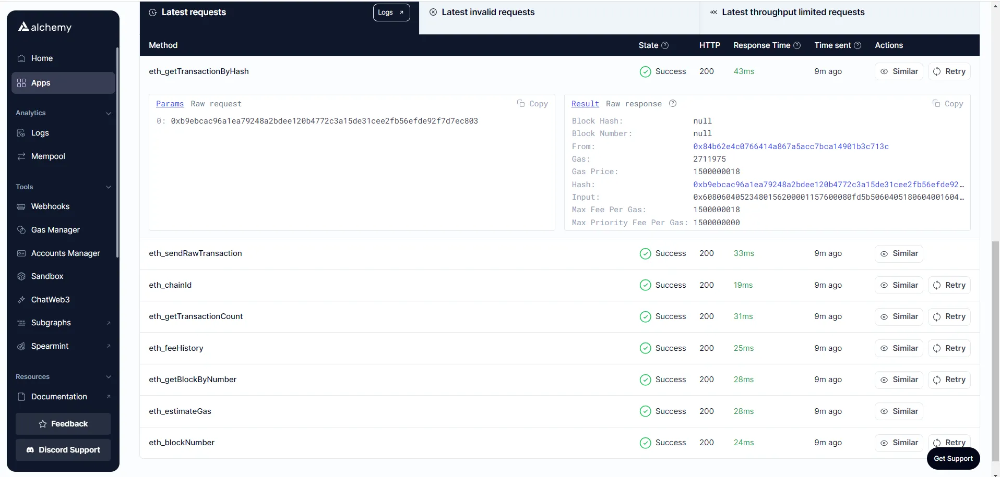
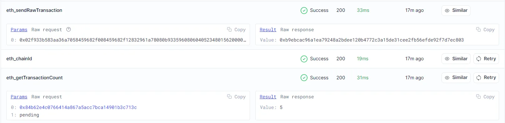
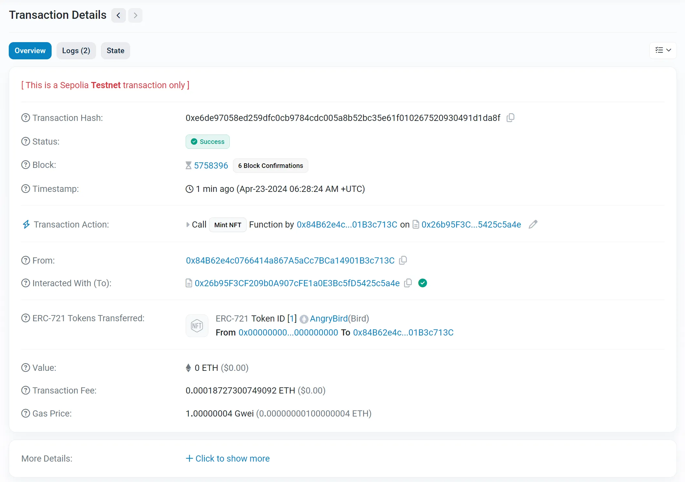
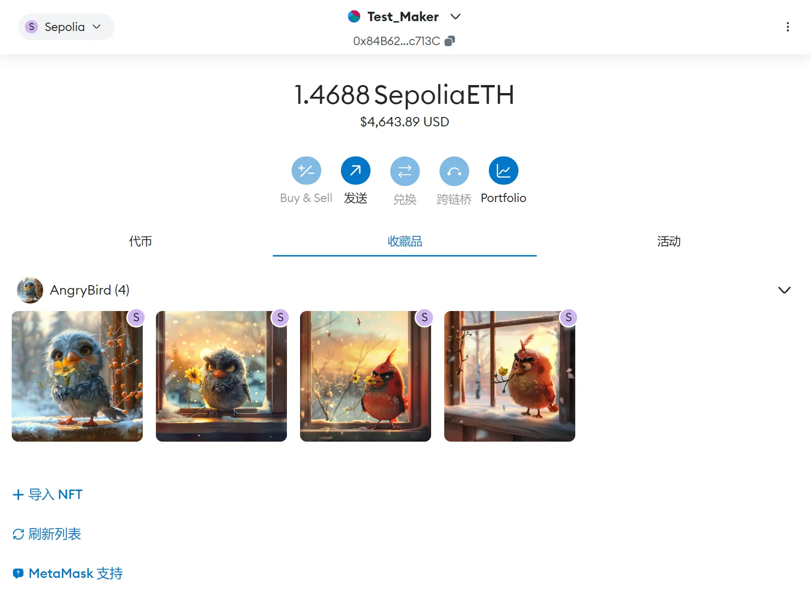
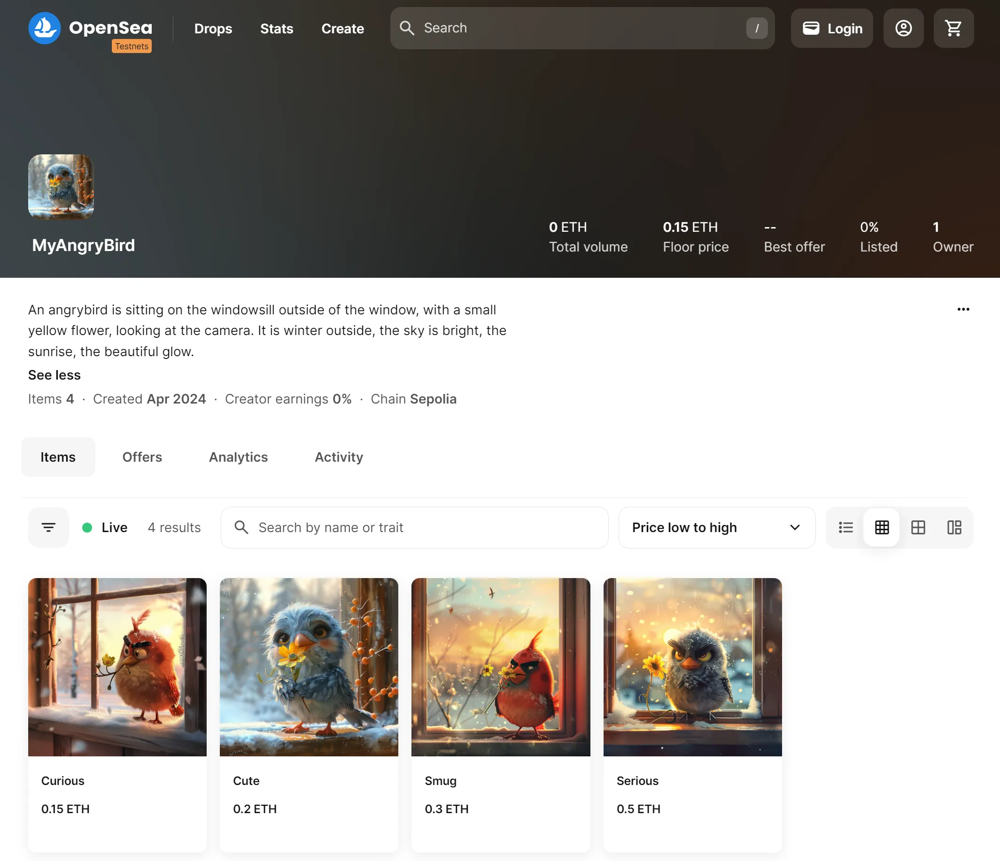

# ERC-721 NFT 实战：合约编写、部署、Mint 全流程

> 本指南介绍如何使用 Metamask、Solidity、Hardhat、Alchemy、Pinata 等工具，在 Ethereum Sepolia 测试网中创建、部署 ERC-721 智能合约，并完成 NFT 的铸造与展示。

## 前置准备

**安装 Node.js：**

```shell
# 安装20.x版本的Node.js
curl -fsSL https://deb.nodesource.com/setup_20.x | sudo -E bash -
sudo apt-get install -y nodejs

# 查看安装的版本
node -v
npm -v
```

**获取 Alchemy Dapp API Key：** 注册一个 [Alchemy](https://www.alchemy.com/) 账户，然后创建一个 Ethereum Sepolia 的 App，获取该 App 的 API Key 以便后续使用。

**创建 Metamask 钱包地址：** 安装 Metamask 浏览器插件，创建一个测试用的钱包地址，然后通过 [Ethereum Sepolia Faucet](https://www.alchemy.com/faucets/ethereum-sepolia) 或 [Chainlink Faucets](https://faucets.chain.link/) 获取 SepoliaETH。

**注意事项：**

- 很多 Sepolia Faucet 为了防止滥用，会对申请者做出限制，例如要求主网钱包余额不低于 0.001 ETH。此时可以通过正规渠道购买少量 ETH 放到一个可信的钱包地址，用该地址获取 SepoliaETH 后再转给测试账户。
- 后续操作中存在私钥泄露的风险，因此请勿在测试账户中存放任何真实资产。

**注册 Pinata 账户：** 注册一个 [Pinata](https://www.pinata.cloud/) 账户，用于存储 NFT 资产及元数据。

## Part I：部署 NFT 智能合约

### Step 1：创建 Hardhat 项目

Hardhat 是一个用于编译、部署、测试及调试智能合约的开发环境，允许开发者在本地完成 Dapp 开发后再发布到实际网络中。

首先创建一个名为 angrybird 的空项目并初始化，然后安装 Hardhat：

```shell
# 创建项目目录
mkdir angrybird && cd angrybird

# 初始化一个 npm 项目
npm init

# 安装 Hardhat
npm install --save-dev hardhat
npx hardhat init	# Select Create an empty hardhat.config.js

# 安装 @nomicfoundation/hardhat-toolbox
npm install --save-dev @nomicfoundation/hardhat-toolbox
```

安装完成后，在 `hardhat.config.js` 文件中添加 `require("@nomicfoundation/hardhat-toolbox");`。完成后的配置文件如下：

```javascript
require("@nomicfoundation/hardhat-toolbox");

/** @type import('hardhat/config').HardhatUserConfig */
module.exports = {
  solidity: "0.8.24",
};
```

执行 `npx hardhat test` 指令验证配置是否正确。验证通过后，安装 OpenZeppelin 智能合约库。

OpenZeppelin 是一个开源的以太坊智能合约库，提供了许多经过审计的智能合约实现，可帮助我们简化开发过程。

由于后续编写智能合约时会用到 Counters.sol，而 OpenZeppelin 5.x 版本已移除该文件，因此这里安装 4.x 版本：

```shell
npm install @openzeppelin/contracts@4.9.3
```

### Step 2：使用 Solidity 编写智能合约

在项目根目录中创建 contracts 目录，然后在该目录中创建 AngryBird.sol 文件：

```solidity
// SPDX-License-Identifier: MIT
pragma solidity ^0.8.17;

import "@openzeppelin/contracts/token/ERC721/extensions/ERC721URIStorage.sol";
import "@openzeppelin/contracts/utils/Counters.sol";
import "@openzeppelin/contracts/access/Ownable.sol";

contract AngryBird is ERC721URIStorage, Ownable {
    using Counters for Counters.Counter;
    Counters.Counter private _tokenIds;

    constructor() ERC721("AngryBird", "Bird") {}

    function mintNFT(address recipient, string memory tokenURI) public onlyOwner returns (uint256) {
        _tokenIds.increment();

        uint256 newItemId = _tokenIds.current();
        _mint(recipient, newItemId);
        _setTokenURI(newItemId, tokenURI);

        return newItemId;
    }
}
```

该合约继承了 OpenZeppelin 中的三个智能合约类：

`ERC721URIStorage.sol` 是 ERC721 合约的扩展，允许每个 NFT 关联一个 URI，该 URI 指向一个包含 NFT 元数据的 JSON 文件。

`Counters.sol` 提供了一种简单安全的计数器机制，可避免并发操作中的问题，主要用于生成递增的 Token ID。

`Ownable.sol` 是一个权限管理合约，包含 owner 状态变量和 onlyOwner 修饰符，用于限制只有合约所有者才能执行特定操作。

构造函数通过调用父合约 ERC721 的构造函数进行初始化，传入 "AngryBird" 和 "Bird" 分别设置 NFT 的 name 和 symbol。

`mintNFT()` 函数用于铸造新的 NFT 并分配给指定地址。该函数使用 onlyOwner 修饰符确保只有合约拥有者才能调用。函数接收两个参数：`recipient` 为接收 NFT 的地址，`tokenURI` 为描述 NFT 元数据的 JSON 文件 URI，包含名称、描述、图像 URL 等信息，这些信息通常存储在 IPFS 或其他存储服务中。函数内部调用了继承自 ERC721 的 `_mint` 方法铸造 NFT，以及 ERC721URIStorage 的 `_setTokenURI` 方法设置元数据 URI。

### Step 3：将 Metamask 与 Alchemy 连接至项目

从虚拟钱包发出的每笔交易都需要使用私钥签名。本步骤将钱包的私钥和 Alchemy API Key 存储在环境变量文件中，为程序提供必要的访问权限。

安装 dotenv 模块以便后续访问 `.env` 文件：

```shell
npm install dotenv --save
```

创建 `.env` 文件，内容为 Metamask 钱包的私钥及 Alchemy API Key：

```plain
API_KEY = "xxx"
API_URL = "https://eth-sepolia.g.alchemy.com/v2/xxx"
PRIVATE_KEY = "xxx"
```

### Step 4：更新 hardhat.config.js 文件

```javascript
require("@nomicfoundation/hardhat-toolbox");
require("dotenv").config();
require("@nomicfoundation/hardhat-ethers");
const { API_URL, PRIVATE_KEY } = process.env;

/** @type import('hardhat/config').HardhatUserConfig */
module.exports = {
  solidity: "0.8.24",
  defaultNetwork: "sepolia",
  networks: {
    hardhat: {},
    sepolia: {
      url: API_URL,
      accounts: [`0x${PRIVATE_KEY}`],
    },
  },
};
```

### Step 5：编写部署脚本

智能合约及配置文件都已准备完成，接下来编写部署脚本。

在项目根目录中创建 scripts 目录，并在该目录中创建 deploy.js 文件：

```javascript
async function main() {
    // Grab the contract factory 
    const AngryBird = await ethers.getContractFactory("AngryBird");

    // Start deployment, returning a promise that resolves to a contract object
    const angrybird = await AngryBird.deploy(); // Instance of the contract 
    console.log("Contract deployed to address:", angrybird.target);
}

main()
    .then(() => process.exit(0))
    .catch(error => {
        console.error(error);
        process.exit(1);
    });
```

关于该部署脚本的详细解释可参考 [Hardhat Tutorial - Testing contracts](https://hardhat.org/tutorial/testing-contracts)。

### Step 6：部署合约

回到项目根目录，执行部署指令：

```shell
$ npx hardhat run scripts/deploy.js --network sepolia
Compiled 18 Solidity files successfully (evm target: paris).
Contract deployed to address: 0x26b95F3CF209b0A907cFE1a0E3Bc5fD5425c5a4e
```

部署完成后，可在 Sepolia Etherscan 区块链浏览器中查看交易信息：


其中 `From` 是我们之前创建的 Metamask 钱包账户地址，`To` 则是刚刚部署的合约地址。

至此，我们已成功将 NFT 智能合约部署到 Ethereum Sepolia 测试网络！

若想了解部署过程的底层细节，可通过 Alchemy Dashboard 的 Logs 栏查看：



通过 Alchemy 记录的日志可以看到，在调用 `.deploy()` 函数后，Hardhat/Ethers 执行了一系列 JSON-RPC 调用：通过 `eth_sendRawTransaction` 将智能合约写入 Sepolia 链上，通过 `eth_getTransactionByHash` 根据哈希值读取交易信息。



## Part II：通过代码铸造 NFT

在 Part I 中，我们已成功将 AngryBird.sol 合约部署到 Sepolia 链上，接下来开始铸造 NFT。

### Step 1：使用 Ethers 库创建 Alchemy Provider

Alchemy Provider 是 Ethers.js 提供的一种便捷方式，用于连接 Alchemy 节点服务，使我们能够通过 Alchemy 的基础设施与以太坊网络进行交互。

在 scripts 目录中创建 `mint-nft.js` 文件：

```javascript
require('dotenv').config();
const ethers = require('ethers');

// Get Alchemy API Key
const API_KEY = process.env.API_KEY;

// Define an Alchemy Provider
const provider = new ethers.AlchemyProvider('sepolia', API_KEY)
```

### Step 2：获取合约 ABI

智能合约 ABI（Application Binary Interface）是与智能合约交互的接口。Hardhat 在编译时自动生成 ABI 并保存在 `artifacts/contracts/AngryBird.sol/AngryBird.json` 文件中。

在 `mint-nft.js` 中添加如下代码解析该 JSON 文件：

```javascript
const contract = require("../artifacts/contracts/AngryBird.sol/AngryBird.json");
```

若想将 ABI 信息输出到控制台，可添加 `console.log(JSON.stringify(contract.abi));`，然后在终端运行 `node scripts/mint-nft.js`。

### Step 3：使用 IPFS 配置 NFT 元数据

IPFS（InterPlanetary File System）是一个使用点对点网络存储和共享数据的分布式文件系统。本教程使用 Pinata 存储 NFT 资产及元数据。

Part I 中编写的 `mintNFT` 函数接收一个 `tokenURI` 参数，该参数解析为描述 NFT 元数据的 JSON 文件，包含名称、描述等信息。

将要创建为 NFT 的文件上传至 Pinata，每个上传的文件都会有一个对应的 hashcode，可通过 `https://gateway.pinata.cloud/ipfs/<image-hashcode>` 查看。接下来在项目根目录为该 NFT 编写 JSON 格式的 metadata：

```json
{
  "attributes" : [ {
    "trait_type" : "Color",
    "value" : "Sky Blue"
  }, {
    "trait_type" : "Expression",
    "value" : "Cute"
  } ],
  "description" : "A cute sky blue angrybird.",
  "image" : "https://gateway.pinata.cloud/ipfs/QmZ8ALU473MDJmTjwkHTDwC6mrtjLP76HUADvU56iNFX8h",
  "name" : "Cute"
}
```

同样将该 cute-metadata.json 文件上传至 Pinata。

### Step 4：创建合约实例

为了调用 AngryBird 合约中的函数，需要使用钱包私钥定义一个 Ethers Signer，并使用合约地址和 ABI 创建合约实例。

在 `mint-nft.js` 中添加如下代码：

```javascript
// Create a signer
const privateKey = process.env.PRIVATE_KEY
const signer = new ethers.Wallet(privateKey, provider)

// Get contract ABI and address
const abi = contract.abi
const contractAddress = '0x26b95F3CF209b0A907cFE1a0E3Bc5fD5425c5a4e'

// Create a contract instance
const myNftContract = new ethers.Contract(contractAddress, abi, signer)
```

### Step 5：调用 mintNFT 合约函数

在 Pinata 中获取 cute-metadata.json 文件的 hashcode，并在 `mint-nft.js` 中添加以下代码：

```javascript
// Get the NFT Metadata IPFS URL
const tokenUri = "https://gateway.pinata.cloud/ipfs/QmXjKU5PFKrVgEP2C7PRnTfdFRZyCc2uvRNsysc8XZ6sKJ"

// Call mintNFT function
const mintNFT = async () => {
    let nftTxn = await myNftContract.mintNFT(signer.address, tokenUri)
    await nftTxn.wait()
    console.log(`NFT Minted! Check it out at: https://sepolia.etherscan.io/tx/${nftTxn.hash}`)
}

mintNFT()
    .then(() => process.exit(0))
    .catch((error) => {
        console.error(error);
        process.exit(1);
    });
```

完整的 `mint-nft.js` 如下：

```javascript
require('dotenv').config();
const ethers = require('ethers');

// Get Alchemy API Key
const API_KEY = process.env.API_KEY;

// Define an Alchemy Provider
const provider = new ethers.AlchemyProvider('sepolia', API_KEY)

// Get contract ABI file
const contract = require("../artifacts/contracts/AngryBird.sol/AngryBird.json");

// Create a signer
const privateKey = process.env.PRIVATE_KEY
const signer = new ethers.Wallet(privateKey, provider)

// Get contract ABI and address
const abi = contract.abi
const contractAddress = '0x26b95F3CF209b0A907cFE1a0E3Bc5fD5425c5a4e'

// Create a contract instance
const myNftContract = new ethers.Contract(contractAddress, abi, signer)

// Get the NFT Metadata IPFS URL
const tokenUri = "https://gateway.pinata.cloud/ipfs/QmXjKU5PFKrVgEP2C7PRnTfdFRZyCc2uvRNsysc8XZ6sKJ"

// Call mintNFT function
const mintNFT = async () => {
    let nftTxn = await myNftContract.mintNFT(signer.address, tokenUri)
    await nftTxn.wait()
    console.log(`NFT Minted! Check it out at: https://sepolia.etherscan.io/tx/${nftTxn.hash}`)
}

mintNFT()
    .then(() => process.exit(0))
    .catch((error) => {
        console.error(error);
        process.exit(1);
    });
```

运行以下指令铸造 NFT：

```shell
$ node scripts/mint-nft.js
NFT Minted! Check it out at: https://sepolia.etherscan.io/tx/0xe6de97058ed259dfc0cb9784cdc005a8b52bc35e61f010267520930491d1da8f
```

通过以上链接可查看铸造 NFT 的交易记录：



在 `https://testnets.opensea.io/` 中，可根据合约地址查看 NFT 详情。通过同样的方式传入不同的 `tokenURI` 参数，可以铸造更多 NFT。

## Part III：在 OpenSea 展示与出售 NFT

### 在 Metamask 钱包中查看 NFT

在 Metamask 中将网络切换为 Sepolia 测试网，然后选择界面中的"收藏品"栏，点击"导入 NFT"并填写相应 NFT 所在的智能合约地址及 Token ID 即可。



**安全提示：** 导入 NFT 后可能存在一些隐私风险。Metamask 在"设置 → 安全和隐私"中明确指出：显示 NFT 媒体和数据会将您的 IP 地址暴露给 OpenSea 或其他第三方，攻击者可能借此将您的 IP 地址与以太坊地址关联起来。

### 在 OpenSea 测试网出售 NFT

在 `https://testnets.opensea.io` 中可查看并修改相关信息，例如设置价格、修改 Collection 名称、增加 Collection Description 等。



## 总结

本教程完整演示了 NFT 开发的核心流程：从环境搭建、智能合约编写，到合约部署、NFT 铸造，最终在 OpenSea 展示。通过实践，我们掌握了 Hardhat 开发框架的基本用法、ERC-721 标准的实现方式，以及 IPFS 去中心化存储的应用。
