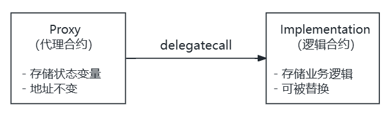
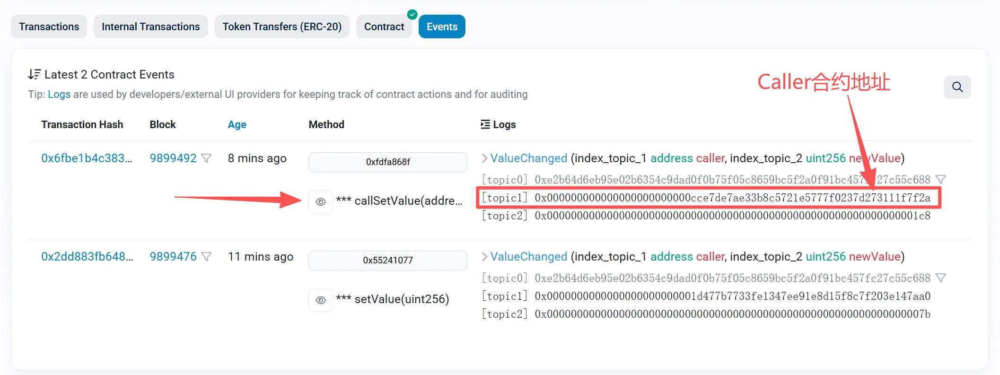

> 本系列共两篇文章，将带你从零到一理解 Solidity 代理合约与可升级合约的核心原理。

## 引言：不可变性的两难

以太坊智能合约有一个核心特性：**不可变性**（Immutability）。一旦部署，合约的字节码就无法修改。

这是一把双刃剑：

- **优点**：用户可以信任合约逻辑不会被篡改，这是去中心化和安全性的基石
- **缺点**：如果合约存在 bug 或需要新功能，开发者束手无策

想象一下：你的 DeFi 协议上线后发现了一个严重漏洞，但你无法修复它——用户资金面临风险，而你只能眼睁睁看着。

这就是为什么社区发明了**代理合约**（Proxy Contract）和**可升级合约**（Upgradeable Contract）模式。

## 核心思路：数据与逻辑分离

既然字节码不可变，那我们换个思路：**把数据和逻辑分开存储**。

```
┌──────────────────────┐                    ┌──────────────────────┐
│        Proxy         │                    │    Implementation    │
│      (代理合约)       │                     │      (逻辑合约)       │
│                      │   delegatecall     │                      │
│  - 存储状态变量        │ ────────────────►  │  - 存储业务逻辑         │
│  - 地址不变           │                    │  - 可被替换            │
└──────────────────────┘                    └──────────────────────┘
```

用户始终与代理合约交互，代理合约负责：
1. 保存所有状态数据
2. 将函数调用转发给逻辑合约执行

当需要升级时，只需部署新的逻辑合约，然后更新代理合约中保存的逻辑合约地址即可。用户无需迁移，地址不变，数据保留。

## delegatecall：代理模式的基石

要理解代理合约，必须先理解 `delegatecall`。

delegatecall 与 call 类似，是 Solidity 中地址类型的低级成员函数，delegate 是委托/代表的意思。

**delegatecall 的本质：借用目标合约的代码，在自己的环境中执行。**

想象一下：你请了一位厨师（逻辑合约）来你家（代理合约）做饭。厨师用的是你家的厨房、你家的食材、你家的餐具。做完饭后，食物留在你家，厨师离开。

基本形式：

```solidity
(bool success, bytes memory returnData) = implementation.delegatecall(calldata)
```

这行代码做了什么？

1. 取 `implementation` 地址上的代码（runtime bytecode）
2. 用你提供的 `calldata` 作为输入
3. **在当前合约的上下文中执行那段代码**
4. 返回执行是否成功 `success` 与返回数据 `returnData`

**「当前合约的上下文」具体指什么？**

- 写入/读取的 `storage` 是当前合约的 `storage`
- `address(this)` 是当前合约地址
- `balance` 也是当前合约的余额
- 事件 `emit` 的发出者地址（log 的 address）也是当前合约

### call vs delegatecall 对比

|                   | call                                           | delegatecall                                                 |
| ----------------- | ---------------------------------------------- | ------------------------------------------------------------ |
| 代码执行位置      | 被调用合约                                     | 调用方（即当前合约）                                         |
| 存储修改位置      | 被调用合约的 storage                           | 调用方（即当前合约）的 storage                               |
| msg.sender        | 调用方（即当前合约）地址                       | 原始外部调用者                                               |
| msg.value         | 会把 value 转给目标（如果设置 `{value: ...}`） | 不会把 ETH 转到实现合约；value 仍在当前合约，但实现代码能"看到"这笔 msg.value |
| address(this)     | 被调用合约地址                                 | 调用方（即当前合约）地址                                     |
| 事件 emitter 地址 | 被调用合约地址                                 | 调用方（即当前合约）地址                                     |

### 动手实验：验证 call 与 delegatecall 的区别

下面的实验将验证：
- **call**：修改的是被调用合约（Logic）的存储，事件从 Logic 发出
- **delegatecall**：修改的是调用方（Caller）的存储，事件从 Caller 发出

**Logic.sol** - 被调用的逻辑合约：

```solidity
// SPDX-License-Identifier: MIT
pragma solidity ^0.8.28;

contract Logic {
    uint256 public value;

    event ValueChanged(address indexed caller, uint256 indexed newValue);

    function setValue(uint256 newValue) external returns (bool) {
        value = newValue;
        emit ValueChanged(msg.sender, value);
        return true;
    }
}
```

**Caller.sol** - 发起调用的合约：

```solidity
// SPDX-License-Identifier: MIT
pragma solidity ^0.8.28;

import "./Logic.sol";

contract Caller {
    uint256 public value;

    event LowLevelCall(bool success, bytes returnData, bool parsedOk);

    function callSetValue(address logic, uint256 _value) external {
        (bool success, bytes memory returnData) = logic.call(
            abi.encodeCall(Logic.setValue, (_value))
        );
        bool parsedOk = _parseBoolReturn(success, returnData);
        emit LowLevelCall(success, returnData, parsedOk);
        require(parsedOk, "Call failed");
    }

    function delegateSetValue(address logic, uint256 _value) external {
        (bool success, bytes memory returnData) = logic.delegatecall(
            abi.encodeCall(Logic.setValue, (_value))
        );
        bool parsedOk = _parseBoolReturn(success, returnData);
        emit LowLevelCall(success, returnData, parsedOk);
        require(parsedOk, "Delegatecall failed");
    }
	
	/// @dev 兼容两类返回：
    /// - 无返回值：returnData.length == 0，但 success == true
    /// - 返回 bool：returnData 编码了 bool（32 bytes）
    /// 注意：如果目标函数返回的是其他类型（例如 uint256），这里不适用。
    function _parseBoolReturn(bool success, bytes memory returnData) internal pure returns (bool) {
        if (!success) return false;
        // 目标函数没有返回值的常见情况：成功时 returnData 为空
        if (returnData.length == 0) return true;
        // 如果确实返回了数据，且长度符合 bool ABI 编码（32 bytes），尝试 decode
        if (returnData.length == 32) {
            return abi.decode(returnData, (bool));
        }
        // 其他长度：无法按 bool 解析，保守处理为失败（也可以选择直接 return true）
        return false;
    }
}
```

**实验步骤**：

1. 部署 Logic 合约，调用 `setValue(123)`，此时 `Logic.value = 123`
2. 部署 Caller 合约
3. 调用 `Caller.callSetValue(Logic地址, 456)`
4. 调用 `Caller.delegateSetValue(Logic地址, 789)`

**预期结果**：

| 操作 | Logic.value | Caller.value | ValueChanged 事件来源 |
|------|-------------|--------------|---------------------|
| 初始 | 123 | 0 | - |
| callSetValue(456) | **456** | 0 | Logic 合约 |
| delegateSetValue(789) | 456（不变） | **789** | Caller 合约 |

以下是某次实验的部署信息：

- 部署者地址：0x1d477b7733Fe1347eE91e8D15f8c7f203E147AA0
- Logic 合约地址：0x6e84C52c6fE239AB2288C07cA2E5b4bF09fBD894
- Caller 合约地址：0xcCe7de7ae33b8C5721e5777f0237D273111F7F2a

调用 `callSetValue` 后，Logic.value 变成 456，事件从 Logic 合约发出：



来源：https://sepolia.etherscan.io/address/0x6e84c52c6fe239ab2288c07ca2e5b4bf09fbd894#events

调用 `delegateSetValue` 后，Logic.value 不变，但 Caller.value 变成 789，事件从 Caller 合约发出：



来源：https://sepolia.etherscan.io/address/0xcce7de7ae33b8c5721e5777f0237d273111f7f2a#events

## 存储槽冲突：一个灾难性的 bug

`delegatecall` 有一个关键细节：**它按存储槽位置操作，而非变量名称**。

看这个有问题的例子：

```solidity
contract Called {
    uint256 public number;  // slot 0

    function increment() public {
        number++;
    }
}

contract Caller {
    address public implementation;  // slot 0  ← 危险！
    uint256 public myNumber;        // slot 1

    function callIncrement() public {
        implementation.delegatecall(
            abi.encodeWithSignature("increment()")
        );
    }
}
```

问题在于：`Called.number` 和 `Caller.implementation` 都在 slot 0。

当执行 `increment()` 时，它会递增 slot 0 的值——但在 `Caller` 中，slot 0 存储的是 `implementation` 地址，而不是 `myNumber`！

**结果**：逻辑合约地址被意外修改，代理合约可能彻底损坏。

### 存储槽的本质

EVM 的存储是一个巨大的 key-value 映射：

- key：0 到 2²⁵⁶-1 的整数（存储槽编号）
- value：32 字节的数据


Solidity 编译器默认从 slot 0 开始分配变量，这就是冲突的根源。

### 解决方案：EIP-1967

核心思想：把代理合约的关键变量放到「不可能冲突」的位置。

2²⁵⁶ 是一个天文数字，如果我们随机选一个槽位，实现合约几乎不可能碰巧用到同一个槽。

EIP-1967 定义了两个特殊槽位：

```solidity
// 逻辑合约地址存储槽
bytes32 constant IMPLEMENTATION_SLOT = 
    bytes32(uint256(keccak256("eip1967.proxy.implementation")) - 1);
// = 0x360894a13ba1a3210667c828492db98dca3e2076cc3735a920a3ca505d382bbc

// 管理员地址存储槽  
bytes32 constant ADMIN_SLOT = 
    bytes32(uint256(keccak256("eip1967.proxy.admin")) - 1);
// = 0xb53127684a568b3173ae13b9f8a6016e243e63b6e8ee1178d6a717850b5d6103
```

**为什么要减 1？**

`keccak256("...") - 1` 的设计很巧妙：

- `keccak256` 生成伪随机数
- 减 1 使得结果没有已知的哈希原像

这意味着没有任何合约能通过 Solidity 的正常语法「算出」这个槽位——除非故意硬编码。

**EIP-1967 只规定了两件事**：

1. 关键变量存在哪里
2. 变量变化时发出什么事件

**它不规定**：谁能修改这些变量、如何升级合约、如何处理函数选择器冲突。这些问题由其他标准解决（透明代理、UUPS 等）。

**Etherscan 如何识别代理？**

当 Etherscan 检测到合约在 EIP-1967 槽位存有非零值时，它会：

1. 标记该合约为代理合约
2. 显示实现合约地址
3. 提供「Read as Proxy」和「Write as Proxy」选项

这就是 EIP-1967 带来的标准化好处——工具链可以自动识别代理模式。

## 一个最简代理合约

理解了原理，我们来看一个基础实现：

**SimpleProxy.sol**：

```solidity
// SPDX-License-Identifier: MIT
pragma solidity ^0.8.20;

contract SimpleProxy {
    bytes32 private constant IMPLEMENTATION_SLOT = 
        0x360894a13ba1a3210667c828492db98dca3e2076cc3735a920a3ca505d382bbc;

    constructor(address _implementation) {
        assembly {
            sstore(IMPLEMENTATION_SLOT, _implementation)
        }
    }

    fallback(bytes calldata data) external payable returns (bytes memory) {
        address impl;
        assembly {
            impl := sload(IMPLEMENTATION_SLOT)
        }

        (bool success, bytes memory result) = impl.delegatecall(data);
        require(success, "Delegatecall failed");
        return result;
    }
}
```

**User.sol** - 模拟用户调用流程核心代码：

```solidity
// SPDX-License-Identifier: MIT
pragma solidity ^0.8.28;

/// @notice 用 Logic 的 ABI 去调用 Proxy
interface ILogic {
    function setValue(uint256 newValue) external returns (bool);
    function value() external view returns (uint256);
}

/// @notice 模拟完整的代理调用流程
contract User {
    /// @notice 演示：用户 -> Proxy -> delegatecall -> Logic 代码 -> 写 Proxy 存储
    function demo(address proxy, address logic, uint256 newValue) 
        public
        returns (uint256 proxyValue, uint256 logicValue, bool success)
    {
        // 通过 Proxy 调用 setValue（会触发 fallback -> delegatecall）
        success = ILogic(proxy).setValue(newValue);

        // 读取 Proxy 的 value（delegatecall 写入的是 Proxy 的存储）
        proxyValue = ILogic(proxy).value();

        // 对比 Logic 自身的 value（应该不变）
        logicValue = ILogic(logic).value();
    }
}
```

完整代码地址：[最简代理合约演示程序](./../../assets/codes/mini_proxy_case/User.sol)

**工作流程**：

1. 用户调用代理合约的某个函数（如 `setValue()`）
2. 代理合约没有这个函数，触发 `fallback`
3. `fallback` 从 EIP-1967 存储槽读取逻辑合约地址
4. 使用 `delegatecall` 将调用转发给逻辑合约
5. 逻辑合约的代码在代理合约的存储上执行

## 小结

本篇我们介绍了：

1. **为什么需要可升级合约**：平衡不可变性与可维护性
2. **delegatecall 的工作原理**：借用代码，本地执行
3. **存储槽冲突问题**：以及 EIP-1967 的解决方案
4. **最简代理合约**：基础实现框架

但这个简单实现还有一个严重问题：**函数选择器冲突**（Function Selector Clash）。

举个例子：如果代理合约有一个 `upgrade()` 函数用于升级，而逻辑合约恰好也有业务函数叫 `upgrade()`，会发生什么？用户调用时，EVM 会优先匹配代理合约的函数，逻辑合约的同名函数将永远无法被调用！

下一篇，我们将深入探讨两大主流代理模式：**透明代理**（Transparent Proxy）和 **UUPS**，看它们如何优雅地解决这个问题。


**系列导航**

- 第一篇：Solidity 代理合约与可升级合约系列（一）：为什么需要可升级？（本篇）
- 第二篇：[Solidity 代理合约与可升级合约系列（二）：透明代理 vs UUPS](./solidity_proxy_upgrade_series_part2_251230.md)
