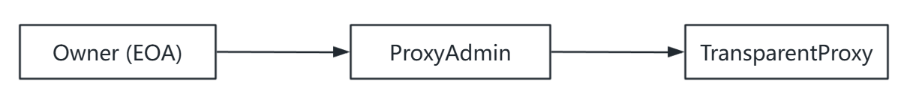
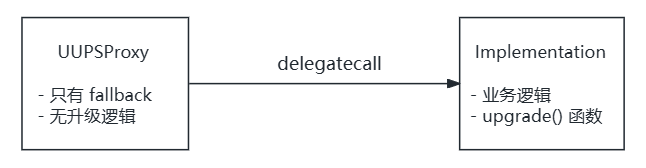

> 上一篇我们理解了 delegatecall 和存储槽冲突问题。本篇将深入两大主流代理模式。

## 函数选择器冲突

在实现可升级代理时，我们遇到了新问题。

假设代理合约需要一个 `upgrade()` 函数来更新逻辑合约地址：

```solidity
contract Proxy {
    address public implementation;

    function upgrade(address newImpl) public {
        implementation = newImpl;
    }

    fallback() external payable {
        // delegatecall to implementation
    }
}
```

问题来了：如果逻辑合约也有一个 `upgrade()` 函数呢？

```solidity
contract Implementation {
    function upgrade(address) public {
        // 业务逻辑...
    }
}
```

当用户调用 `upgrade()` 时，EVM 会先检查代理合约是否有匹配的函数。如果有，就直接执行代理合约的函数，**永远不会触发 fallback**。

结果：逻辑合约的 `upgrade()` 函数无法被调用。

更危险的是：不同函数可能有**相同的函数选择器**。函数选择器只有 4 字节，存在约 1/43 亿的碰撞概率。比如 `clash550254402()` 和 `proxyAdmin()` 的选择器完全相同。

## 解决方案一：透明代理（Transparent Proxy）

透明代理的核心思路很简单：**代理合约除了 fallback，不暴露任何公开函数**。

但没有公开函数，怎么升级？答案是：**通过 msg.sender 来区分调用者**。


**为什么叫「透明」？**

对于普通用户来说，代理合约是「透明」的——他们看不到任何代理相关的函数，所有调用都会被转发。代理合约的管理功能只对管理员「可见」。

```solidity
contract TransparentProxy {
    address immutable admin;

    constructor(address _admin) {
        admin = _admin;
    }

    fallback() external payable {
        if (msg.sender == admin) {
            // 执行升级逻辑
        } else {
            // delegatecall 到逻辑合约
        }
    }
}
```

规则：
- **admin 调用**：路由到升级逻辑
- **普通用户调用**：路由到逻辑合约

这完全消除了函数选择器冲突——因为代理合约根本没有公开函数。

### OpenZeppelin 的实现结构

但上述设计有个问题：admin 无法直接使用合约功能，因为它的调用会被路由到升级逻辑。

OpenZeppelin 的解决方案是引入 **ProxyAdmin** 合约：



- 代理合约的 admin 是 ProxyAdmin 合约（地址固定）
- ProxyAdmin 的 owner 是真正的管理员
- owner 通过 ProxyAdmin 间接升级代理
- owner 也可以直接调用代理使用合约功能（因为 msg.sender 是 owner，不是 admin）

**OpenZeppelin 合约继承结构**：

```
Proxy.sol (抽象基类)
    │
    └── ERC1967Proxy.sol (实现 EIP-1967 槽位)
            │
            └── TransparentUpgradeableProxy.sol
                    │
                    └── 配合 ProxyAdmin.sol 使用
```

```solidity
contract ProxyAdmin {
    address public owner;

    function upgradeAndCall(
        ITransparentUpgradeableProxy proxy,
        address implementation,
        bytes memory data
    ) public onlyOwner {
        proxy.upgradeToAndCall(implementation, data);
    }
}
```

关键设计：

- 代理合约只有 `fallback()` 函数
- 所有管理功能通过 ProxyAdmin 调用
- 管理员地址存储在 EIP-1967 槽位

**优点**：

- 彻底消除函数选择器冲突
- 升级逻辑在代理合约中，逻辑合约不需要包含升级代码

**缺点**：

- 需要额外部署 ProxyAdmin 合约
- 每次调用都要检查 `msg.sender == admin`，增加 gas 消耗

## 解决方案二：UUPS（通用可升级代理标准）

UUPS（ERC-1822）采用了不同的策略：**把升级逻辑放在逻辑合约中**。



### 升级是如何工作的？

UUPS 的升级过程：

1. 管理员调用 Proxy 的 `upgradeTo(newImpl)`
2. Proxy 通过 `fallback()` 将调用 delegatecall 给当前实现合约
3. 实现合约的 `upgradeTo()` 被执行
4. 由于是 delegatecall，修改的是 Proxy 的存储
5. Proxy 的实现地址被更新为 `newImpl`

```
Admin ──upgradeTo(V2)──► Proxy ─delegatecall─► Impl V1
                           │                      │
                           │    upgradeTo() 修改   │
                           │    Proxy 的存储       │
                           ▼                      │
                    implementation = V2  ◄────────┘
```

### 代码结构

代理合约极其简单：

```solidity
contract UUPSProxy {
    constructor(address _implementation) {
        assembly {
            sstore(
                0x360894a13ba1a3210667c828492db98dca3e2076cc3735a920a3ca505d382bbc,
                _implementation
            )
        }
    }

    fallback() external payable {
        // 读取实现地址并 delegatecall
    }
}
```

逻辑合约需要继承 OpenZeppelin 的 `UUPSUpgradeable`：

```solidity
import "@openzeppelin/contracts-upgradeable/proxy/utils/UUPSUpgradeable.sol";

contract MyContract is UUPSUpgradeable {
    // 业务逻辑...

    function _authorizeUpgrade(address newImplementation) 
        internal 
        override 
        onlyOwner 
    {}
}
```

### proxiableUUID：安全检查

UUPS 有个巧妙的安全机制：升级前会检查新合约是否兼容。

```solidity
function proxiableUUID() external view returns (bytes32) {
    return IMPLEMENTATION_SLOT;
}
```

升级时，会调用新合约的 `proxiableUUID()`：
- 如果返回正确的存储槽地址，说明新合约是 UUPS 兼容的
- 如果调用失败或返回值错误，升级被拒绝

这防止了意外升级到一个没有升级能力的合约——那将导致合约永远无法再升级。

### UUPS 的风险

**风险一：忘记实现升级函数**

如果新版本的实现合约没有 `upgradeTo()` 函数，合约将**永久失去升级能力**：

```solidity
// ❌ 灾难：忘了继承 UUPSUpgradeable
contract ImplV2 {
    // 没有 upgradeTo() 函数 → 永远无法再升级！
}
```

防护措施：OpenZeppelin 要求实现合约继承 `UUPSUpgradeable`，并实现 `_authorizeUpgrade()` 钩子。

**风险二：未初始化的实现合约**

如果有人直接调用实现合约的 `initialize()`，他可以成为实现合约的 owner，然后调用 `upgradeTo()` 指向一个包含 `selfdestruct` 的合约。**这曾经是真实的攻击向量**（Wormhole 事件）。

防护：在构造函数中调用 `_disableInitializers()`：

```solidity
constructor() {
    _disableInitializers();
}
```

## 透明代理 vs UUPS：如何选择？

| 特性 | 透明代理 | UUPS |
|------|---------|------|
| 升级逻辑位置 | 代理合约 | 逻辑合约 |
| Gas 成本 | 较高（每次检查 admin） | 较低 |
| 代理合约大小 | 较大 | 最小 |
| 逻辑合约大小 | 较小 | 较大（含升级代码）|
| 风险 | 较低 | 较高（可能丢失升级能力）|
| 适用场景 | 通用场景、安全优先 | 高频调用、gas 敏感 |

**选择建议**：

- 逻辑合约接近 24KB 限制 → 透明代理
- 需要极致 gas 优化 → UUPS
- 追求简单安全 → 透明代理

OpenZeppelin 当前**推荐使用 UUPS**，因为它更轻量且灵活。

### 架构对比图


## 其他代理模式简介

除了透明代理和 UUPS，还有几种常见模式，这里简单了解即可：

### Beacon Proxy

多个代理共享同一个逻辑合约地址，通过 Beacon 合约统一管理。更新 Beacon 一次，所有代理同时升级。

**适用场景**：需要批量部署和批量升级，如 NFT 工厂。

### Diamond Proxy（EIP-2535）

一个代理可以指向**多个**逻辑合约，通过函数选择器路由到不同的 Facet。

**适用场景**：超大型合约，需要突破 24KB 限制。

### Minimal Proxy（EIP-1167）

极简克隆模式，所有克隆共享同一份逻辑代码，部署成本极低（约 45 字节），但**不可升级**。

**适用场景**：需要大量部署相同逻辑的合约，如用户钱包。

## 小结

本篇我们学习了：

1. **函数选择器冲突问题**：代理合约的公开函数会遮蔽逻辑合约的同名函数
2. **透明代理**：通过检查 msg.sender 区分调用者，消除冲突
3. **UUPS**：将升级逻辑放入逻辑合约，代理合约极简化
4. **如何选择**：根据 gas 优化需求、合约大小限制、安全性需求决定
5. **其他代理模式**：Beacon、Diamond、Minimal Proxy

**最后的建议**：

可升级合约是一把双刃剑。它解决了不可变性的困境，但也引入了新的信任假设和安全风险。

在使用可升级模式前，请认真思考：

- 你的合约真的需要升级能力吗？
- 用户是否信任你（或 DAO）不会恶意升级？
- 你是否有完善的升级治理流程？

如果答案都是肯定的，那么请选择适合的模式，遵循最佳实践，让可升级性成为你的优势而非负担。

**参考资料**

- [RareSkills: Book of Proxy Patterns](https://rareskills.io/proxy-patterns)
- [Ethereum.org: 升级智能合约](https://ethereum.org/zh/developers/docs/smart-contracts/upgrading)
- [OpenZeppelin Upgrades Plugins](https://docs.openzeppelin.com/upgrades-plugins)
- [EIP-1967: Standard Proxy Storage Slots](https://eips.ethereum.org/EIPS/eip-1967)
- [EIP-1822: Universal Upgradeable Proxy Standard](https://eips.ethereum.org/EIPS/eip-1822)


**系列导航**

- 第一篇：[Solidity 代理合约与可升级合约系列（一）：为什么需要可升级？](./solidity_proxy_upgrade_series_part1.md)
- 第二篇：Solidity 代理合约与可升级合约系列（二）：透明代理 vs UUPS（本篇）
