# DeFi 课程（2024 版）学习笔记

> 本文是我 2024 年在 B 站学习梁培利老师的公开课程《DeFi 课程（2024版）》时整理的学习笔记。课程以 Uniswap 为核心，系统梳理了 DeFi 领域的关键概念与协议原理，涵盖稳定币、去中心化交易所、借贷协议等主题。笔记中保留了课堂要点、案例分析以及我个人的一些补充说明，希望对同样在学习 DeFi 的朋友有所帮助。
>

**📢 课程更新提示**：该课程 2025 年已推出最新版——[《Uniswap 专题：从V1到V4》](https://space.bilibili.com/220951871/lists/5076602)，讲解内容更为详细，重点介绍了 Uniswap V3 的机制原理，推荐感兴趣的读者关注。

课程视频：https://space.bilibili.com/220951871/lists/2824381

课程幻灯片和讲义：https://github.com/liangpeili

## 第 1 课 - DeFi 课程简介

**区块链应用的常见分类：**

- DeFi：Uniswap/AAVE/Curve/DAI/Compound 等；
- GameFi：从 CryptoKitties 开始；
- SocialFi：nostr/Damus/friend.tech；
- 国内目前政策：去 Fi 留 block，服务实体经济；

**CeFi 的主要组成机构与职能：**

- 中央银行：发行法定货币；
- 商业银行：存款、结算、信贷等；
- 保险公司：风险转移与分散；
- 证券公司：证券买卖、交易，证券承销等；
- 银监会、证监会和保监会；
- 国家金融监督管理总局；

**CeFi 的特点：**

- 集中的账户管理；
- 交易审查与监控；
- 基于对机构的信任；
- 手续费作为主要利润来源；
- 不透明性/信息差；

穷人死于 P2P、中产死于理财，富人死于信托。

**DeFi 能做什么：**

- 全球支付；
- 交易；
- 理财；
- 借款；
- 贷款；
- 衍生品；

**DeFi 的特点：**

- 账号个人管理：Not your keys, not your coins；
- 无需许可；
- 开源可验证；
- 可编程性；

> 注意：目前国内并没有做纯 DeFi 的政策空间。

**课程安排：**

- 以 Uniswap 为核心，梳理 DeFi 领域的上下游产品及其原理；
- 从稳定币入手，逐步介绍去中心化交易所 Uniswap 的核心逻辑，进而扩展到其他领域 DeFi 产品（如借贷等）和算法；
- 理论课 24 学时 + 实验课 8 学时；
- 《区块链应用系统开发实践》32 学时；

> 梁老师的一个小野心：把这个课程做成中文圈里最好的。

## 第 2 课 - 稳定币：USDT/USDC/BUSD

**货币的演化：**

- 实物货币；
- 金属货币；
- 基于黄金等贵金属抵押的法定货币；
- 基于信用的法定货币；
- 电子货币；
- 数字货币？

通货膨胀有利于经济发展，而通货紧缩不利于。

**稳定币：沟通赛博空间和现实世界的桥梁**

- 加密货币的波动太大；
- 相比加密货币，人们更相信法币；
- 在加密货币世界，也需要价值锚定；

**稳定币的类型：**

- 基于法币锚定的稳定币：USDT/USDC/BUSD 等；
- 基于加密资产超额抵押的稳定币：DAI；
- 基于算法的稳定币（算法稳定币）：UST/Frax 等；

**基于法币抵押的稳定币 -- USDT**

- 稳定币市值排名第一；
- 由 Tether 发行；
- 中心化管理；

https://tether.to

There are five steps in the lifecycle of Tether tokens：

1. 一个经过 KYC 认证的个人或机构可以充值法币到 Tether 公司持有的银行账户中；
2. Tether 公司发行 USDT 到这个用户或公司提供的地址，Tether 公司转给用户的数量和用户充值给 Tether 公司银行账户的数量一样；
3. 用户持有 USDT 就可以拿这个去参与链上产品，比如说存储、理财、交换等；
4. 用户如果不想再持有 USDT 了，可以在 tether.to 上转回去；
5. Tether 公司把法币从自己公司转到用户的银行账户上，并销毁链上对应数量的 USDT；

> 💡 Tether 公司将近 100 人，2023 年第四季度净利润近 200 亿人民币；同期的小米公司员工超过 3 万人，净利润近 49 亿人民币。

区块链公司跟互联网公司的区别：区块链公司不需要很多人，那它需要什么样的人？在这个行业待下去的收益是互联网的很多倍。

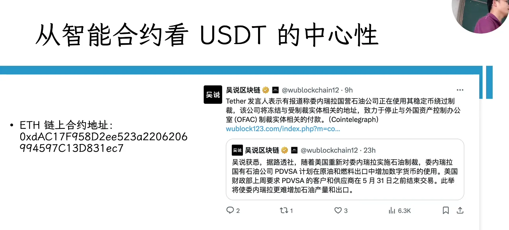

**基于法币抵押的稳定币 -- USDC**

- 稳定币市值排名第二；
- 由 Circle 管理和发行；

**基于法币抵押的稳定币 -- BUSD**

- Paxos 发行的美元稳定币；
- 受纽约金融服务局 NYDFS 的监管；
- 用了 Binance 的品牌；
- 可以 1:1 购买和赎回；
- 100% 的美元或者美元现金等价物支撑；
- 仅在以太坊发行；
- 2023 年 2 月份停止发行；

## 第 3 课 - 稳定币：DAI/AMPL

**基于加密资产超额抵押的稳定币 -- DAI**

- DAI 是 Maker Protocol 的主要产品；
- Maker Protocol 由 MakerDAO 管理；
- MKR 是 MakerDAO 的治理代币；

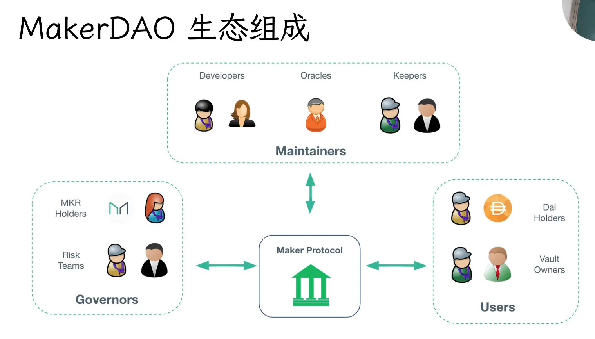

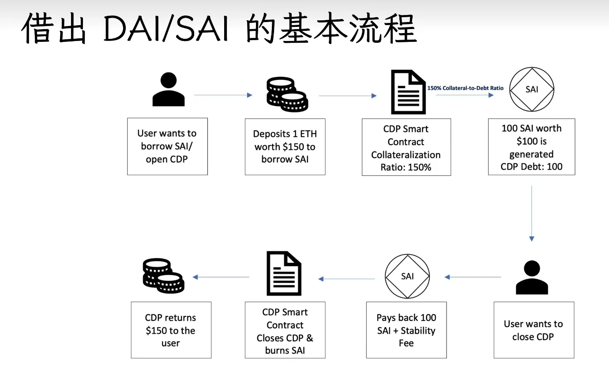

**DAI 的供应量控制：**

- 贷款利率：Stability Fee
- 存款利率：DAI Saving Rate（DSR）
- 如果 1 DAI = 0.99 USD，提高利率；
- 如果 1 DAI = 1.01 USD，降低利率；

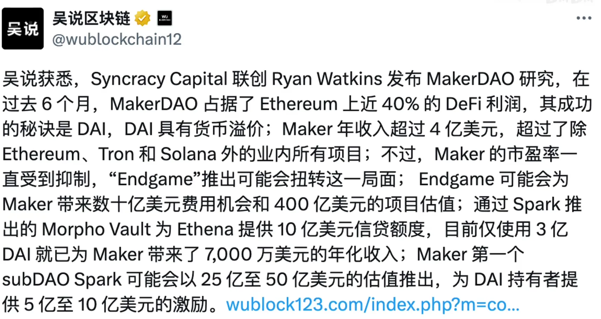

> MakerDAO 的员工数比 Tether 更少。

课后思考：研究 DAI 的盈利方式，为什么会有这么高的收入？（这类问题是区块链项目创业一个比较好的思考切入点）

**案例分析**

- 假设 1 ETH = 2000 USD，质押了 5 个 ETH 到 Maker Vault，按照 150% 的超额抵押率，最多可以借出 10000 / 150% = 6666.67 个 DAI。保险起见，用户借出 5000 DAI，其余 1666.67 为缓冲区。
- 情形 1：ETH 涨价到 3000 USD。此时 5 ETH = 15000 USD，基于 150% 的抵押率，用户最多可以借出 10000 DAI。
- 情形 2：ETH 跌到 1500 USD，此时 5 ETH = 7500 USD，7500 USD / 5000 DAI = 150%。用户面临三个选择：
    - 往 Maker Vault 质押更多的 ETH；
    - 还回 5000 DAI + Stability Fee，拿回 5 个 ETH；
    - 还回部分 DAI + Stability Fee，增加自己的缓冲区；

**DAI 的防护网之一 ——Collateral Auction**

- 情形 3：ETH 跌到 1200 USD，此时 5 ETH = 6000 USD，触发清算，Keeper 介入清算流程；
- 5 个 ETH 按照市价折扣 3% 进行拍卖，每次增加 0.5%，直到拍卖成功；
- Keeper 使用 DAI 来竞拍，价高者得；
- 扣除 5000 DAI + Penalty Fee 等费用，其余 ETH 返回给用户；

**DAI 的防护网之二——Maker Buffer**

- Stability Fee / Penalty Fee 等缓慢积攒；
- 情形 4：ETH 跌到 900 USD，此时 5 ETH = 4500 USD，拍卖后的缺口为 500 USD；
- 从 Maker Buffer 支付 500 DAI，弥补缺口；

**DAI 的防护网之三——Debt Auction**

- 情形 5：ETH 跌到 900 USD，此时 5 ETH = 4500 USD，拍卖后的缺口为 500 USD，而 Maker Buffer 里只有 100 DAI，资金缺口为 400 USD。
- 增发 MKR 进行拍卖；
- 用户使用 DAI 参与拍卖，拍卖得到的 DAI 来弥补缺口；
- 这是一种对社区治理的惩罚方式；

增发 MKR 使得币的价值被稀释。

**Decentralized Autonomous Organization (DAO)**

- 一种新型的组织形式
- 发行治理 Token
- 治理 Token 代表投票权
- 社区共治、共建、共享

**MakerDAO 的运行机制**

- 提案阶段

    - 1. 发起提案：任何 MKR 持有人都可以发起新提案；
    - 2. 在 MakerDAO 社区讨论；
    - 3. 提交优化后的提案；
    - 4. Risk Team 对其进行风险评估；

- 投票阶段

    - 一个 MKR Token 表示一个投票权，可以代理；
    - 投票期一般持续 7 天；
    - 根据投票结果决定是否通过；（4% 同意）

**Surplus Auction**

- Maker Buffer Limit
- 超出限制后的 DAI 用来拍卖购买 MKR
- 销毁 MKR
- 一种社区治理的奖励方式

用户参与一些协议的质押，可以用来加杠杆，例如有 1 ETH，借出来一些币拿来买 ETH，再把买来的 ETH 放进去借钱，依次重复。

> 💡 在学习一种新的协议时，都要思考一个问题：为什么别人愿意来参与你的协议？

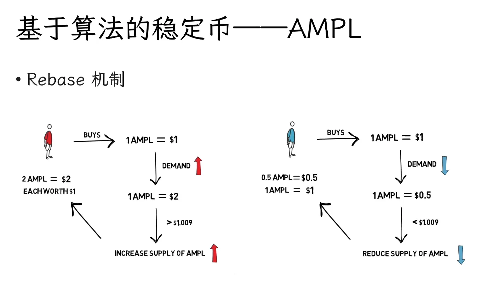

**总结：**

- 稳定币诞生的原因；
- 稳定币的类型：USDT/USDC/BUSD/DAI/AMPL；
- USDT 的中心性；
- DAI 的运行原理；
- Maker Protocol 中的清算；
- AMPL 的运行原理；

## 第 4 课 - ERC4626

**Vault**

- 资产的管理、分红
- 用户充值某项资产，获取某个凭证
- 该凭证作为分红、退出的依据
- Yield Farming / 借贷 / 质押等

https://eips.ethereum.org/EIPS/eip-4626

> 💡 建议研究 ERC20 提案的原始内容。

EIP 从想法到落地的流程：

1. 产生一个想法；
2. 提出 Proposal；
3. 讨论通过后正式成为标准；
4. 第三方库（例如 OpenZeppelin）根据这个标准去实现；
5. 开发者使用。

## 第 5 课 - ERC4626（二）

本节课简略过了一遍 ERC4626 的实现细节，此处省略。

## 第 6 & 7 课 - 去中心化交易所

DeFi 领域的三大支柱：稳定币、交易所、借贷。

**交易所：**

- 证券交易所
- 期货交易所
- 加密资产交易所

    - 中心化交易所
    - 去中心化交易所

2017 年 9 月 4 日，七部门联合发布《关于防范代币发行融资风险的公告》，然后 Binance 出海了，但是 OKX 总部却还在北京，甚至发行了 OKX token。

从 2020 年开始有 DEX 这个赛道。

**中心化交易所的业务模式——以币安为例**

- **交易费**：交易所通过提供买卖加密货币的平台来收取交易费用。有些交易所还提供高级交易选项，如杠杆交易，这通常会带来更高的费用；
- **上币费**：项目方团队后面都会去找交易所上币，然而上币需要缴纳一笔数额不小的上币费；
- **量化交易**：用户在交易所中，一般数字资产都是暂时存放在交易所，基本上交易所掌握所有筹码可以选择做多或者做空，交易所可以去赚取差价，而用户提币出去也能赚取手续费；
- **原生代币**；

> 💡 梁老师举了个例子：自己了解到的一个项目，2017 年左右为了上前三的交易所，上币费为 1100 万人民币（购买交易所发行的原生代币，参与投票竞选）。项目方安全审计要花钱，上交易所也要花钱，而且还得通过内部关系，熟人才行。交易所特别赚钱。

**中心化交易所的交易模式——订单簿模式**

- 中央限价订单簿（CLOB）就是一本由出价和报价组成的完全透明账本，从最优价开始依次排序（两边分别是参与者愿意买/卖的价格）。
- 所有的参与者都能看到所有的报价和出价，他们也可以参与其中。
- 订单簿中两边的第一行，即是最优的报价/出价。

**订单簿模式的优劣**

优势：

- 透明的流动性
- 做市商可自由出入
- 做市商可以自由决定价格与数量

劣势：

- 冷启动问题（很难给出初始流动性）
- 对非流动性资产不利
- 如果是链上交易所，则对链的 TPS 的要求很高

交易所刚开始的时候需要很大的资金量，用户玩的顺畅，才会吸引更多用户过来。

早期去中心化交易所使用订单簿的模式，但由于链上 TPS 太低，没有发展起来。

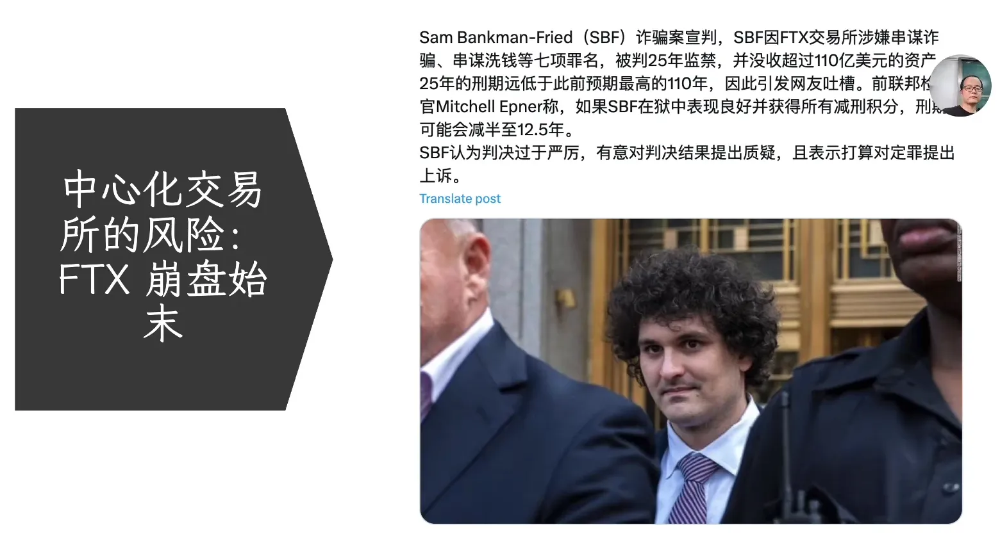

**链上交易方案：自动做市商**

- 出现原因：以太坊的 TPS 对于支撑链上订单簿的实时更新来说太低了。反面案例：Solana 链由于其 60K 的 TPS，其上有许多订单簿模式的交易所。
- 交易所里没有订单簿，只有一系列预设的函数，为各类货币的互相交换来定价。
- 这些预设的函数（例如 x*y=k）基于两种货币在各自流动性池中的供给变化率来设定价格。在某个货币的流动性池内，任何人都能够提供该种货币以增加其流动性，从而获得收益。

两个代币数量的乘积等于一个常量。

Vault：放一些币进去，返回一个 share，表示放进去的凭证。

用户将流动性放到一个交易池里，交易池会给用户发行一个新的 Token，叫 Liquidity Provider Token（LPT）。

只要有价差，就有套利空间，就会被套利机器人吃掉。

**DEX 的去中心化：**

- 任何人都可以添加流动性，成为 LP，并拿到 LP Token；
- LP 在任意时间可以移除流动性并销毁 LP Token，拿回自己添加的 Token；
- 用户可以使用非官方的前端页面来进行交易；
- 交易时收取一定手续费，并且分配给 LPT Holder；

提供 LP 可能亏损，需要承担无常损失的风险。

**自动化做市模式的优劣：**

- **优势：**

    - 对于新的代币，可以很方便地冷启动
    - 去中心化
    - 代币交换可组合性很高

- **劣势：**

    - 所有价格点的统一流动性（在 Uniswap V3 中已解决）
    - 滑点频繁
    - 波动性大，经常有很大的无常损失（流动性提供者在平均表现上是盈利的）

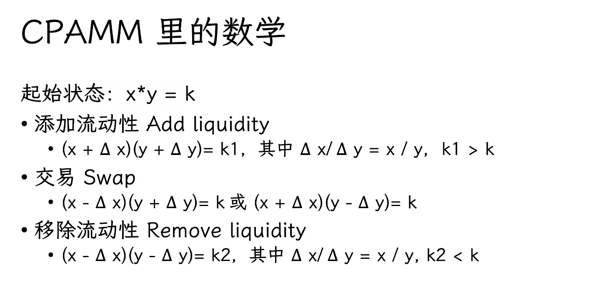

需要理解的是，如何基于 x*y=k 这个公式来完成添加流动性、Swap、移除流动性这三个操作以及里面的一些计算细节。写一个 CPAMM 合约，Token 如何提供，提供 Token 之后如何把 share 返回给用户，具体怎么计算，swap 是怎么算的，移除流动性是怎么算的。

添加流动性会不会影响价格？

我们希望流动性的体现和添加的数量成一个线性关系。

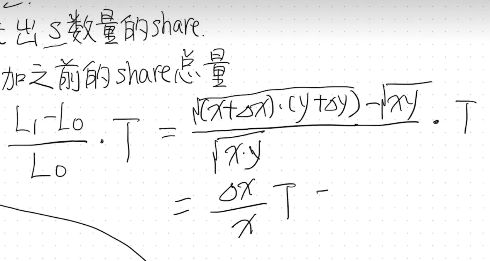

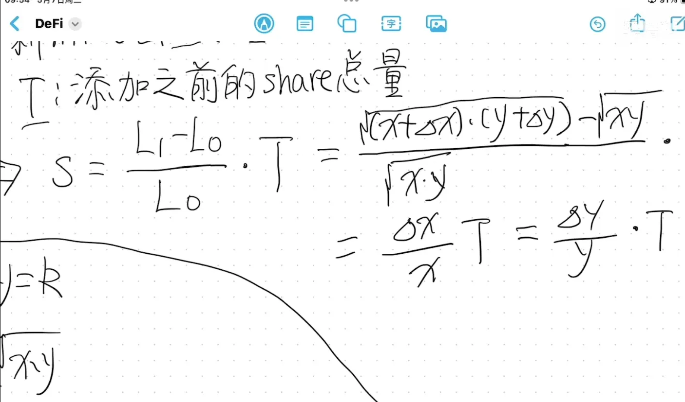

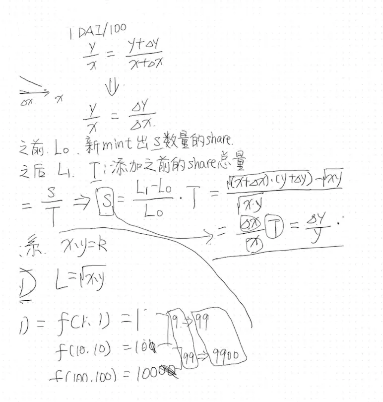

如果池子很浅，就会产生很高的滑点。

### ChatGPT 补充：为什么需要链上自动做市商？

在中心化交易所（Binance、Coinbase 等）中使用订单簿模式，这种模式需要：

- **高频订单更新**：买方和卖方不断地挂出买入和卖出订单；
- **强大的撮合引擎**：一个高速、中心化的服务器来实时匹配这些买单和卖单；
- **做市商**：专业的机构或个人提供流动性，通过不断报价来缩小买卖价差，让市场更高效；

如果直接把订单簿搬到区块链上（即链上订单簿），会遇到一些问题：

（1）性能瓶颈与高昂成本：区块链（尤其是早期的以太坊）速度慢、吞吐量低，每一笔挂单、撤单、匹配交易都需要支付 Gas 费，并需要全网节点确认。订单簿需要不断地挂单、撤单、修改订单、撮合交易，每一笔交易都需要支付 Gas 费，一旦网络拥堵，Gas 费飙升；

（2）区块链延迟高：中心化交易所的撮合延迟是微秒级，而链上的交易延迟远无法达到 CEX 水平，高延迟 + 无法实时撮合 → 订单深度会变得非常差；

（3）链上订单簿易被 MEV 抢跑：链上订单簿的订单都是公开的，MEV bot 可以看到你的订单并直接抢跑，导致用户持续受到损失，这会让订单簿体验极差；

（4）小型长尾代币没有做市商：在中心化交易中，专业做市商负责挂买单/卖单维持深度，依赖于高频交易和复杂的算法。链上操作成本高，没有人会主动给新代币挂单做深度，导致深度差、滑点巨大、无法交易，无法实现"人人可发币"的去中心化生态。

直接将传统金融的订单簿模式复制到区块链上，在技术和经济上都是不可行的。因此，我们需要一个全新的、为区块链原生设计的交易模式。

AMM 的理念非常简单但革命性：**让流动性池（Liquidity Pool）自动报价，无需订单簿或做市商。**

例如 Uniswap 的 x*y=k 模型：

- 用户把 Token A 和 Token B 存进池子
- 池子用公式自动给出价格
- 和池子交易即可，不需要对手盘

AMM 本质上：

- **用算法提供流动性**
- **用代币池子替代订单簿**
- **用 LP（流动性提供者）替代专业做市商**

## 第 8 课 - Uniswap 简介

On Path Independence：https://vitalik.eth.limo/general/2017/06/22/marketmakers.html

A Short History of Uniswap：https://blog.uniswap.org/uniswap-history

Uniswap Whitepaper V1：https://hackmd.io/@HaydenAdams/HJ9jLsfTz

**Uniswap V1：**

- 2018 年 11 月 2 日发布；
- 使用 Vyper 语言编写；
- 仅支持 ERC20-ETH 直接互换或者通过 ETH 进行互换（Chained-swap）；
- 合约地址：https://github.com/Uniswap/v1-contracts/tree/master/contracts

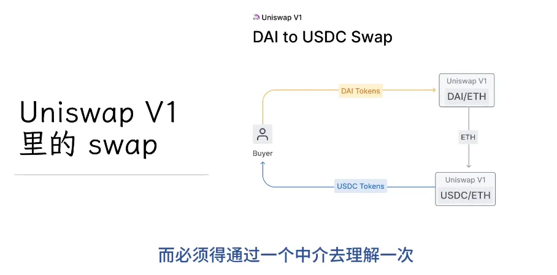

Vitalik 的"On Path Independence"是 2017 年 6 月份发表的，2018 年 11 月才有人正式地用五六百行代码把文章的主要思想实现出来。现在觉得很简单，但回头看的话，也不太容易。好比万有引力公式，现在看很简单，但前人发现这个公式用了几百年。

Uniswap v2 Overview：https://blog.uniswap.org/uniswap-v2【March 23, 2020】

**Uniswap V2：**

- 2020 年 5 月发布；
- 增加 ERC20 - ERC20 直接互换；
- 增加 Flash Swap；
- 增加 Oracle；
- 改进手续费收取方式；
- 引爆了 DeFi 赛道；
- 2020 年 9 月，发行治理代币 UNI；

2020 年 5 月份 Uniswap V2 发布，引爆了 DeFi 赛道。

Sushi 克隆 Uniswap 源码，Yield Farming，吸血攻击，导致 Uniswap 空投 UNI。

> 💡 区块链圈，不要光关注技术和产品逻辑，仅仅只是八卦就可以发现很多素材，每一个新闻背后都有故事。

**Uniswap V2 的核心合约**

- Uniswap V2 Core

    - UniswapV2Pair.sol
    - UniswapV2Factory.sol

- Uniswap V2 Periphery

    - Router contract
    - Library contract

**Uniswap vs SushiSwap**

- 2020 年 8 月 28 日，SushiSwap 发布；
- SushiSwap fork 了 Uniswap，并且做了一些改进；
- SushiSwap 增加了奖励系统，从 Uniswap 吸引走许多流动性；
- 作为回击，2020 年 9 月 Uniswap 宣布发行 UNI 作为治理代币；

Introducing Uniswap v3：https://blog.uniswap.org/uniswap-v3【March 23, 2021】

**Uniswap V3**

- 2021 年 3 月，Uniswap V3 发布；
- 主要特性：

    - 增加集中流动性；
    - 优化手续费设置；
    - LPT 改成基于 NFT 的 Liquidity Token；
    - 改进开源协议；

V2 的流动性没有集中，任何价格都覆盖，但其实一个 Token 的波动通常只局限于一个范围，在范围之外做流动性是浪费的。

V2 中添加流动性获得的 share 是 ERC20 版本，在 V3 中是 NFT。有了集中流动性后，每个人添加的价格范围可能不一样，例如 A 添加 ETH 流动性的区间是 2800~3200\$，而 B 是 3600~4000\$。

V2 源码被克隆抄袭，V3 源码协议不允许克隆商用，有效期 2 年。

Our Vision for Uniswap v4：https://blog.uniswap.org/uniswap-v4【June 13, 2023】

【补充】UNIfication：https://blog.uniswap.org/unification【November 10, 2025】

**Uniswap V4**

- 2023 年 6 月 23 日发布代码草案；
- 新增主要特性：

    - Hook
    - Singleton Pool Manager Design
    - Reintroduction of Native ETH
    - Flash Accounting

- 目标：更快、更省 Gas Fee，容易集成；成为 DeFi 领域的基础设施；

Hook 的应用举例：在每一次 swap 前验证 KYC；像股票交易所一样设置交易时间限制（节假日、周末停盘）。

在 V2 中只支持 ERC20 之间的转换，ETH 与其他 ERC20 Token 的转换都需要先换成 WETH（即 ETH 的 ERC20 版本），V4 中把原生 ETH 拉回来了。

DeFi 领域有很多东西可以像搭积木一样叠加，把别人做好的东西作为自己应用的一个模块。Uniswap V4 就想往这方面发展，成为 DeFi 领域的基础设施。

Pancakeswap 是 BSC 上最大的 DEX。

**Uniswap VS Binance**

- 无须实名认证
- 代码开源
- 上币不收费
- 用户自己管理资金，不用托管到交易所
- 社区治理

Not your keys, not your coins.

## 第 9 课 - Uniswap V2 的手续费计算

Uniswap V2 Whitepaper：https://uniswap.org/whitepaper.pdf

在 Uniswap V1 中，每一笔交易就扣一个手续费。

> 💡 梁老师提到白皮书中的 Chapter 2.4 节有点难理解。

**通过增发 share 的方式把手续费给项目方**

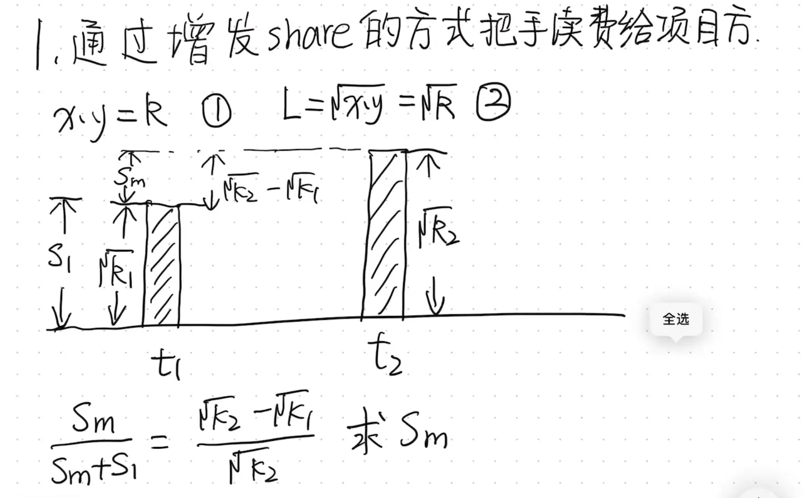

通过使 $S_1$ 增值的方式把手续费给 LP

**项目方想分走手续费里的一定比例**

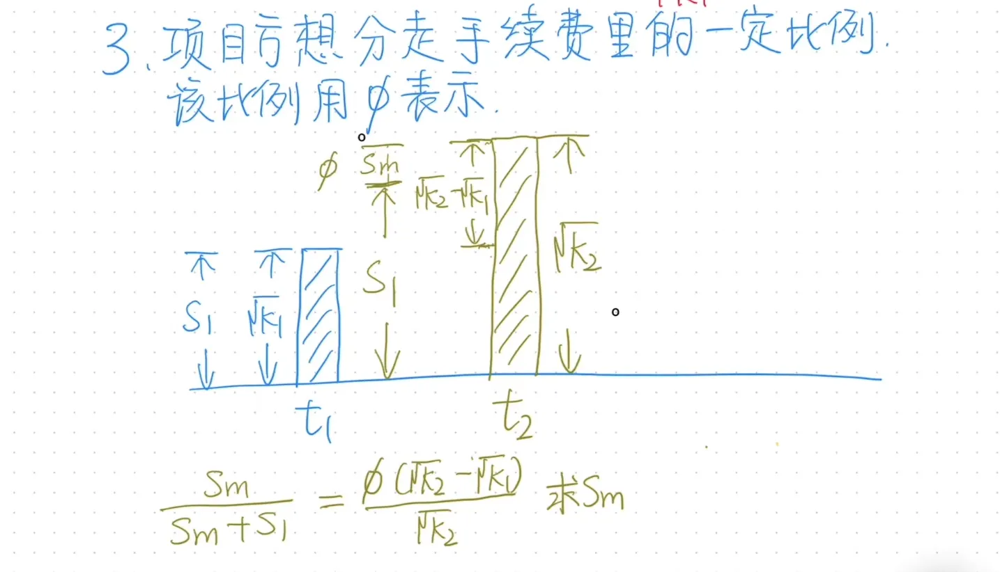

| 方式                     | 谁拿走 swap 产生的价值增加？   | share 是否增发？ | Uniswap 是否采用？       |
| ------------------------ | ------------------------------ | ---------------- | ------------------------ |
| 1. 增发 share → 给项目方 | 项目方拿手续费（protocol fee） | 是，mint LPT     | ✔（V2 feeTo 模式）       |
| 2. S₁ 增值 → 给 LP       | 全部手续费给 LP                | 否               | ✔（默认无 protocol fee） |
| 3. 抽走 φ 比例           | φ 给项目方，1−φ 给 LP          | 是               | ✔（V2 支持 φ = 1/6）     |

三者是同一套数学，用不同视角表达。

参考资料：[How Uniswap V2 computes the mintFee](https://www.rareskills.io/post/uniswap-v2-mintfee)

> 💡 收取手续费不是在 swap 时收，而是在添加和移除流动性时收，带来 shares 总量的 mint 或者 burn。

## 第 10 课 - Uniswap V2 里的 TWAP

> 本节课程包含较多代码演示。

Uniswap V2 链上价格预言机

【GPT-4o】TWAP（Time-Weighted Average Price，时间加权平均价格）是 Uniswap V2 中引入的一种机制，为了解决去中心化交易所中瞬时价格易受操纵的安全隐患，通过时间加权平均价格来提供更稳定的价格数据。它大大降低了短期价格操纵的风险，并为 DeFi 协议提供了一个更加可靠的价格预言机。

**(1) 为什么要引入 TWAP？**

在去中心化交易所（如 Uniswap）上，瞬时价格是由流动性池中代币的供需关系决定的。因此，在没有 TWAP 之前，这种瞬时价格可以在短时间内被操纵者影响，使得 DeFi 协议在依赖 Uniswap 的价格预言机时存在安全隐患。

例如，如果某个协议基于 Uniswap 上的即时价格来清算借款或执行套利交易，那么攻击者可能通过一个短暂的、大规模的交易瞬间改变池中的价格，从而使协议误以为价格发生了大幅波动，这种攻击被称为"闪电贷价格操纵攻击"（flash loan price manipulation）。

为了防止这种问题，Uniswap V2 引入了 TWAP 机制，通过计算一个时间段内的平均价格来提供更可靠的价格信息。这样，协议可以依赖这个平均价格，而不是瞬时的市场价格，从而大大减少了短时间内价格波动带来的风险。

**(2) TWAP 工作原理**

Uniswap V2 的 TWAP 是基于累积价格的机制来实现的。每个交易对的价格会在每个区块内更新一次，这个价格基于池中的代币数量（X 和 Y）的比值。

具体来说，Uniswap V2 追踪两个代币对之间价格的累积值：

1. 每个区块结束时，Uniswap 会记录当前的价格乘以自上次更新以来经过的时间，并将其累积。
2. 累积价格随着每个区块不断增长，因此计算价格的时间越长，累积的价格值就越大。

为了计算某一时间段的平均价格（即 TWAP），可以通过以下步骤：

1. 记录开始时间的累积价格。
2. 记录结束时间的累积价格。
3. 用结束时间的累积价格减去开始时间的累积价格，然后除以时间差（区块数），得出这段时间内的平均价格。

通过这种方式，Uniswap V2 让用户能够基于区块链的历史数据计算任意时间段的加权平均价格，而不是依赖瞬时价格。

示例：假设某个交易对是 ETH/DAI，我们想要在过去 6 小时内计算 ETH 的时间加权平均价格。假设每个区块的平均出块时间为 15 秒，因此 6 小时大约包含 1440 个区块。

1. 在区块高度 `N` 处，我们记录下 ETH/DAI 的累积价格 `P1`。
2. 6 小时后，在区块高度 `N + 1440` 处，我们记录下新的累积价格 `P2`。
3. TWAP 的计算公式为：$TWAP = \frac{P2 - P1}{1440}$ 

这个结果就是过去 6 小时内 ETH/DAI 的时间加权平均价格。

**(3) 可能导致的问题**

1. **延迟性**：TWAP 是一个历史价格的平均值，因此它无法快速反映出市场的瞬时变化。在价格剧烈波动时（如市场突然崩盘或大幅上涨），TWAP 可能无法提供及时的市场价格。这意味着依赖 TWAP 的协议可能在极端情况下做出错误决策，因为价格滞后。
2. **计算复杂度**：对于较长时间的 TWAP 计算，尤其是当需要跨越多个区块时，可能需要读取大量的链上数据，增加了计算成本。这对于高频交易或依赖频繁价格更新的协议来说，可能并不适用。
3. **攻击可能性**：虽然 TWAP 解决了短期内的价格操纵问题，但攻击者仍可能通过长时间的资金操控影响 TWAP。例如，攻击者可以在多个区块内不断调整池中的代币数量，影响累积价格，从而逐步改变 TWAP 值。这种攻击需要更大的资本和更长的时间，但并不是不可能。
4. **价格操控的潜在窗口**：TWAP 虽然能防止单个瞬间的价格操控，但在一定时间窗口内，攻击者仍有可能影响价格。例如，如果攻击者知道某个协议将在未来某个时间点依赖 TWAP 进行结算或清算操作，他们可以在 TWAP 计算的关键时间窗口内影响价格，造成一定时间段内的价格偏差，从而实现利益最大化。

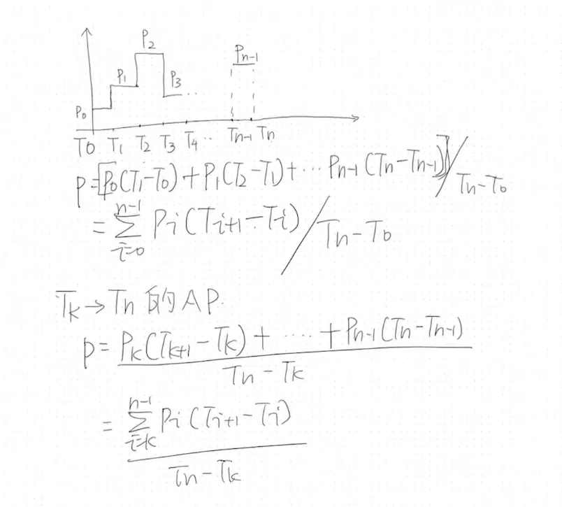

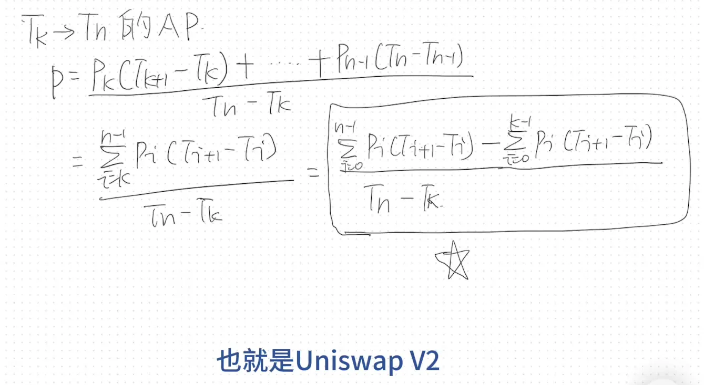

https://github.com/Uniswap/v2-core/blob/master/contracts/UniswapV2Pair.sol

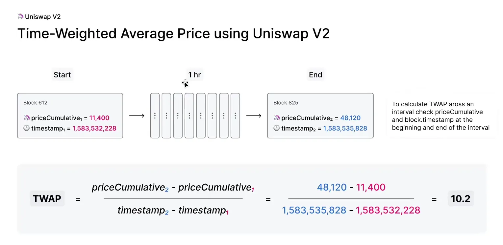

> 💡 Uniswap V2 是使用 Solidity 0.6.6 版本编写的。

Uniswap 中没有实现上面计算"$T_k$ -> $T_n$ 的 AP"公式中的分母部分，因为不可能记住过去所有时间的 price（每次更新都需要花 Gas，Uniswap 不会去记录这个事情），如果需要 TWAP，那就需要自己做一个快照（snapshot）。

（课堂代码演示部分省略）v2-twap.sol 大概 90 行代码，TokenA.sol、TokenB.sol

**【课程实验】TWAP 实验**：自己部署 Uniswap V2 合约，实现 TWAP。

> 💡 Fixed Point 是 Uniswap 自己独创的一个数据类型，UQ112.112 格式。

分别部署 TokenA、TokenB，各自发行 1e26 个，通过 UniswapV2Router02.sol 合约操作。

## 第 11 课 - Uniswap 里的 Flash Swap

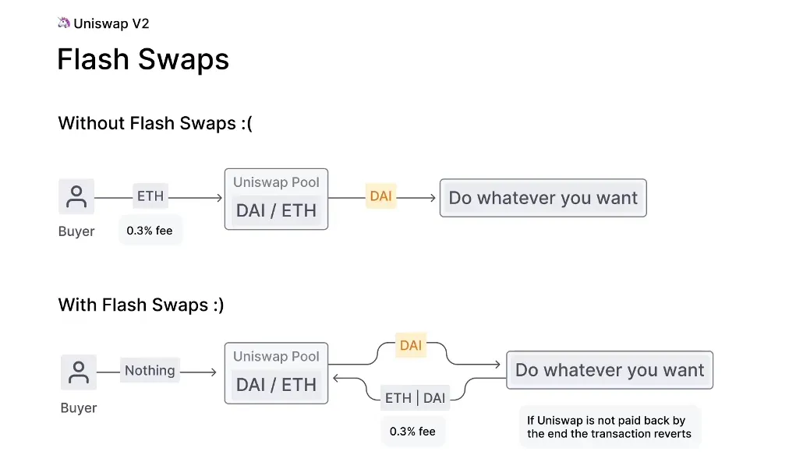

> 💡 Flash Swap 是 DeFi 才有的东西，传统金融没有这类机制。

【GPT-4o】Flash Swap 允许用户"先借代币再付款"，而这笔付款只在交易的最后时刻进行。如果用户无法偿还借出的代币，那么交易将回滚，之前发生的所有操作都将被撤销。

核心代码位于 https://github.com/Uniswap/v2-core/blob/master/contracts/UniswapV2Pair.sol 合约的 `swap()` 函数。

课堂演示的 FlashSwap.sol：https://github.com/liangpeili/defi-2024/tree/main/Flash_swap

课外阅读：[Flash Loans and how to hack them: a walk through of ERC 3156](https://www.rareskills.io/post/erc-3156)

Flash Loan 和 Flash Swap 本质上是一回事（在一笔交易里完成借和还）。

## 第 12 课 - Uniswap V2 的无常损失计算

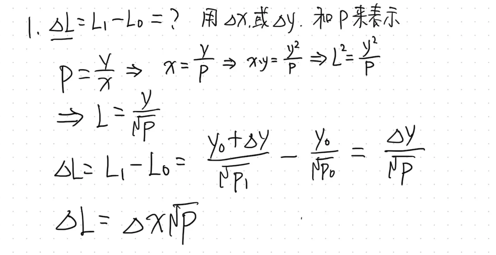

做 LP，无论 Token 是涨价还是降价都会导致资产比不做 LP 要少一些，这个就叫无常损失（Impermanent Loss）。那为什么还要做 LP 呢？

> Ivan Kuznetsov《Programming DeFi: Uniswap V2》 系列教程：
>
> https://jeiwan.net/posts/programming-defi-uniswapv2-1/
>
> https://jeiwan.net/posts/programming-defi-uniswapv2-2/
>
> https://jeiwan.net/posts/programming-defi-uniswapv2-3/
>
> https://jeiwan.net/posts/programming-defi-uniswapv2-4/
>

## 第 13 课 - Staking Reward 原理及实现

> 这堂课质量很高，需要用心去理解。

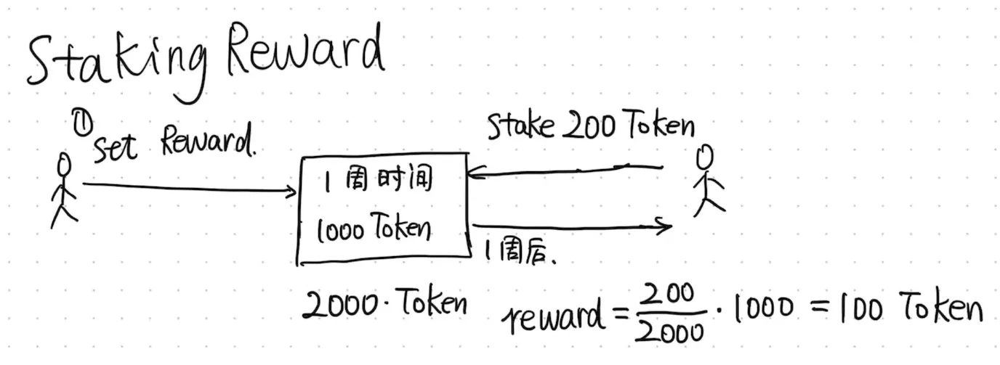

项目方设定好时间周期以及奖励总量。

如果有一万个用户，用智能合约来表示之后，不可能每秒钟更新一次余额。质押和解除质押操作都不是高频操作，关键在于能否写成时间复杂度为线性的智能合约算法。

某个时间段内，单位 Token 质押得到的奖励——即 Reward Per Token。

用户 u 从第 k 到 n 秒之间得到的奖励 = 质押的数量 ×（单位数量从 0 到 n 的奖励 - 单位数量从 0 到 k 的奖励）

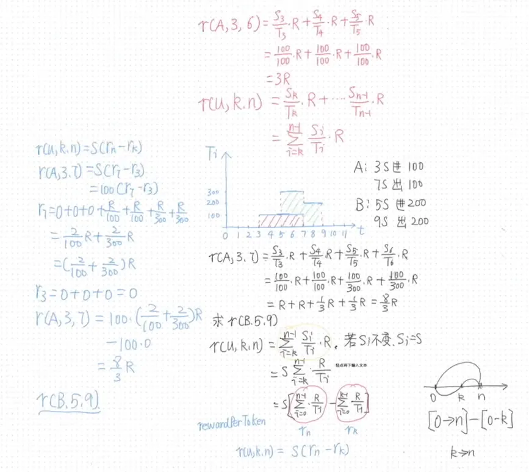

能否化简 rn？

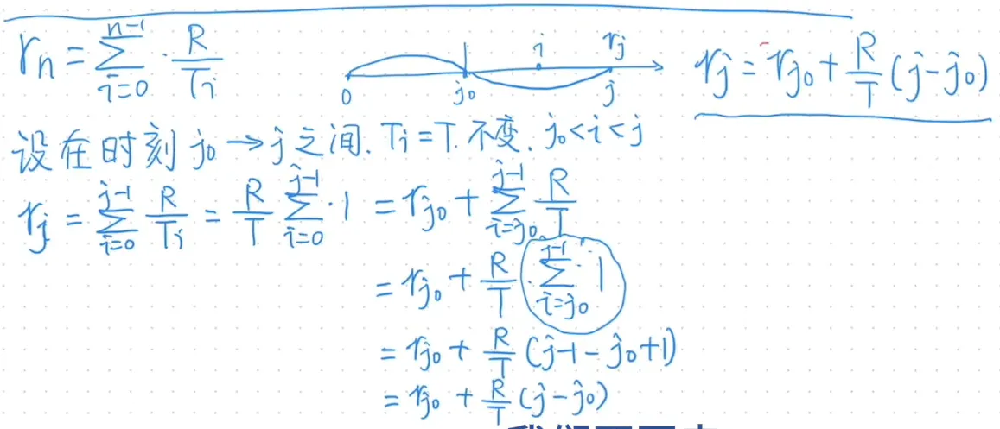

对整个项目来说，只需要记录几个值就行了。

图片来源：[Staking Rewards - Math, Examples and Algorithm | DeFi](https://www.youtube.com/watch?v=iNZWMj4USUM)

推荐 Youtuber @smartcontractprogrammer 的 [DeFi 系列视频](https://www.youtube.com/playlist?list=PLO5VPQH6OWdX-Rh7RonjZhOd9pb9zOnHW)，是很赞的一个英文视频讲解系列。

计算 r(B, 5, 11) 和 r(C, 6, 13)

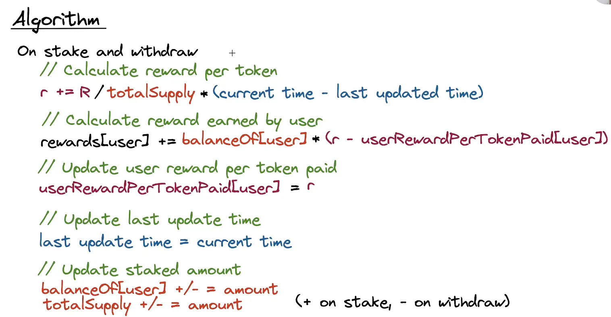

StakingReward.sol 代码演示（约一百来行代码）。

## 第 14 课 - Uniswap V3 简介

Uniswap V3 白皮书：https://app.uniswap.org/whitepaper-v3.pdf

Introducing Uniswap v3：https://blog.uniswap.org/uniswap-v3【March 23, 2021】

2021年5月，Uniswap V3发布，主要特性：

- 增加集中流动性
- 优化手续费设置
- TWAP 优化
- 改进开源协议

V3 开源许可证要求的两年代码保护期在 2023 年到期了。

Uniswap V2 资金利用效率低，做 LP 风险很大。

如果代币价格剧烈波动，用户承受无常损失的风险较大，所以对于波动剧烈的 Token 来说，应该收取更高的手续费来弥补 LP 的损失。

V3 的核心改进：在某个价格范围之内去做流动性。

Uniswap 查看流动性地址：https://app.uniswap.org/explore/pools

Uniswap V3 因为有集中流动性的引入，每个用户可以选择在自己认可的一个价格区间去做流动性，最后综合的结果就如下所示：

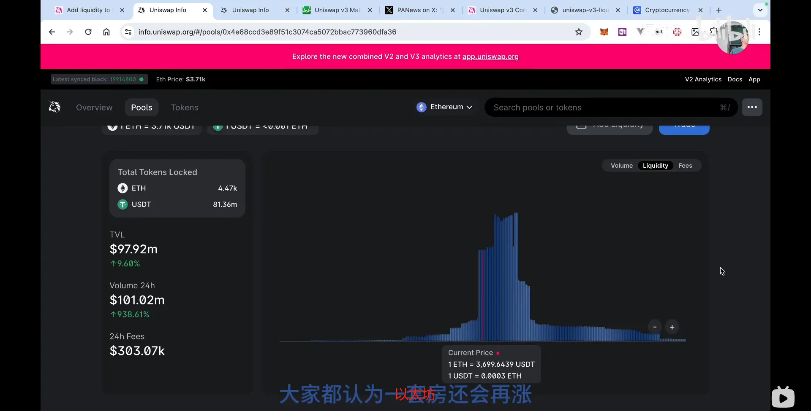

很多用户认为以太坊还会再涨，所以就提前到未来这个价格区间内去做流动性。用户做流动性被交易使用到了才能赚手续费。

思考问题：

（1）在 ETH 价格高的位置埋伏了一个单子，只需要提供 ETH，为什么？

（2）在 ETH 价格低的位置埋伏了一个单子，只需要提供 USDT，为什么？

（3）Uniswap V3 因为提供了 Range Order 订单，用户可以把它作为限价订单去使用，怎么理解？

Uniswap V3 可以在同一个 Pool 中提供多个价格范围之内的流动性。

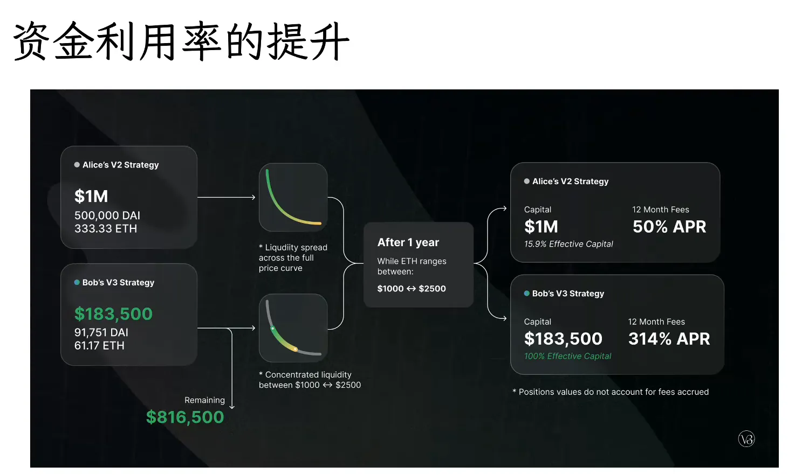

手续费的收取：

- 针对不同的交易对，设置不同的梯度
  - 0.01%, 0.05%, 0.30% 和 1.00%
- 管理费可以收取手续费的10%-25%

https://docs.uniswap.org/concepts/protocol/range-orders

【GPT-4o 补充】

区间订单（Range Orders）是 Uniswap V3 中的一种新型交易方式，允许流动性提供者（LP）通过在特定价格区间内提供流动性来实现类似限价单（Limit Order）的效果。

传统的限价单 vs 区间订单：

- **传统限价单**：比如你想以某个特定的价格买入或卖出某个资产，你设置一个限价单，当市场价格达到你的限价时，交易会自动完成。
- **Uniswap V3 的区间订单**：用户将待交易资产设置在特定的价格区间内，当市场价格达到该区间时自动完成交换，类似限价单的效果。而且 Uniswap V3 的区间订单不需要等待另一方来下单交易，而是直接与流动性池（AMM）进行交易。

Uniswap V3 通过引入区间订单和集中流动性，使得用户能够像在传统交易所中设置限价单一样，实现特定价格区间内的资产交易。

## 第 15 课 - Uniswap V3 的集中流动性

实际上只需要提供 x_real 和 y_real 的两个 Token，就可以维持价格 Pc 在 Pa 和 Pb 之间波动。

虚拟流动性：限定范围后，通过提供更少的 LP，就可以达到在 Uniswap V2 里面更多的 LP 的效果。

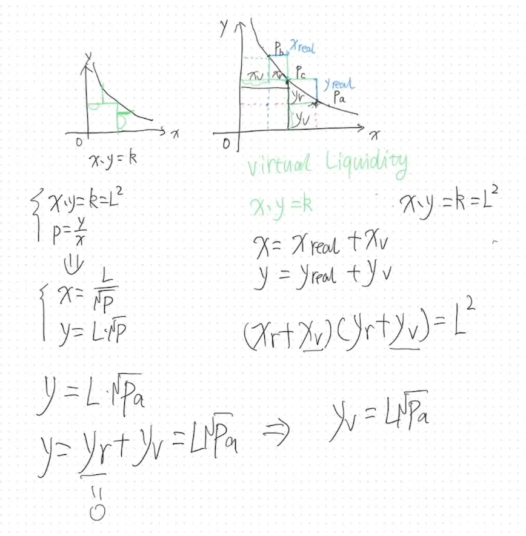

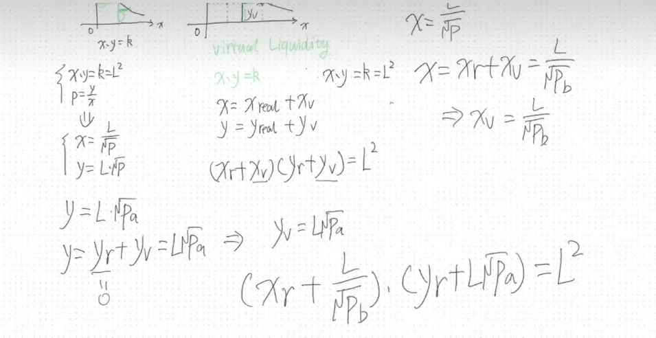

Uniswap V3 的模拟器：可以模拟不同的价格流动性、不同价格范围，和 V2 进行对比。

https://www.desmos.com/calculator/6si0vmgwhc?lang=zh-CN

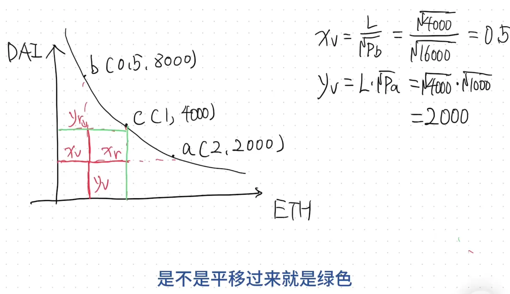

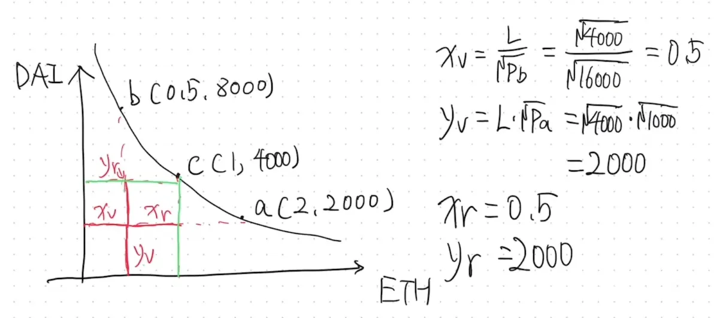

## 第 16 课 - Uniswap V3 的流动性计算

## 第 17 课 - Uniswap V3 的无常损失计算

（本节笔记待补充）

## 第 18 课 - Uniswap V4 简介

（本节笔记待补充）

## 第 19 课 - 去中心化借贷

（本节笔记待补充）
