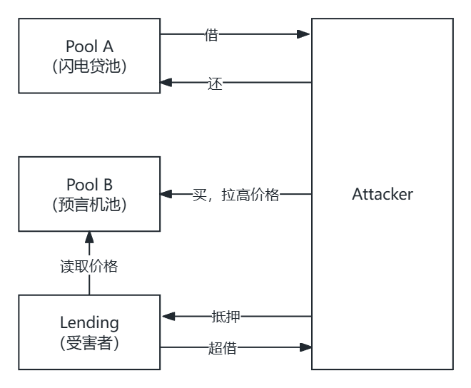
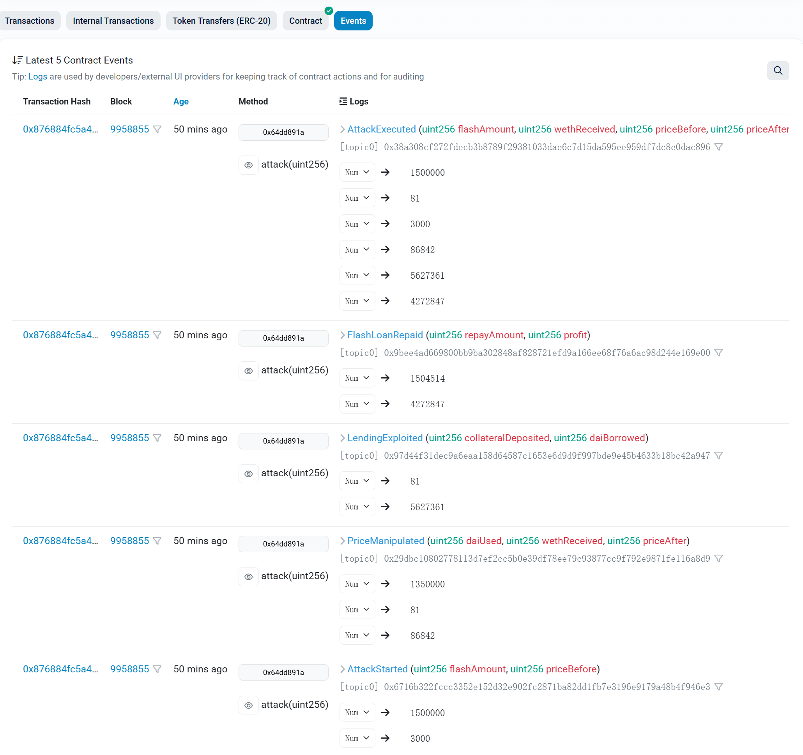

> 2020 年 2 月，一个匿名攻击者用 0 本金，在 13 秒内从 bZx 协议"借"走了 35 万美元。他是怎么做到的？答案是：**闪电贷**。

本文将带你从零理解闪电贷，并亲手复现一次攻击。

**阅读路线**：概念 → 源码 → 攻击演示 → 防御方案

## 一、闪电贷是什么？

**一句话定义**：闪电贷 = 无抵押借款 + 同一交易内还款。

你可以借走池子里的全部资产，只要在这笔交易结束前还回来（外加手续费），就像什么都没发生过。

**传统借贷 vs 闪电贷**

| 对比项 | 传统借贷 | 闪电贷 |
|--------|----------|--------|
| 抵押品 | 必须 | 不需要 |
| 借款时长 | 几天到几年 | 约 12 秒（一个区块） |
| 信用审核 | 需要 | 不需要 |
| 失败后果 | 产生债务 | 交易回滚，无任何影响 |

**为什么能无抵押？**

以太坊交易具有**原子性**：要么全部成功，要么全部失败。

借了 100 万 DAI，做了一系列操作，最后还不上？整个交易回滚，就像你从没借过。技术本身就是担保。

## 二、Uniswap V2 如何实现闪电贷？

一个反直觉的事实：在 Uniswap V2 中，**所有的 swap 本质上都是闪电贷**。

- 普通交易：先付钱 → 再收货
- Uniswap V2：先收货 → 再付钱（乐观转账）

**时序图**


**swap 函数源码**

以下是 [UniswapV2Pair.sol](https://github.com/Uniswap/v2-core/blob/master/contracts/UniswapV2Pair.sol) 的核心逻辑（有精简）：

```solidity
function swap(
    uint amount0Out,    // 借出的 token0 数量
    uint amount1Out,    // 借出的 token1 数量
    address to,         // 接收地址
    bytes calldata data // 关键：这个参数决定是否触发回调
) external lock {
    require(amount0Out > 0 || amount1Out > 0, "INSUFFICIENT_OUTPUT_AMOUNT");
    
    (uint112 _reserve0, uint112 _reserve1,) = getReserves();
    require(amount0Out < _reserve0 && amount1Out < _reserve1, "INSUFFICIENT_LIQUIDITY");

    // 1. 乐观转账：先把代币转给调用者
    if (amount0Out > 0) IERC20(token0).transfer(to, amount0Out);
    if (amount1Out > 0) IERC20(token1).transfer(to, amount1Out);

    // 2. 如果 data 非空，触发闪电贷回调
    if (data.length > 0) {
        IUniswapV2Callee(to).uniswapV2Call(msg.sender, amount0Out, amount1Out, data);
    }

    // 3. 获取回调结束后的真实余额
    uint balance0 = IERC20(token0).balanceOf(address(this));
    uint balance1 = IERC20(token1).balanceOf(address(this));

    // 4. 计算实际转入量（你到底还了多少？）
    uint amount0In = balance0 > _reserve0 - amount0Out ? balance0 - (_reserve0 - amount0Out) : 0;
    uint amount1In = balance1 > _reserve1 - amount1Out ? balance1 - (_reserve1 - amount1Out) : 0;
    require(amount0In > 0 || amount1In > 0, "INSUFFICIENT_INPUT_AMOUNT");

    // 5. K 值校验（扣除 0.3% 手续费后，乘积不能变小）
    uint balance0Adjusted = balance0 * 1000 - amount0In * 3;
    uint balance1Adjusted = balance1 * 1000 - amount1In * 3;
    require(balance0Adjusted * balance1Adjusted >= uint(_reserve0) * uint(_reserve1) * 1000000, "K");

    // 6. 更新储备量
    _update();
    emit Swap(msg.sender, amount0In, amount1In, amount0Out, amount1Out, to);
}
```

**关键点解释**

1. **乐观转账**：先把币转给你，这就是"借"的本质；
2. **回调机制**：`data` 非空时调用 `uniswapV2Call()`，让你在回调中使用借来的资金；
3. **余额结算**：回调结束后，合约检查"真实余额"来推算你还了多少，而不是相信你声称的数字；
4. **K 值校验**：恒定乘积公式 `x × y = k`，扣除手续费后乘积不能变小，否则整笔交易回滚。

**普通交易 vs 闪电贷**

唯一区别是 `data` 参数：

| 场景 | data 参数 | 行为 |
|------|-----------|------|
| 普通交易 | 空 `bytes("")` | 不触发回调 |
| 闪电贷 | 非空 | 触发 `uniswapV2Call` 回调 |

**手续费**

闪电贷手续费 ≈ 0.3%，公式：`fee = borrowAmount × 3 / 997`

例如：借 1,000,000 DAI，需还约 1,003,010 DAI。

## 三、闪电贷攻击演示

### 攻击原理

闪电贷本身不是漏洞，它只是**放大器**。真正的漏洞是：**使用 DEX 即时价格作为预言机**。

AMM（自动做市商）的价格由池子比例决定：

```
价格 = reserve1 / reserve0
```

大额交易会**立即**改变这个比例，从而操纵价格。

**攻击四步曲**



1. 从 Pool A 闪电贷借入大量 DAI；
2. 在 Pool B 用 DAI 买 WETH，拉高 WETH 价格；
3. 将 WETH 存入 Lending 作抵押，按虚高价格借出超额 DAI；
4. 归还闪电贷，剩余即为利润。

### 为什么能成功？

攻击成功的 3 个条件：

1. **预言机使用即时价格** — 可被单笔交易操纵；
2. **流动性池较小** — 小资金即可大幅移动价格；
3. **借贷协议有足够资金** — 利润来源。

简单数学（以本演示为例）：

```
初始状态：
  Pool B: 100 WETH + 300,000 DAI，价格 = 3,000 DAI/WETH

攻击过程：
  1. 从 Pool A 借 1,500,000 DAI
  2. 用 1,350,000 DAI 在 Pool B 买 WETH
     → 获得约 81 WETH
     → Pool B 新价格 ≈ 86,842 DAI/WETH（涨了 29 倍！）
  3. 存 81 WETH 到 Lending
     → 按虚高价格计算抵押价值：81 × 86,842 ≈ 7,034,202 DAI
     → 可借 (80%)：约 5,627,361 DAI
  4. 还款 1,504,514 DAI
  
利润：5,627,361 - 1,504,514 + 150,000 ≈ 4,272,847 DAI
```

### Remix 部署演示

完整源码：https://github.com/lifefindsitsway/flash_loan_attack_demo

**文件结构**

```
Flash_Loan_Attack_Demo/
├── interfaces/
│   ├── IERC20.sol           # ERC20 标准接口
│   ├── ILending.sol         # 借贷协议接口
│   ├── IPair.sol            # 交易对接口
│   └── IUniswapV2Callee.sol # 闪电贷回调接口
│
├── Attacker.sol             # 攻击合约
├── ERC20.sol                # 测试代币
├── Lending.sol              # 有漏洞的借贷协议
└── UniswapV2Pair.sol        # 交易对（部署两次）
```

**部署步骤**

1.部署代币

- 部署 WETH，mint 20,000 个
- 部署 DAI，mint 60,000,000 个

2.部署交易对

- Pool A（大池）：10,000 WETH + 30,000,000 DAI
- Pool B（小池）：100 WETH + 300,000 DAI

3.部署 Lending

- 构造函数传入 Pool B 地址（读取 Pool B 价格）
- 转入 20,000,000 DAI 作为储备

4.部署 Attacker

- 传入 Pool A、Pool B、Lending、WETH、DAI 地址

5.执行攻击

- 调用 `Attacker.attack(1500000)`

**攻击结果**



从 [Attacker合约日志](https://sepolia.etherscan.io/address/0x562192326504d8966e56097eab2dfc7e304dbd8a#events) 可以看到：借出 1,500,000 DAI，用 1,350,000 DAI 买入约 81 WETH，价格从 3,000 拉升至 86,842，最终利润 4,272,847 DAI。

**常见问题**

**Q：为什么需要两个池子？**

Uniswap V2 的 swap 函数有重入锁，回调期间无法调用同池的 swap。这也解释了为什么真实攻击通常涉及多个协议。

**Q：Pool B 为什么这么小？**

教学演示用。真实场景中，攻击者会寻找流动性薄弱的池子。

## 四、如何防御？

### 方案一：TWAP（时间加权平均价格）

取多个区块的平均价格，攻击者必须在多个区块内维持高价，成本极高。

```solidity
function getTWAP(uint period) external view returns (uint) {
    uint currentCumulative = pair.price0CumulativeLast();
    uint previousCumulative = observations[period];
    return (currentCumulative - previousCumulative) / period;
}
```

### 方案二：Chainlink 预言机

使用去中心化预言机，多个节点聚合数据，无法被单笔交易操纵。

```solidity
import "@chainlink/contracts/src/v0.8/interfaces/AggregatorV3Interface.sol";

function getPrice() public view returns (uint) {
    (, int price,,,) = priceFeed.latestRoundData();
    return uint(price);
}
```

### 其他方案

- **多预言机验证**：同时使用 TWAP 和 Chainlink，偏差过大则拒绝交易；
- **延迟执行**：借款请求需等待至少 1 个区块才能执行。

## 总结

3 条 Key Takeaways：

1. **闪电贷让普通人也能进行大资金攻击**，成本仅需手续费和 Gas；
2. **真正的漏洞是使用 DEX 即时价格作为预言机**，闪电贷只是放大器；
3. **防御核心**：永远不要信任可被单笔交易操纵的价格源。

---

> ⚠️ 本文仅供学习研究，请勿用于非法用途。
