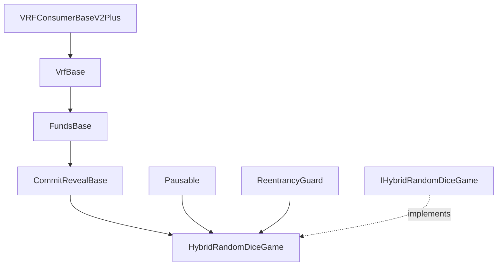

> 一个生产级的链上骰子游戏合约，采用 **Commit-Reveal + Chainlink VRF 混合随机** 方案，解决链上游戏的随机数可预测、资金卡死、并发结算透支等核心安全问题。

Author：Lifefindsitsway

Date：2026-01-24

Github Repo：https://github.com/lifefindsitsway/HybridRandomDiceGame

## TL;DR

- 🎲 **双熵源混合随机**：Commit-Reveal 绑定玩家输入 + Chainlink VRF 提供可验证随机，任一方无法单独操控结果
- 🔓 **完整逃生机制**：reveal 超时可取消、VRF 超时可重试、VRF 卡死可强制退出，资金永不被锁死
- 💰 **并发安全**：in-flight reserve 机制防止多玩家同时结算导致奖池透支
- 🔍 **前端友好**：GameLens 聚合层，一次 RPC 调用返回完整 UI 数据

## （一）项目简介

**Hybrid Random Dice Game** 是一个基于以太坊（EVM）构建的、具有**双重随机性保障**的去中心化骰子游戏参考实现。

传统的链上随机数往往面临两大难题：要么依赖区块哈希容易被矿工操纵，要么单纯依赖预言机容易被抢跑（Front-running）。本项目采用 **Commit-Reveal（承诺-揭示）** 模式结合 **Chainlink VRF（可验证随机函数）**，构建了一套无法被预测、无法被操控的混合随机数机制。

此外，项目引入了独特的 **`GameLens` 架构**，将复杂的链上状态聚合为前端友好的数据结构，极大地降低了前端集成的复杂度与 RPC 请求量，是 Web3 全栈游戏开发的最佳实践范例。

### 1.1 玩家指南：如何开始游戏🎲

本游戏采用 **Commit-Reveal** 机制来保证公平性，因此与普通的“点击即开奖”游戏流程略有不同，请按照以下步骤操作：

1. **💰 下注 (Commit)**

   - 选择一个你觉得幸运的骰子点数（1-6）。
   - 点击 **Commit** 按钮并支付 **0.001 ETH**。
   - *幕后机制：此时你的猜测和本地生成的密钥会被加密哈希后提交上链，任何人无法提前知晓你的选择。*

2. **⏳ 等待锁定 (Wait)**

   - 提交成功后，进入 **60秒** 的锁定冷静期。
   - 这是为了防止区块重组攻击，请耐心等待倒计时结束。

3. **🔓 揭示 (Reveal)**

   - 倒计时结束后，**Reveal** 按钮变亮。

   - **重要：** 你有 **120秒** 的时间窗口点击此按钮。

   - 点击后，前端会将你最初的猜测和密钥提交给合约进行验证，并触发 Chainlink VRF 获取真随机数。

     *⚠️ 注意：如果你超时未揭示，将被视为放弃，资金会因过期仅允许退回部分。*

4. **🎰 开奖 (Settlement)**

   - 等待几秒钟（取决于 Chainlink VRF 的回调速度），随机数生成完毕。
   - 如果骰子点数与你的猜测一致，你将获得 **5倍 (0.005 ETH)** 的奖金！

5. **💸 提现 (Withdraw)**

   - 奖金会自动累积在合约的“待提现余额”中。
   - 你可以随时点击 **Withdraw** 将所有奖金提取到你的钱包。

> **Q: 为什么要等两步（Commit + Reveal）这么麻烦？** 
>
> **A:** 如果允许直接下注开奖，恶意攻击者可以监视内存池（Mempool），一旦发现随机数对自己不利就回滚交易。通过先“下注并锁定”，再“揭示并开奖”，我们彻底杜绝了这种作弊可能，确保每一局游戏都是绝对公平的。

### 1.2 核心安全痛点与对应机制

- **随机数安全（Anti-predict / Anti-bias）**
  - **Commit-Reveal**：玩家先提交 `commitHash = keccak256(player, guess, secret, contract, chainId, nonce)`，揭示时验证，降低 mempool 预测与复制输入风险；
  - **VRF 可验证随机**：Reveal 后发起 Chainlink VRF 请求，随机性由链下网络提供并可在链上验证；
  - **Hybrid Mix（双熵源混合）**：结算时将 VRF 随机与玩家 secret 混合，降低“单一熵源失效/被操控”的单点风险。

- **资金不被“卡死”（Escape Hatches）**
  - **Reveal 窗口**：Commit 后必须在指定时间窗口内 Reveal；错过时间窗口可 `cancelExpiredCommitment()`（惩罚性退款，退回净下注的一半）；
  - **VRF 超时重试**：VRF 超过 `VRF_TIMEOUT = 10 minutes` 未回调，允许 `retryVrfRequest()`（最多重试次数 `MAX_RETRIES = 3`）；
  - **VRF 长时间无响应强制退出**：超过 `VRF_STUCK_TIMEOUT = 24 hours` 可 `cancelStuckGame()` 全额退回净下注（不计手续费）。

- **并发资金安全（No prize overdraft）**
  - **In-flight Reserve（在途局预留金）**：当玩家进入等待 VRF 状态时，立即把本局潜在奖金计入 `reservedForInFlightGames`，避免多玩家并发 reveal 导致“奖池只够一局却通过多局检查”的资金透支问题。

- **可观测性（Observability-first）**
  - 关键状态变更与结算结果以 **Events** 记录，便于 subgraph/数据平台追踪与回放；
  - 链上保留必要状态（例如 `LastResult`），历史靠事件索引，减少链上存储膨胀。

- **前端 / 集成友好（Lens 聚合查询）**
  - `GameLens` 是只读聚合器：一次 `eth_call` 返回 `PlayerDashboard`（按钮可用性、倒计时、nextAction 等）与 `GlobalInfo`（余额/预留/手续费等），降低前端多次 RPC 拼装复杂度。

### 1.3 与其他方案对比

| 方案 | 随机数安全 | VRF 故障处理 | 并发安全 | 资金逃生 |
|------|-----------|-------------|---------|---------|
| 纯 Blockhash | ❌ 矿工可操控 | N/A | ❌ 无 | ❌ 无 |
| 纯 VRF | ⚠️ 单熵源 | ❌ 永久卡死 | ⚠️ 部分 | ❌ 无 |
| 纯 Commit-Reveal | ⚠️ 玩家可放弃 | N/A | ❌ 无 | ⚠️ 部分 |
| **本项目** | ✅ 双熵源混合 | ✅ retry + cancel | ✅ in-flight reserve | ✅ 完整 |

## （二）项目结构说明与继承链

### 2.1 总览图

**系统交互总览**：一张图同时展示外部角色（玩家 / VRF / 管理员 / 手续费接收者 / 注资者）、单玩家单局状态机、以及 Pull Payment 结算路径，帮助快速理解“怎么玩 + 怎么结算 + 怎么运维”。

```mermaid
flowchart LR
  %% ========== Actors ==========
  Player["Player<br/>玩家"]
  Owner["Owner<br/>管理员"]
  Funder["Funder<br/>奖池注资者"]
  VRF["Chainlink VRF<br/>Coordinator"]
  FeeRecipient["FeeRecipient<br/>手续费接收者"]

  %% ========== Core Contract ==========
  Game["HybridRandomDiceGame<br/>主合约"]

  %% ========== Accounting (keep light) ==========
  subgraph Book["Accounting（核心记账项）"]
    direction TB
    PW["pendingWithdrawals(player)<br/>玩家待提现（奖池派奖/退款）"]
    Fees["protocolFeesAccrued<br/>累计手续费（可提取）"]
  end

  %% ========== Per-Player State (final code) ==========
  subgraph SM["Player Game State（单玩家单局）"]
    direction LR
    S0["None<br/>空闲 / 可开新局"]
    S1["Committed<br/>已提交承诺"]
    S2["RandomRequested<br/>已请求 VRF"]

    S0 -->|"commit 成功"| S1
    S1 -->|"revealAndRequestRandom 成功"| S2
    S2 -->|"VRF 回调有效：settle 后清理"| S0

    S1 -->|"cancelExpiredCommitment"| S0
    S2 -->|"retryVrfRequest"| S2
    S2 -->|"cancelStuckGame"| S0
  end

  %% ========== Funding / Admin ==========
  Funder -->|"receive() / fund"| Game
  Owner -->|"pause / unpause"| Game
  Owner -->|"setConfigs (fee + vrf)"| Game

  %% ========== Fee Flow ==========
  FeeRecipient -->|"withdrawProtocolFees"| Game
  Game -->|"FeeCharged<br/>protocolFeesAccrued += fee"| Fees
  Game -->|"ProtocolFeesWithdrawn"| FeeRecipient

  %% ========== Player ↔ Game (merged to 6 edges) ==========
  Player -->|"commit"| Game
  Player -->|"revealAndRequestRandom"| Game
  Player -->|"retryVrfRequest"| Game
  Player -->|"cancelExpiredCommitment"| Game
  Player -->|"cancelStuckGame"| Game
  Player -->|"withdraw"| Game

  %% ========== Game ↔ State machine (keep emit/event) ==========
  Game -->|"emit Committed + state=Committed"| S1
  Game -->|"emit RandomnessRequested + state=RandomRequested"| S2
  Game -->|"emit Settled + clear state"| S0

  %% ========== VRF callback ==========
  Game -->|"requestRandomWords"| VRF
  VRF -->|"fulfillRandomWords"| Game

  %% ========== CallbackIgnored (keep as a note, no branching) ==========
  NoteCI["CallbackIgnored（不 revert）<br/>策略：emit CallbackIgnored + return"]
  VRF -.-> NoteCI

  %% ========== Accounting updates (keep minimal) ==========
  Game -->|"win / refund: credit"| PW
  Game -->|"Withdrawn: transfer payout"| Player

```



**主流程**：`commit → revealAndRequestRandom → VRF 回调 settle → state 回到 None（可开新局）`。

**容灾分支**：

- `cancelExpiredCommitment`：reveal 超时，惩罚性退款 `netBet/2`；
- `retryVrfRequest`：超过 `VRF_TIMEOUT`，重发 VRF 并更新 `requestId`；
- `cancelStuckGame`：超过 `VRF_STUCK_TIMEOUT`，全额退回 `netBet`。

**资金闭环**：注资/下注进入合约余额；`commit` 按 `feeBps` 记账到 `protocolFeesAccrued`；奖金/退款统一记账到 `pendingWithdrawals`，玩家 `withdraw` 提现；手续费由 `FeeRecipient` 调用 `withdrawProtocolFees` 提取。

**异步鲁棒性**：VRF 旧回调/异常回调不 `revert`，采用 `CallbackIgnored(emit + return)`，避免状态/资金卡死。

### 2.2 目录结构

```
HybridRandomDiceGame/
├── .github/
│   └── workflows/                        # CI/CD 配置
│
├── contracts/                            # 合约源码
│   ├── core/                             # 游戏核心逻辑入口
│   │   └── HybridRandomDiceGame.sol      # 唯一部署的核心合约（状态机 + 资金闭环 + VRF 回调）
│   │
│   ├── base/                             # 抽象模块（被 core 继承）
│   │   ├── CommitRevealBase.sol          # 状态机 + commit/reveal + 回调结算 + 退出逻辑
│   │   ├── VrfBase.sol                   # VRF 请求封装 + 配置
│   │   └── FundsBase.sol                 # 资金模型：bet/prize/fee/pull payment/reserve
│   │
│   ├── shared/                           # 共享定义（非 library）
│   │   ├── Types.sol                     # enum + struct（GameState/NextAction/Dashboard 等）
│   │   ├── Errors.sol                    # 自定义错误（revert 更省 gas、语义更清晰）
│   │   └── Events.sol                    # 事件全集（历史靠事件追踪）
│   │
│   ├── libraries/                        # 哈希计算与工具库（pure/view）
│   │   └── HashLib.sol                   # computeCommitHash + mixRandomness
│   │
│   ├── interfaces/
│   │   └── IHybridRandomDiceGame.sol     # 对外接口（前端/集成用）
│   │
│   └── lens/                             # 前端数据聚合层（可选部署）
│       └── GameLens.sol                  # 聚合玩家仪表盘/全局信息
│
├── test/                                 # 测试套件
│   ├── unit/                             # 单元测试
│   │   ├── HashLib.t.sol                 # 库函数测试（纯函数）
│   │   ├── GameLens.t.sol                # View 逻辑测试
│   │   └── HybridRandomDiceGame.t.sol    # 核心合约测试（间接覆盖 base 模块）
│   │
│   ├── integration/                      # 集成测试
│   │   └── FullGameFlow.t.sol            # 完整流程 + 边缘场景
│   │
│   ├── utils/                            # 测试工具
│   │   ├── CommitRevealHarness.sol       # 暴露 internal 函数的测试壳
│   │   └── VrfHarness.sol                # VRF 模块测试壳
│   │
│   └── mocks/                            # Mock 合约
│       └── MockVRFCoordinatorV2Plus.sol  # VRF Coordinator 模拟器
│
├── script/                               # 部署脚本
│
├── lib/                                  # 依赖库（forge-std / OpenZeppelin / Chainlink）
│
├── .env.example                          # 环境变量模板
├── .gitignore
├── .gitmodules                           # Git 子模块配置
├── foundry.toml                          # Foundry 配置文件
└── README.md                             # 项目文档
```

### 2.3 继承链



核心合约 `HybridRandomDiceGame` 在 `CommitRevealBase`（状态机与 commit-reveal）与 `FundsBase`（资金闭环）基础上叠加 `VrfBase`（VRF 请求/回调封装），并通过 `Pausable + ReentrancyGuard` 强化可用性与安全性，对外暴露 `IHybridRandomDiceGame` 作为集成接口。

### 2.4 关键参数

| 参数                | 值            | 说明                                |
| ------------------- | ------------- | ----------------------------------- |
| `BET_AMOUNT`        | `0.001 ether` | 每局下注金额                        |
| `PRIZE_AMOUNT`      | `0.005 ether` | 中奖奖金                            |
| `MAX_FEE_BPS`       | `500`         | 手续费上限（5%）                    |
| `COMMIT_DURATION`   | `60 秒`       | commit 后等待多久进入 reveal 窗口   |
| `REVEAL_DURATION`   | `120 秒`      | reveal 窗口长度                     |
| `VRF_TIMEOUT`       | `10 minutes`  | VRF 超时可 retry                    |
| `VRF_STUCK_TIMEOUT` | `24 hours`    | VRF 长时间无响应可 emergency cancel |
| `MAX_RETRIES`       | `3`           | VRF 最大重试次数                    |

## （三）Mermaid 框架图（状态机 / 时序 / 资金流）

### 3.1 状态机图

```mermaid
stateDiagram-v2
  [*] --> None: 初始 / 上一局结束

  None --> Committed: commit(commitHash)<br/>支付 BET
  Committed --> RandomRequested: revealAndRequestRandom(guess, secret)<br/>验证承诺 + 发起 VRF

  RandomRequested --> None: fulfillRandomWords(requestId)<br/>回调到达 -> settle<br/>记录结果+Pull Payment记账

  %% ----------------------------
  %% 异常/容灾分支
  %% ----------------------------
  Committed --> None: cancelExpiredCommitment()<br/>超过 revealDeadline<br/>退部分净下注 / 解锁

  RandomRequested --> RandomRequested: retryVrfRequest()<br/>超过 VRF_TIMEOUT<br/>重发 VRF（更新 requestId）

  RandomRequested --> None: cancelStuckGame()<br/>超过 VRF_STUCK_TIMEOUT<br/>全额退回净下注 / 解锁

  %% ----------------------------
  %% CallbackIgnored 不是状态跳转：
  %% - UnknownRequestId / InvalidGameState / RequestIdMismatch / EmptyRandomWords
  %% - 策略：emit CallbackIgnored + return（不 revert）
  %% - 玩家仍停留在 RandomRequested，可 retry
  %% ----------------------------


```



游戏状态从 `None → Committed → RandomRequested → None` 完成一局结算，同时提供 `cancelExpiredCommitment / retryVrfRequest / cancelStuckGame` 三条容灾路径，且对“旧回调/异常回调”采用 `CallbackIgnored(emit + return)` 的非 revert 策略保证异步回调鲁棒性。

### 3.2 时序图：异步回调触发结算（Commit–Reveal + VRF）

该流程用 `commit-reveal` 绑定玩家输入、用 `requestId` 锚定 VRF 异步回调并支持超时重试/旧回调忽略，最终通过 `pendingWithdrawals + withdraw()` 的 Pull Payment 完成资金结算，避免回调内直接转账带来的重入与可用性风险。

简易版：

```mermaid
sequenceDiagram
  autonumber
  participant P as Player
  participant G as HybridRandomDiceGame
  participant C as VRFCoordinator

  P->>G: commit(commitHash) + 下注金额
  Note over P,G: 等待 COMMIT_DURATION 秒，进入 reveal 窗口
  P->>G: revealAndRequestRandom(guess, secret)
  G->>C: requestRandomWords(...) -> requestId
  C-->>G: fulfillRandomWords(requestId, randomWords)
  Note over G: mixRandomness(VRF, secret) -> roll<br/>完成结算并记录事件（Events）
  Note over G: 若胜利：pendingWithdrawals[player] += PRIZE
  P->>G: withdraw()
  
```



详细版：

```mermaid
sequenceDiagram
  autonumber
  participant P as Player
  participant G as HybridRandomDiceGame
  participant C as VRFCoordinator
  participant N as VRF Network

  Note over P,G: Tx #1 — Commit：提交 commitHash 并支付下注（进入 Committed）
  P->>G: commit(commitHash) + 下注金额
  G-->>P: emit Committed(player, commitHash, revealWindow, nonce)

  Note over P,G: Tx #2 — Reveal：验证承诺 + 发起 VRF（进入 RandomRequested）
  P->>G: revealAndRequestRandom(guess, secret)
  G->>G: verify commitHash == keccak(...)
  Note over G: 关键点：requestId 是后续回调匹配与容灾（retry）的锚点
  G->>C: requestRandomWords(...) -> requestId
  G-->>P: emit RandomnessRequested(player, requestId)

  Note over C,N: Off-chain：VRF 节点生成 randomWords + proof<br/>（链下异步阶段）
  C->>N: distribute requestId to VRF nodes
  N-->>C: proof + randomWords

  Note over C,G: Tx #3 — Callback：Coordinator 回调（可能延迟/可能是旧 requestId）
  C->>G: fulfillRandomWords(cbRequestId, randomWords)

  alt 回调被忽略（不 revert）
    Note over G: CallbackIgnored 场景：UnknownRequestId / InvalidGameState / RequestIdMismatch / EmptyRandomWords
    G-->>P: emit CallbackIgnored(cbRequestId, reason)
    Note over P,G: 玩家仍停留在 RandomRequested，可继续等待或 retry
  else 有效回调 -> 结算
    G->>G: mixed = keccak(VRF, secret, player, requestId, ...)
    G->>G: roll = mixed % 6 + 1
    alt win
      G->>G: pendingWithdrawals[player] += PRIZE
      G-->>P: emit Settled(player, requestId, roll, won=true)
    else lose
      G-->>P: emit Settled(player, requestId, roll, won=false)
    end
    Note over G: 清理本局状态（回到 None，玩家可开新局）
    G->>G: clear game state
  end

  opt VRF 超时容灾（after VRF_TIMEOUT）
    Note over P,G: 超时仍未回调 -> 玩家可重试，产生 newRequestId
    P->>G: retryVrfRequest()
    G->>C: requestRandomWords(...) -> newRequestId
    G-->>P: emit VrfRequestRetried(oldRequestId, newRequestId)
    G-->>P: emit RandomnessRequested(player, newRequestId)
  end

  opt VRF 长时间无响应（after VRF_STUCK_TIMEOUT）
    Note over P,G: 最终逃生口：强制取消并退款，避免资金卡死
    P->>G: cancelStuckGame()
    G-->>P: emit StuckGameCancelled(player, refund)
  end

  Note over P,G: Tx #4 — Pull Payment：玩家主动提现（避免回调里直接转账）
  P->>G: withdraw()
  G-->>P: transfer payout
  G-->>P: emit Withdrawn(player, amount)

```



### 3.3 资金流图

```mermaid
flowchart LR
  P["Player<br/>玩家"] -->|"commit: pay BET"| G["Game Contract<br/>合约"]
  D["Funder<br/>注资者"] -->|"fund prize pool<br/>(receive)"| G

  G -->|"accrue fee"| F["protocolFeesAccrued<br/>累计手续费"]
  G -->|"keep net bet in balance"| B["contract balance<br/>合约余额"]

  G -->|"on reveal: reserve PRIZE"| R["reservedForInFlightGames<br/>在途奖金预留"]
  R -->|"release on settle / cancelStuck"| B

  G -->|"if win / refund: credit"| W["pendingWithdrawals(player)<br/>玩家待提现"]
  P -->|"withdraw()"| G
  G -->|"transfer payout"| P

  FR["FeeRecipient<br/>手续费地址"] -->|"withdrawProtocolFees()"| G
  G -->|"transfer fees"| FR

```



玩家 `commit` 支付的下注进入合约余额（并按 `feeBps` 记账到 `protocolFeesAccrued`），`reveal` 时为本局奖金计入 `reservedForInFlightGames` 防止并发透支，结算胜利或取消退款只做 `pendingWithdrawals` 记账，最后由玩家 `withdraw()` Pull Payment 提现；手续费则由 `FeeRecipient` 调用 `withdrawProtocolFees()` 从合约余额提走。

## （四）安全模型

### 威胁模型（Threat Model）

| 攻击者 | 能力假设 | 防护措施 |
|--------|---------|---------|
| **普通用户** | 监听 mempool、选择性提交 | `commitHash` 绑定 `player/guess/secret/nonce`，无法复制他人 commit |
| **MEV Bot** | 抢跑 / 复制交易 | commit 阶段只看到 hash，无法获知 `guess`；reveal 阶段复制无意义（secret 不同） |
| **VRF 节点** | 选择性响应、延迟回调 | `secret` 在 commit 时隐藏，节点无法预知最终结果；超时可 retry/cancel |
| **矿工/验证者** | 操控区块时间戳、交易排序 | 时间窗口设计宽松（60s+120s）；结果由 VRF+secret 混合决定，非单一熵源 |
| **合约 Owner** | 暂停合约、修改配置 | `pause` 只阻止新游戏，不影响已开始的游戏结算；配置修改有上限约束 |

### 关键不变式（Invariants）

| 编号 | 不变式 | 说明 |
|------|-------|------|
| **INV-1** | `available >= 0` | 可用余额始终非负，不会出现"负债"状态 |
| **INV-2** | 每局游戏最多结算一次 | `requestId` 一一映射，回调后立即清理 `requestToPlayer` |
| **INV-3** | 玩家资金永不锁死 | 任何状态下都有退出路径：`cancelExpired` / `retry` / `cancelStuck` / `withdraw` |
| **INV-4** | 并发 reveal 不会透支奖池 | `reservedForInFlightGames` 在 reveal 时预留，结算时释放 |
| **INV-5** | 旧回调不会干扰新游戏 | `requestId` 不匹配时触发 `CallbackIgnored`，不 revert、不修改状态 |

### 安全机制清单

- **重入防护**：所有外部调用使用 `ReentrancyGuard`
- **溢出保护**：Solidity 0.8.28 内置溢出检查
- **访问控制**：管理函数使用 `onlyOwner`，手续费提取限制为 `feeRecipient`
- **Pull Payment**：奖金/退款先记账到 `pendingWithdrawals`，玩家主动提取
- **紧急暂停**：`Pausable` 机制，但不影响已开始游戏的正常结算

## （五）部署与测试

### 5.1 环境准备

**前置条件**

- Foundry（包含 `forge`、`cast`、`anvil`）
- Node.js >= 20.9.0（用于安装 Chainlink 合约库）
- Git

**初始化项目**

```bash
mkdir HybridRandomDiceGame && cd HybridRandomDiceGame
forge init

# 安装 OpenZeppelin
forge install OpenZeppelin/openzeppelin-contracts

# 安装 Chainlink 合约库（二选一）
npm install @chainlink/contracts --save
# 或
pnpm add @chainlink/contracts
```

> **备用方案**：如果以上指令无法正常安装 OpenZeppelin 或 Chainlink 合约库，可以直接从 GitHub 仓库下载并放到 `lib/` 目录下：
>
> - Chainlink：[smartcontractkit/chainlink-evm](https://github.com/smartcontractkit/chainlink-evm)
> - OpenZeppelin：[OpenZeppelin/openzeppelin-contracts](https://github.com/OpenZeppelin/openzeppelin-contracts)

### 5.2 项目配置

**foundry.toml**

```toml
[profile.default]
src = "contracts"
test = "test"
out = "out"
libs = ["lib"]
solc = "0.8.28"
optimizer = true
optimizer_runs = 200

remappings = [
  "forge-std/=lib/forge-std/src/",
  "@chainlink/contracts/=lib/chainlink-evm/contracts/",
  "@openzeppelin/=lib/openzeppelin-contracts/"
]

[rpc_endpoints]
mainnet  = "${MAINNET_RPC_URL}"
sepolia  = "${SEPOLIA_RPC_URL}"

[etherscan]
mainnet  = { key = "${ETHERSCAN_API_KEY}" }
sepolia  = { key = "${ETHERSCAN_API_KEY}" }
```

**.env 配置**

```dotenv
# ========== Deployer / RPC ==========
PRIVATE_KEY=0x...
SEPOLIA_RPC_URL=https://...
MAINNET_RPC_URL=https://...

# Etherscan key（可选，用于 --verify）
ETHERSCAN_API_KEY=...

# ========== VRF v2.5 (V2Plus) ==========
# Ethereum Mainnet
MAINNET_VRF_COORDINATOR=0x...
MAINNET_VRF_KEY_HASH=0x...
MAINNET_VRF_SUB_ID=...

# Sepolia
SEPOLIA_VRF_COORDINATOR=0x...
SEPOLIA_VRF_KEY_HASH=0x...
SEPOLIA_VRF_SUB_ID=...

# ========== Game Config ==========
# 协议手续费接收地址（建议填部署者地址）
FEE_RECIPIENT=0x...

# 手续费（基点），合约上限 MAX_FEE_BPS = 500（即 5%）
FEE_BPS=300

# 可选：部署后给奖池注资（wei），不需要填 0
PRIZE_POOL_SEED_WEI=0

# 可选：是否额外部署 GameLens（1=部署，0=不部署）
DEPLOY_LENS=0
```

### 5.3 编译与测试

```bash
# 编译
forge build -vvv

# 运行全部测试
forge test

# 运行指定测试文件
forge test --match-path test/unit/HashLib.t.sol -vvv

# 运行指定测试函数
forge test --match-test testCommitSuccessful -vvv

# 查看 gas 报告
forge test --gas-report
```

### 5.4 测试架构

```
test/
├── unit/                                 # 单元测试
│   ├── HashLib.t.sol                     # 库函数测试（纯函数）
│   ├── GameLens.t.sol                    # View 逻辑测试
│   └── HybridRandomDiceGame.t.sol        # 核心合约测试（间接覆盖 base 模块）
│
├── integration/                          # 集成测试
│   └── FullGameFlow.t.sol                # 完整流程 + 边缘场景
│
├── utils/                                # 测试工具
│   ├── CommitRevealHarness.sol           # 暴露 internal 函数的测试壳
│   └── VrfHarness.sol                    # VRF 模块测试壳
│
└── mocks/                                # Mock 合约
    └── MockVRFCoordinatorV2Plus.sol      # VRF Coordinator 模拟器
```

#### 单元测试覆盖矩阵

**HashLib.t.sol** — 纯函数库测试

| 测试维度             | computeCommitHash | mixRandomness | 交叉验证 |
| -------------------- | ----------------- | ------------- | -------- |
| 确定性               | ✅                 | ✅             | —        |
| 已知向量             | ✅×2               | ✅             | —        |
| 参数敏感性（逐因子） | ✅×6               | ✅×6           | —        |
| 边界值 / 零值        | ✅×3               | ✅×2           | —        |
| 编码方式验证         | ✅                 | —             | —        |
| 雪崩效应             | —                 | ✅×2           | —        |
| Fuzz 测试            | ✅×2               | ✅             | —        |
| 函数空间隔离         | —                 | —             | ✅        |

**HybridRandomDiceGame.t.sol** — 核心合约 53 个 test case

| 测试区域                     | 数量 | 关注点                                                       |
| ---------------------------- | ---- | ------------------------------------------------------------ |
| A. 部署与初始化              | 3    | 常量、手续费、VRF 配置                                       |
| B. receive()                 | 2    | ETH 接收、事件发射                                           |
| C. commit()                  | 8    | 成功路径 + 5 种 revert 条件                                  |
| D. revealAndRequestRandom()  | 10   | 成功路径 + 8 种 revert + 暂停下放行                          |
| E. cancelExpiredCommitment() | 4    | 退款计算、时间校验、暂停下放行                               |
| F. cancelStuckGame()         | 4    | 全额退款、超时校验、暂停下放行                               |
| G. retryVrfRequest()         | 4    | 新 requestId、超时校验、MAX_RETRIES                          |
| H. withdraw()                | 3    | 余额转账、零余额 revert、暂停下放行                          |
| I-L. Admin 函数              | 10   | pause/unpause/setFeeConfig/setVrfConfig/withdrawProtocolFees |
| M. View 函数                 | 6    | 默认值、计算一致性、资金分布                                 |
| N. VRF 结算                  | 3    | 获胜/失败结算、_toDice 覆盖所有 6 面                         |
| O-P. 综合场景                | 2    | 暂停下完整流程、多玩家并发                                   |
| Q. reservedForInFlightGames  | 8    | 在途预留资金安全                                             |
| R. CallbackIgnored           | 9    | VRF 回调健壮性                                               |

**GameLens.t.sol** — 只读聚合器测试

| 测试节 | 测试目标             | 数量 | 核心验证点                                                   |
| ------ | -------------------- | ---- | ------------------------------------------------------------ |
| A      | 初始状态             | 2    | 新玩家 dashboard 默认值 + GlobalInfo 初始资金                |
| B      | Committed 阶段       | 3    | WaitRevealWindow → Reveal → CancelExpired 的 NextAction 切换 |
| C      | RandomRequested 阶段 | 3    | WaitVrf → Retry → CancelStuck 的 NextAction 切换             |
| D      | 结算后               | 3    | Win→Withdraw / Lose→StartGame / LastResult 覆盖              |
| E      | 暂停状态             | 2    | 空闲玩家→Paused / 活跃玩家→状态机操作优先                    |
| F      | NextAction 优先级    | 3    | Committed > Withdraw / Withdraw > StartGame / Withdraw > Paused |
| G      | GlobalInfo 动态      | 3    | inFlight 增减 / pending+fees 变化 / paused 反映              |
| H      | 倒计时精度           | 2    | Committed 和 RandomRequested 两阶段的秒级精确验证            |
| I      | 边缘情况             | 3    | 零地址 / 多玩家独立性 / game 地址不可变                      |

#### 集成测试覆盖矩阵

**FullGameFlow.t.sol** — 端到端流程验证

| 测试节        | 测试数 | 核心价值                                 |
| ------------- | ------ | ---------------------------------------- |
| A. 完整获胜   | 1      | 5 步全链路 + 玩家 ETH 余额精确验算       |
| B. 完整失败   | 1      | 失败后无 pending、nonce 递增、可立即重开 |
| C. 过期取消   | 1      | 惩罚退款（50%）精确计算 + withdraw       |
| D. VRF 重试   | 2      | 单次重试 + 双重重试，旧回调安全忽略      |
| E. Stuck 取消 | 1      | 全额退款（非玩家过错）精确计算           |
| F. 连续多局   | 2      | 三局交替结果 + 批量提现                  |
| G. 多玩家并发 | 3      | 一赢一输 / 双赢 / 回调乱序到达           |
| H. 资金守恒   | 4      | 赢/输/取消/并发 四种场景的**每步快照**   |
| I. 暂停恢复   | 2      | 完整生命周期 + 所有退出通道验证          |
| J. 边界场景   | 3      | 最小奖池 / 零手续费 / LastResult 覆盖    |

> **H 节（资金守恒）** 是集成测试的核心——不仅验证最终结果，而是在流程的**每个中间状态**都调用 `_assertSolvency`，等价于一个确定性执行的轻量 invariant test。如果任何一步的 `reservedForInFlightGames` 增减错误、`totalPendingWithdrawals` 漏记、或 `protocolFeesAccrued` 计算偏差，都会在精确的位置暴露。

#### Mock 基础设施

**MockVRFCoordinatorV2Plus.sol** — VRF 模拟器

提供三种回调模式，覆盖从简单测试到批量 invariant 测试的全场景需求：

| 回调模式                      | 函数                                               | 适用场景                   |
| ----------------------------- | -------------------------------------------------- | -------------------------- |
| 手动指定 consumer（向后兼容） | `fulfillRandomWords()` / `fulfillWithSingleWord()` | 现有测试零改动迁移         |
| 自动查找 consumer（增强版）   | `fulfill()` / `fulfillSingle()`                    | 新测试推荐，含请求校验     |
| 批量操作                      | `fulfillAll()` / `fulfillBatch()`                  | invariant 测试快速推进状态 |

| 特性              | 内联版本（74 行） | 独立版本（401 行）                       |
| ----------------- | ----------------- | ---------------------------------------- |
| 请求记录          | ❌ 只递增计数器    | ✅ 完整记录 consumer / params / timestamp |
| 回调模式          | 手动指定 consumer | 手动 + 自动查找 + 批量三种模式           |
| 测试可观测性      | ❌                 | ✅ 8 个查询函数 + 2 个事件                |
| 重复 fulfill 防护 | ❌                 | ✅ `AlreadyFulfilled` 错误                |
| 批量操作          | ❌                 | ✅ `fulfillAll` + `fulfillBatch`          |

### 5.5 部署

通过 `script/DeployHybridRandomDiceGame.s.sol` 部署合约：

```bash
# 加载环境变量
set -a
source .env
set +a

# 部署到 Sepolia 测试网（同时验证合约）
forge script script/DeployHybridRandomDiceGame.s.sol:DeployHybridRandomDiceGame \
  --rpc-url sepolia \
  --broadcast \
  --verify \
  -vvvv

# 如果不需要 Etherscan 验证，去掉 --verify
forge script script/DeployHybridRandomDiceGame.s.sol:DeployHybridRandomDiceGame \
  --rpc-url sepolia \
  --broadcast \
  -vvvv
```

> `--verify` 会在广播成功后自动将脚本中所有 `CREATE` 出的合约提交到 Etherscan 验证，便于在区块浏览器上查看已验证的源码。

## 参考资料

[Commit-Reveal Scheme in Solidity](https://speedrunethereum.com/guides/commit-reveal-scheme)
